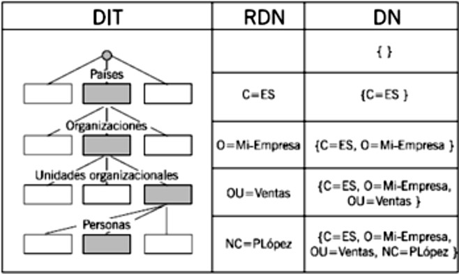

# Conceptos básicos

**Firma electrónica** (concepto jurídico): Conjunto de datos en forma electrónica,
consignados junto a otros o asociados con ellos,
que pueden ser utilizados como medio de identificación del firmante.

**Firma digital** (concepto tecnológico): Valor o conjunto de caracteres,
calculado criptográficamente a partir de unos datos,
que permiten verificar la integridad, autenticidad y no repudio de dichos datos,
denominados como *mensaje*.

**Certificado de firma electrónica**: declaración electrónica que vincula
los datos de validación de una firma con una persona física y confirma,
al menos, el nombre o seudónimo de esa persona

**Sello electrónico**: Datos en formato electrónico anejos a otros datos,
o asociados de manera lógica con ellos, para garantizar el origen y
la integridad de estos últimos.

**Sello de tiempo electrónico**: Sello electrónico que vincula unos datos a un
instante concreto, aportando la prueba de que estos datos existían en ese instante.
Una firma que incluye un sello de tiempo con el resultado de la validación del
certificado es una **firma longeva**, siendo esta longevidad determinada
por el sellado y por lo tanto requerirá resellado antes de que caduque
el certificado que se usó para el sello de tiempo.

**Certificado de autenticación de sitio web**: declaración que autentica
un sitio web y lo vincula a la persona física o jurídica a quien se
ha expedido el certificado

**Servicio de confianza**: servicio electrónico, prestado habitualmente a cambio
de remuneración, consistente en creación, verificación y/o validación de
firmas electrónicas, sellos electrónicos, sellos de tiempo electrónicos,
servicios de entrega electrónica certificada, certificados para la autenticación
de sitios web y/o certificados relativos a estos servicios. 
Las personas físicas o jurídicas que prestan estos servicios son TSP.

## Clave pública/privada (PKI) y tercero de confianza

* **Clave privada**: Parte que se utiliza para firmar y no se debe compartir
* **Clave pública**: Parte que se comparte para que el receptor pueda desencriptar
y verificar que el emisor posee la clave privada.

Pasos para realizar una firma y verificarla en el receptor:

1. Se calcula el hash del mensaje
2. Se encripta el hash del mensaje con la clave privada del emisor (esta es la firma)
3. Se envían al receptor el documento junto con la firma
4. En el receptor, se calcula de nuevo el hash del mensaje original
5. Se utiliza la clave pública del emisor para desencriptar la firma
6. Se compara el hash calculado con el desencriptado,
si coinciden se ha mantenido la integridad y se garantiza el no repudio

**Tercero de confianza**: Actor externo que, aportando su firma, acredita que
la clave realmente es de quien dice ser. Puede implementarse de dos maneras:

* Redes de confianza: la confianza se asigna de manera descentralizada, siendo
los propios usuarios los que firmar los certificados de otros usuarios.
* Autoridades de certificación centralizadas (organizadas de forma jerárquica)
que gestionan certificados **X.509** firmados por ellos mismos.
Este modelo se compone de:
    * Autoridades de certificación (CA): expide, gestiona y revoca los certificados
    * Autoridad de registro (RA): Auxilia a la CA en el proceso de Verificación
    de identidad del titular que solicita un certificado a la CA.
    * Autoridad de validación (VA): Valida el estado de los certificados mediante CRL u OCSP
    * [Servicio de directorio](https://es.wikipedia.org/wiki/Servicio_de_directorio): empleado por las CAs para almacenamiento y distribución de certificados y CRLs

## Certificado digital X.509 v3

El certificado digital es un documento electrónico, expedido y firmado
por una tercera parte de confianza (AC), que vincula una clave pública
con la identidad del propietario de la clave privada complementaria.

**X.509 v3** (o PKIX) es el estándar de la ITU-T (adoptado por la IETF, RFC5280)
para infraestructuras de clave pública.
Especifica la estructura y formato de los certificados digitales de clave pública,
de las listas de revocación de certificados (CRL) y de los certificados de atributos.

Su sintaxis se define en lenguaje ASN.1 y tiene la siguiente estructura:

* Version
* Serial number: identificador del certificado, único para cada CA.
* Signature algorithm: algoritmo empleado por la CA para firmar el certificado
* Issuer: nombre de la tercera parte de confianza (CA) que lo expide
* Validity period: periodo de validez de las claves (desde - hasta)
* Subject: sujeto titular vinculado a la clave pública (en notación DN)
* Subject Public Key Information: clave pública y algoritmo usado para
crearla (lo que la ley incluye en los "datos de verificación de firma")
* Campos opcionales:
    * Issuer unique identifier: Permite reutilizar nombres de emisor
    * Subject unique identifier: Permite reutilizar nombres de sujeto
* Extensions: Permiten asociar información adicional a sujetos, claves públicas, etc
y se componen de tres partes:
    * Extensión ID: Identificador que proporciona la semántica y el tipo de información (texto, fecha, etc) del valor de la extensión
    * Critical: flag que indica si es seguro o no ignorar el campo de extensión si no se reconoce el tipo
    * Value: valor de la extensión
* Ejemplos de extensiones:
    * Subject Alternative Name (SAN): identidades adicionales, seudónimos
    * Authority Information Access: enlaces al servidor OCSP de la VA
    * CRL distribution points (CDP) y Freshest CRL (Delta CRL dist. point):
    enlaces a las CRL y a la Delta-CRL
    * Key Usage: Restringe el propósito de la clave pública certificada, indicando, por ejemplo,
        * digitalSignature: uso para autenticación
        * nonRepudiation / ContentCommitment: uso para firma digital
        * keyCertSign: para certificados de CA
* Issuer digital signature: firma de la tercera parte de confianza (autofirmado)

### Validación de firma con certificado

La validación de una firma con certificado conlleva a su vez
la validación del certificado, para ello hay que comprobar:

* Los limites de su uso (Key Usage)
* El periodo de validez (Validity period)
* El estado de vigencia del certificado, pues puede estar revocado o temporalmente
suspendido antes de vencer el periodo de validez

Para comprobar este último punto hay dos tecnicas diferentes:

**CRL**: Listas mantenidas por las CAs donde aparecen los número de serie
de los certificados revocados antes de expirar y la fecha de revocación.
Se acceden a ellas a través de repositorios HTTP o LDAP cuya ubicación
esta indicada en la extensión CDP del certificado.

Para mitigar el problema que supone el crecimiento de la CRL se emplean los delta-CRL
(extensión Freshest CRL) que solo contienen los certificados revocados desde
la publicación de la última CRL de base.

**OCSP**: Protocolo que permite consultar a una VA el estado de un certificado.
Usa mensajes codificados en ASN.1 y se envían sobre HTTP. Las respuestas pueden
ser *good*, *unknown* o *revocked* y van firmadas y con sello de tiempo.

Consultar directamente a las CAs, vía OCSP, conlleva problemas de rendimiento
tanto para la CA como para el cliente. Como solución a esto se usa OCSP Stapling,
una técnica por la que el propio servidor web (que esta visitando el cliente)
consulta el servido OCSP periódicamente de manera que cuando un cliente
va a hacer el [TLS/SSL handshake](https://es.wikipedia.org/wiki/Seguridad_de_la_capa_de_transporte#Handshake_TLS) con él puede adjuntar (grapa)
las respuestas del OCSP en ese mismo proceso.

## Sello de tiempo y firma longeva

El sello de tiempo soluciona el problema de dar un falso negativo al validar unos datos
que fueron firmados con un certificado que era valido cuando se uso pero que
ahora (cuando se esta volviendo a validar) se encuentra revocado.

La **firma longeva**, al incluir el resultado de la validación del
certificado, soluciona el problema de que los PSCs eliminen los certificados
de las CRLs una vez que el certificado ha caducado, lo que impedía saber después
de su fecha de caducidad si alguna vez fueron revocados y cuando.

## Formatos de firma (hash y cifrado asimétrico)

La terminación AdES denota que es una firma electrónica avanzada.

* PKCS#7 / [CMS](https://es.wikipedia.org/wiki/Cryptographic_Message_Syntax "Cryptographic Message Syntax"){.abbr}: Permite diferentes tipos de objetos (data, signed-data, enveloped-data, signed-and-enveloped-data, digested-data y encrypted-data)
* CAdES: Permite tanto attached signature, como detached signature.
* XMLDsig:
    * Define una sintaxis XML para soporte a la firma digital.
    * Permite firmar cualquier tipo de recurso, no solo XML.
    * Existen varios modos: detached signature, enveloped signature y enveloping signature.
* PAdES (PDF Advanced Electronic Signature)
* S/MIME (Secure / Multipurpose Internet Mail Extensions)
* ASiC (Associated Signature Container)
    * Define una estructura de contenedor para englobar: archivo, firma y sello de tiempo
    * El contenedor está basado en zip

CAdES y XAdES son respectivamente versiones AdES de [CMS](https://es.wikipedia.org/wiki/Cryptographic_Message_Syntax "Cryptographic Message Syntax"){.abbr} y XMLDsig.

En CAdES y XAdES, según donde se guarde la firma, tenemos:

* El fichero firma incluye el documento original (en base64 o una
referencia con un hash del documento):
    * CAdES attached/implicit (implícita): el fichero de firma envuelve el propio contenido firmado de forma que, para acceder al contenido, es necesario interpretar la firma
    * XAdES internally detached (desplegada): documento y firma son nodos al mismo
    nivel del XML, vinculados por una relación interna
    * XAdES enveloping (envolvente): el nodo de la firma contiene el nodo del
    contenido
    * XAdES enveloped (envuelta): el nodo del contenido contiene el nodo de la
    firma (ej: Factura electrónica)
* El fichero firma no incluye el documento original:
    * CAdES detached/explicit (explicita)
    * XAdES externally detached (despegada): similar al *internally detached* pero
    realmente no incluye el documento original, si no una URL a su localización
    sin hash.

CAdES y XAdES permiten los siguientes perfiles de formato:

* BES (Basic Electronic Signature): firma con un formato básico, incluyendo los atributos necesarios para la firma electrónica
* EPES (Explicit Policy Electronic Signature): firma BES más un atributo con el identificador de la política de firma a aplicar (por ejemplo: política de firma de la AGE v1.9 urn:oid:2.16.724.1.3.1.1.2.1.9)
* T (Timestamped): añade un sello de tiempo sobre cualquiera de las anteriores.
* C (Complete): añade referencias a datos de verificación (certificados y listas de revocación).
* X (Extended): añade un sello de tiempo a C (Complete) para proteger contra el posible compromiso de validez en el futuro.
* XL (eXtended Long-term): añade certificados y evidencias de revocación (ej. CRL o respuestas OCSP), para permitir la verificación en el futuro, incluso si su fuente original no estuviera disponible.
* A (Archival): añade sellos de tiempo posteriores periódicamente (re-sellado)
para garantizar la integridad de la firma, ya que de otro modo el paso del tiempo
haría que tarde o temprano el algoritmo con que se firmo quedara obsoleto.

Las dos últimas son una forma de implementar la *firma longeva*, aunque la `XL`
solo dura lo que dure su sello, mientras que la `A` durara mientras se siga
re-sellando.

<fieldset class="firma_ades">
  <legend>A</legend>

<fieldset class="nivel_conformidad_eidas">
  <legend>X-L</legend>

<fieldset>
  <legend>X</legend>

<fieldset>
  <legend>C</legend>

<fieldset class="nivel_conformidad_eidas">
  <legend>T</legend>

<fieldset class="firma_ades_leaf nivel_conformidad_eidas">
  <legend>BES</legend>
  
Signed info

  
Signature

  
Key info

  
Signed properties

  
Unsigned properties

</fieldset>
  
Sellado de tiempo sobre la firma electrónica

</fieldset>
  
Referencias a las listas de revocación y a los certificados

</fieldset>
  
Sellado de tiempo sobre las referencias a los certificados y las listas de revocación

</fieldset>
  
Certificados y listas de revocación

</fieldset>
  
Secuencia de sellados de tiempo

</fieldset>

(*) En azul los niveles de conformidad que deben ser admitidos según el eIDAS (más detalles abajo).

## Protocolos de directorio

Un servicio de directorio es una aplicación que almacena de forma organizada
información sobre los usuarios de un sistema y sobre el sistema en sí. Ejemplos:

**X.500** es el estándar de ITU-T, se caracteriza por ser flexible pero complejo.
Caracteristicas:

* Su arquitectura se divide en DIB (Directory Information Base), DSA
(Directory System Agent) y DUA (Directory User Agent)
* La información se organiza como un árbol jerarquizado
y se almacena como objetos atributo-valor en ASN.1
* Un RDN (Relative Distinguish Name) identifica un nivel del árblol
* Un DN (Distinguish Name) es un identificador completo y único de cada entrada del árbol

Figura 1: Esquema de arquitectura X.500

Figura 2: Ejemplo de RDN y DN en LDAP

**LDAP** fue originalmente un protocolo alternativo para acceder
a servicios de directorio X.500 a través de la pila de protocolos TCP/IP
en vez de usar el modelo OSI (requisito de DAP en aquel entonces)
pero actualmente cubre toda la solución, no solo el protocolo entre usuario
y servidor.

* Es compatible con X.500, usa la misma estructura y ASN.1
* Usa el puerto 389, y para LDAPS el puerto 636
* Además de RDN y DN permite alias y registros referenciales
* Es estándar de IETF (RFC 2251 y RFC 2256) y abierto
* Se puede usar con LDIF para trabajar con los datos en formato ASCII (lo que no sea texto lo codificará en Base64)

## Mecanismos de identificación y control de acceso

El **control de acceso** consta de tres procesos (AAA):

* **Autenticación**: verificar la identidad del usuario que solicita acceso
* **Autorización**: determinar las acciones permitidas al usuario. [Políticas de acceso](https://es.wikipedia.org/wiki/Control_de_acceso):
    * [DAC](https://es.wikipedia.org/wiki/Control_de_acceso_discrecional "Control de acceso discrecional"):
    Cada objeto esta asociado a una ACL que contiene el nivel de acceso de cada usuario/grupo.
    * [MAC](https://es.wikipedia.org/wiki/Control_de_acceso_obligatorio "Control de acceso obligatorio"):
    Los derechos de acceso son establecidos por una entidad central
    * [RBAC](https://en.wikipedia.org/wiki/Role-based_access_control "Acceso basado en roles"):
    El nivel de acceso esta asociado a roles de manera que los usuarios tienen el acceso
    del rol que este ocupando en ese momento, el cual puede cambiar
* **Trazabilidad**: monitorizar y registrar los permisos concedidos y los recursos accedidos

Los métodos de autenticanción usan uno o más de los siguientes **factores de autenticanción**:

* **Factor de conocimiento**: algo que el usuario sabe (ej: contraseña)
* **Factor de posesión**: algo que el usuario tiene (ej: móvil)
* **Factor de inherencia**: algo que el usuario es (ej: huella dactilar)
* **Factor de conducta**: algo que el usuario hace

Una **autenticanción fuerte** ha de usar al menos dos factores.

Un **HSM** es un dispositivo criptográfico basado en hardware que genera, almacena y protege
claves criptográficas. Puede ser empleado para realizar firmas remotas o firmas en la nube.
Un ejemplo es *Cl@ve Firma*.

### DNI electrónico

El **DNI electrónico** permite acreditar la identidad
y firmar documentos otorgándoles validez jurídica,
pero no permite cifrado de datos del usuario.
El DNIe reparte su contenido en dos zonas:

* Zona pública: accesible en solo lectura y sin más restricciones:
    * Claves Diffie-Hellman
    * Certificado cualificado CA emisora (clave pública de root CA para certificados card-verifiables)
    * Certificado cualificado de autenticación (digitalSignature)
    * Certificado cualificado de firma (nonRepudiation)
* Zona seguridad: accesible en solo lectura y sólo en puntos DGP:
    * Datos de filiación e ID
    * Imagen de la fotografiá
    * Imagen de la firma manuscrita
    * Datos biométricos

Para el DNIe el Ministerio de Interior (DGP) hace de CA y la FNMT y MINHAC hace de VA.

# Regulación y Administración Pública

## Conceptos eIDAS

Del cumplimiento del **eIDAS** (reglamento UE 910/2014) se derivan las siguientes
definiciones:

**Firma avanzada**: firma electrónica que cumple los requisitos:

* estar vinculada al firmante de manera única
* permitir la identificación del firmante
* haber sido creada utilizando datos de creación de la firma electrónica que el firmante puede utilizar,
con un alto nivel de confianza, bajo su control exclusivo
* estar vinculada con los datos firmados por la misma de modo tal que cualquier modificación ulterior
de los mismos sea detectable

**Firma electrónica cualificada**: firma electrónica avanzada que se crea
mediante un dispositivo cualificado de creación de firmas electrónicas
y que se basa en un certificado cualificado de firma electrónica.
A efectos jurídicos este tipo de firma:

* tendrá un efecto equivalente al de una firma manuscrita
* y si además esta basada en un certificado cualificado emitido en un estado
miembro será reconocida como una firma electrónica cualificada
en todos los demás EEMM.

**Dispositivo cualificado de creación de firma electrónica**:
dispositivo de creación de firmas electrónicas que cumple los requisitos:

* estar garantizada razonablemente la confidencialidad de los datos de creación
de firma electrónica utilizados para la creación de firmas electrónicas
* los datos de creación de firma electrónica utilizados para la creación de
firma electrónica solo puedan aparecer una vez en la práctica
* existe la seguridad razonable de que los datos de creación de firma electrónica utilizados para la
creación de firma electrónica no pueden ser hallados por deducción y de que la firma está protegida
con seguridad contra la falsificación mediante la tecnología disponible en el momento
* los datos de creación de la firma electrónica utilizados para la creación de firma electrónica puedan
ser protegidos por el firmante legítimo de forma fiable frente a su utilización por otros

**Certificado cualificado de firma electrónica**: certificado de firma electrónica
que ha sido expedido por un prestador cualificado de servicios de confianza
y que cumple, entre otros, los requisitos siguientes:

* Indicar si ha sido expedido como certificado cualificado
* Indicar si los datos de validación se encuentran en un dispositivo cualificado
de firma.
* Contener el nombre del firmante o, en su caso, un seudónimo claramente establecido como tal

**Sello cualificado de tiempo electrónico**:
Sello electrónico avanzado que cumple con los siguientes requisitos:

* Vincular la fecha y hora con los datos de forma que se elimine
la posibilidad de modificar los datos sin que se detecte.
* Basarse en una fuente de información temporal vinculada al Tiempo Universal Coordinado.
* Haber sido firmada mediante el uso de firma electrónica avanzada o sellada
con un sello electrónico avanzado del prestador cualificado de servicios de
confianza o por cualquier método equivalente.

Un **certificado cualificado de sello electrónico** debe contener al menos,
el nombre del creador y, cuando proceda, su número de registro oficial.

**Certificado cualificado de autenticación de sitio web**: Certificado de
autenticación de sitio web que cumple con los siguientes requisitos:

* se expide a una persona física o jurídica, identificada en el propio certificado
* deberá aparecer al menos su ciudad y estado
* contiene el/los nombre/s de dominio explotados por la persona física o
jurídica a la que se expida el certificado

**Servicio de confianza cualificado**: servicio de confianza que cumple los
requisitos aplicables del eIDAS.

**QTSP**: prestador de servicios de confianza que presta servicios
de confianza cualificados y al que el organismo de supervisión ha concedido la
cualificación.

**Lista de servicios de confianza TSL**: Lista de TSPs que expiden certificados
cualificados (QTSP). Cada EM de la UE debe publicar y mantener su propia lista.
Ejemplos del sector público:

* CA de confianza: Ministerio del Interior DGP
* VA de confianza: FNMT
* RA de confianza: AEAT, DGP, SegSoc, SocEst Correos y Telégrafos

## Regulación

Los tipos de firma exigidos por el sector público son, de menor a mayor
nivel de garantía:

1. firma electrónica avanzada
2. firma electrónica avanzada basada en un certificado cualificada de firma electrónica
3. firma electrónica cualificada

Siendo normalmente exigido el nivel 1 o 2, y siempre aceptándose cualquier
certificado de nivel superior al exigido pero nunca exigiendo una firma
superior a la cualificada.

En la decisión de ejecución UE 2015/1506 se establece que **los formatos** de firmas
electrónicas avanzadas y sellos avanzados **que deben reconocer el sector público**
son XAdES, CAdES o PAdES en niveles de conformidad B, T o LT (XL), y los
contenedores ASiC.

Adicionalmente, los sistemas de **clave concertada** se aceptan como sistema de
identificación en el Art. 9 de la Ley 39/2015 y se basan en el registro previo del usuario,
durante el cual se acuerda una clave a usar con el proveedor y que garantiza la
identidad del usuario, sin ser necesario un certificado electrónico.  
Un ejemplo sería Cl@ve Permanente o cualquier otro sistema de usuario-contraseña.

En la resolución de 14 de julio de 2017 de la SGAD se establece que el uso de
firma electrónica no criptográfica ha de garantizar igualmente la autenticidad,
integridad y no repudio cumpliendo lo siguiente:

* Utilizar un sello electrónico cualificado del organismo que incluya un sello
de tiempo
* Garantizar la autenticidad del firmante vía Cl@ve
* Recoger evidencias para la verificación de identidad. Dichas evidencias también
han de sellarse
* Devolver un justificante CSV verificable en sede
* Incluir un campo check para que el interesado exprese consentimiento y voluntad
de firma

### Identificación electrónica transfronteriza

El **reconocimiento mutuo** entre EEMM implica que cuando se necesite acceder
a un servicio en linea del sector público se debe reconocer los medios de
identificación electrónica expedidos por otros EEMM siempre que:

1. el medio de identificación haya sido expedido por un sistema incluido
en la **[lista publicada por la Comisión Europea](https://administracionelectronica.gob.es/pae_Home/pae_Estrategias/pae_Identidad_y_firmaelectronica/Nodo-eIDAS/Sistemas-de-identificacion-electronica-notificados.html)**
2. el servicio en linea use un nivel de seguridad **sustancial o alto**
3. el **nivel de seguridad** del medio de identificación es igual o superior
al requerido por el servicio en linea

Este reconocimiento debe producirse a más tardar 12 meses después de que
la Comisión publique la lista.

Opcionalmente, un EM podrá aceptar también medios de identificación
con nivel de seguridad bajo que estén incluidos en la lista de la Comisión.

Un sistema de identificación electrónica podrá ser incluido en la lista
(a esto lo llaman **ser objeto de notificación**) cuando:

1. el EM responsable garantiza la disponibilidad de la autenticacíon
en linea de manera que otro EM pueda obtener y confirmar los datos de identificación
de la persona autenticada por ese medio (nodos eIDAS)
2. cumple con los requisitos de al menos uno de los **niveles de seguridad** previstos:

| Nivel de seguridad | Grado de confianza en  la identidad declarada  del usuario | El objetivo es [...]  el riesgo de uso indebido  o alteración de la identidad |
|:-------------------|:----------------------|:-----------------------------|
| **bajo**           | limitado              | reducir                      |
| **sustancial**     | sustancial            | reducir sustancialmente      |
| **alto**           | superior              | evitar                       |

### Requisitos para los TSP

1. Aportar medidas técnicas y organizativas que gestiones los riesgos para la seguridad
2. En un **plazo máximo de 24 horas** tras tener conocimiento de una violación de seguridad
o perdida de integridad debe:
    * notificarla al **organismo de supervisión** y, en caso pertinente, a otros
    organismos relevantes como el **organismo nacional de seguridad** o la
    **autoridad de protección de datos**.
    * notificarla a la persona física o jurídica que puedan haberse visto afectadas
    por el fallo
    * a su vez el organismo de supervisión notificado:
        * avisara a **ENISA** y a los organismos de supervisión de otros EEMM que
        pudieran haber sido afectados
        * informará al público (o exigirá al prestador que lo haga) si considera
        que la violación reviste interés general
        * facilitará a ENISA un resumen anual de notificaciones de violaciones de
        seguridad recibidas

Además de lo anterior, los QTSP deberán también:

1. informar al organismo de supervisión de cualquier cambio en la prestación del servicio
2. contar con personal y subcontratistas con conocimientos especializados,
fiabilidad, experiencia, cualificación y formación necesarias
3. mantener **recursos financieros** suficientes o **pólizas de seguros** de responsabilidad
4. informar de manera clara y comprensible a los potenciales usuarios de las
condiciones y limitaciones de su servicio
5. utilizar sistemas y productos fiables que estén protegidos contra toda
alteración y que garanticen la seguridad y fiabilidad técnica
6. utilizar sistemas fiables para almacenar los datos de forma verificable
7. implementar medidas contra la falsificación y el robo del dato
8. **registrar** y mantener toda información pertinente sobre **datos expedidos y recibidos**
9. tener un **plan de cese actualizado**
10. garantizar un tratamiento licito de datos personales

y si expiden certificados cualificados:

11. mantener una **base de datos de certificados cualificados expedidos**
12. informaran de forma automatizada, fiable y gratuita a cualquier usuario
del estado de validez o revocación de los certificados
13. cumplir en un plazo máximo de **24 horas** con las **solicitudes de revocación**,
dejando registro de dicha revocación en su base de datos y publicando el
estado de la revocación, momento en el cual se hace efectiva

El **organismo de supervisión** de cada EM supervisa los QTSP tanto
preventivamente como cuando surge una incidencia, mientras que con los demás
TSP solo interviene a posteriori, tras recibir información de que no se cumple
la regulación.

Los QTSP deben pasar (y pagar) **una auditoria al menos cada 2 años**.
Adicionalmente el organismo supervisor puede ordenar (y pagar)
una auditoria en cualquier momento.

El incumplimiento de los requisitos puede acarrear la perdida de la cualificación.

## Servicios comunes para firma electrónica

**Suite @firma**, la cual se compone de:

* Plataforma @firma: permite la validación de certificados digitales mediante
llamadas a WS
* VALIDe: permite la validación manual de firmas, certificados, y visualizar y
realizar firmas
* TS@: permite realizar sellados y resellados de tiempo (firma longeva)
* Cliente @firma (Autofirma): permite la realización firmas en el cliente
* Cl@ve firma: permite la realización de firmas con certificado electrónico en la nube
* Integr@: facilita la integración con @firma y la realización de firma en
servidor (sello del organismo) para entornos Java

**FIRe**: solución que simplifica el uso y realización de
firmas electrónicas de usuario al concentrar en un solo
componente todos los requisitos de creación de firmas
basadas tanto en certificados locales como en certificados en
la nube.

# Bibliografía

* PreparaTic27 - Pack1/080
* PreparaTic27 - Pack1/081
* [www.uv.es - Introducción a los certificados digitales](https://www.uv.es/sto/articulos/BEI-2003-11/certificados_digitales.html)
* [mozilla.org - OCSP Stapling in Firefox](https://blog.mozilla.org/security/2013/07/29/ocsp-stapling-in-firefox/)
* [wikipedia.org - OCSP stapling](https://en.wikipedia.org/wiki/OCSP_stapling)
* [blog.signaturit.com - Firma electrónica avanzada, simple o cualificada, ¿sabes distinguirlas?](https://blog.signaturit.com/es/firma-electronica-simple-vs-avanzada)
* [mineco.gob.es - FAQ Reglamento (UE) Nº 910/2014 y eIDAS](https://avancedigital.mineco.gob.es/es-es/Servicios/FirmaElectronica/Paginas/preguntas-frecuentes.aspx)
* [Cl@ve - definiciones](https://clave.gob.es/clave_Home/dnin/definiciones.html)
* [serviciosmin.gob.es - Prestadores de servicios electrónicos de confianza](https://sede.serviciosmin.gob.es/es-es/firmaelectronica/paginas/Prestadores-de-servicios-electronicos-de-confianza.aspx)
* [networkencyclopedia.com - X.500](https://networkencyclopedia.com/x-500/)
* [firmaelectronica.gob.es - Formatos de Firma](https://firmaelectronica.gob.es/Home/Ciudadanos/Formatos-Firma.html)
* [webs.um.es - Formatos de firma electrónica](https://webs.um.es/danielsm/miwiki/lib/exe/fetch.php?id=inicio&cache=cache&media=cursocarm-tema3.pdf)
