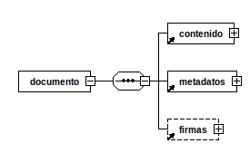
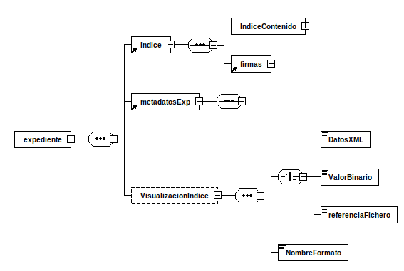
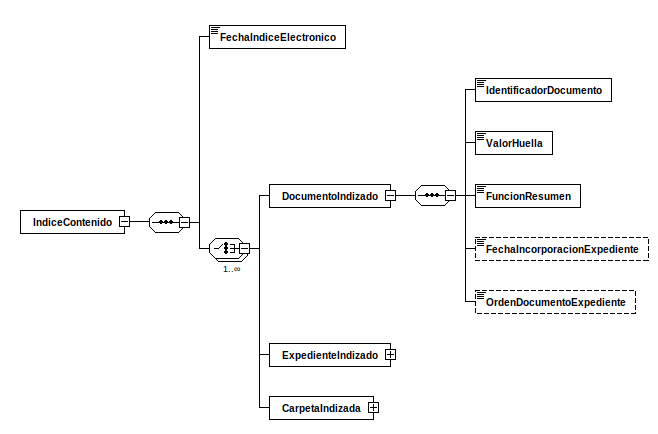

# Conceptos básicos

**ENI**: establece los principios y directrices de interoperabilidad en el
intercambio y conservación de la información electrónica por parte de
las AAPP (Real Decreto 4/2010, de 8 de enero).

**NTI**: concretan detalles para facilitar los aspectos más prácticos y
operativos de la interoperabilidad entre las AAPP y con el ciudadano.

**EIF**: Marco Europeo de Interoperabilidad, cuyas recomendaciones sobre
interoperabilidad fueron tenidas en cuenta para la elaboración del ENI y sus NTI.

**Modelo de datos**: Conjunto de definiciones (nivel conceptual),
interrelaciones (nivel lógico), y reglas y convenciones (nivel físico)
que permiten describir los datos para su intercambio.

**PGDE**: Política de gestión de documentos electrónicos.
Define las directrices para la creación y gestión de Documentos.
Su definición es la primera medida para realizar el archivo electrónico.

# Ojetivos

* Establecer los **criterios y recomendaciones** que deben seguir las AAPP
para garantizar la interoperabilidad y la no discriminación de los ciudadanos
por razón de su elección tecnológica.
* Proporcionar los **elementos comunes** para facilitar la interacción de las AAPP,
y comunicar los requisitos de interoperabilidad a la industria.
* Facilitar la **implantación de políticas de seguridad**, contribuyendo a una
favoreciendo racionalidad técnica y economía de escala.

La interoperabilidad se concibe, al igual que la seguridad, desde una perspectiva integral.

# Elementos

* **Principios básicos de interoperabilidad**: La interoperabilidad:
    * como cualidad integral presente desde la concepción y
    a lo largo de todo el ciclo de vida.
    * con carácter multidimensional (organizativo, semántico y técnico)
    * con enfoque de soluciones multilaterales para obtener las ventajas derivadas
    del escalado, de las arquitecturas modulares y multiplataforma y de compartir,
    reutilizar y colaborar
* **Interoperabilidad organizativa**:
    * establecer y publicar las condiciones para el consumo de servicios puestos
    a disposición del resto de entidades
    * ofrecer servicios a través de la **Red SARA**
    * mantener inventario de procedimientos y servicios
    * mantener relación actualizada de los órganos administrativos,
    oficinas de registro y atención al ciudadanos, y las relaciones entre ellos
* **Interoperabilidad semántica**: Identificar, inventariar y publicar
**modelos de datos** con carácter común (CISE)
* **Interoperabilidad técnica**: Uso de **estándares abiertos** y, de forma
complementaría, estándares de uso generalizado con respecto a:
    * documentos y expedientes electrónicos puestos a disposición o requeridos del ciudadano
    * aplicaciones y servicios en su relación con el ciudadano y otras entidades (ej: sede electrónica)
* **Infraestructuras y servicios comunes**:
    * enlazar infraestructuras y servicios de las AAPP con las infraestructuras
    y servicios comunes de la AGE
    * intercambio de asientos registrales a través de **ORVE** y **SIR**
* **Utilización, preferentemente, de la Red SARA**:
    * conectar la red de la entidad a la Red SARA
    * aplicar el Plan de Direccionamiento de la Administración
    * sincronizar las aplicaciones y servicios con la hora oficial a través
    del Real Instituto y Observatorio de la Armada o los servicios de la Red SARA
* **Reutilización** y transferencia de tecnología:
    * licenciar como **EUPL** (o equivalente) las aplicaciones susceptibles de ser reutilizadas
    * inventariar en el **CTT** las aplicaciones para su libre reutilización
    * reutilizar las soluciones ya disponibles en el CTT
    * publicar el código fuente con licencias de libre reutilización
* **Interoperabilidad de la firma electrónica y de los certificados**:
adopción de la política de firma electrónica y de certificados de la AGE
o uso de esta como referencia para elaborar la propia. Rige aspectos relativos a:
    * validación de certificados y firmas electrónicas
    * listas de confianza
    * aplicaciones usuarias
    * prestadores de servicios de certificación (TSL)
    * plataformas de validación de certificados y firma electrónica (ej @firma)
* **Recuperación y conservación del documento electrónico**:
    * definir y publicar la **PGDE**
    * definir los calendarios de conservación de los documentos y expedientes
    * definir normativa interna en cuanto a la generación de copias autenticas
    * definir el esquema institucional de metadatos
    * cumplir el ENS, el RGPD y el LOPD-GDD
    * utilizar preferentemente firmas longevas
    * digitalizar los documentos en soporte papel

# Las NTI

El ENI establece la serie de NTI que son de obligado cumplimiento por las AAPP
que desarrollan aspectos concretos de la interoperabilidad entre las AAPP
y con los ciudadanos.

## Catálogo de estándares

## [Documento electrónico](https://administracionelectronica.gob.es/pae_Home/dam/jcr:9e80361c-2550-4a7e-b99e-20ea123b4aef/Guia_NTI_documento_electronico_EPUB_2ed_2016.epub)

Esta NTI recoge los requisitos mínimos sobre la estructura y formato de los
documentos para su intercambio y por tanto para la interoperabilidad.

**Objetivo**: describir los componentes del documento electrónico, contenido,
en su caso, firma electrónica y metadatos, así como la estructura y formato
para su intercambio.

**Ámbito**: documentos administrativos electrónicos y documentos susceptibles
de formar parte de un eExpediente. Ej:

* Documentos de decisión: resoluciones, acuerdos, contratos, convenios y declaraciones
* Documentos de transmisión: comunicaciones, notificaciones, publicaciones y acuses de recibo
* Documentos de constancia: actas, certificados y diligencias
* Documentos de juicio: informes
* Documentos de ciudadano: solicitudes, denuncias, alegaciones, recursos,
comunicaciones, facturas y otros incautados
* Otros: documentos de organizaciones / ciudadanos objeto de intercambio

Un eDoc puede estar formado por varios ficheros (ej: fichero de texto + fichero
de imagen), varias firmas asociadas y varios conjuntos de metadatos vinculados a
cada fichero individual, pero a efectos de tratamiento, gestión y conservación
constituye un único objeto electrónico.

El eDoc debe tener sentido completo y ser susceptible de identificación
y tratamiento diferenciado, y constituya evidencia de acciones.

**Componentes** del eDoc:

* Contenido: conjunto de datos del documento.
* Firma electrónica: permite detectar cambios posteriores a la firma y esta
vinculada de forma única al firmante y a los datos. todos los documentos
susceptibles de estar en un eExpediente deben tener al menos una firma, cuyo
tipo puede ser un CSV o una firma basada en certificados (base64).
* Metadatos: proporciona contexto (propiedades relativas a la gestión/conservación
de los documentos) y da caracter probatorio del eDoc en el tiempo.
El NTI no especifica la implementación pero si sus condiciones de intercambio y
reproducción.

**Metadato de gestión** de documentos: Información estructurada o semiestructurada
que hace posible la creación, gestión y uso de documentos a lo largo del tiempo.
Sirven para identificar, autenticar y contextualizar documentos, y a las personas,
los procesos y los sistemas que los crean, gestionan, mantienen y utilizan.

**Metadatos mínimos obligatorios**:

* Versión NTI: http://administracionelectronica.gob.es/ENI/XSD/v1.0/documento-e
* Identificador: ES_ORGNAO_AAAA_IDespecífico (ej: ES_E00010207_2010_MPR000000000000000000000010207)
* Órgano: Código alfanumérico único para cada órgano/unidad/oficina extraído del DIR3
* Fecha de captura: YYYY-MM-DDTHH:MM:SS (ISO 8601)
* Origen: 0 = Ciudadano, 1 = Administración
* Estado de elaboración:
    * Original (Ley 11/2007 Art. 30)
    * Copia electrónica auténtica con cambio de formato (Ley 11/2007 Art. 30.1)
    * Copia electrónica auténtica de documento papel (Ley 11/2007 Art. 30.2 y 30.3)
    * Copia electrónica parcial auténtica
    * Otros
* Nombre de formato: Formato lógico del fichero de contenido del documento electrónico
(ha de ser uno de los listados en la NTI de Catálogo de estándares)
* Tipo documental:
    * Documentos de decisión:
        * Resolución
        * Acuerdo
        * Contrato
        * Convenio
        * Declaración
    * Documentos de transmisión:
        * Comunicación
        * Notificación
        * Publicación
        * Acuse de recibo
    * Documentos de constancia:
        * Acta
        * Certificado
        * Diligencia
    * Documentos de juicio:
        * Informe
    * Documentos de ciudadano:
        * Solicitud
        * Denuncia
        * Alegación
        * Recursos
        * Comunicación ciudadano
        * Factura
        * Otros incautados
    * Otros
* Tipo de firma: CSV o alguno de los formatos de firma electrónica listados en
la NTI de Política de firma y certificados de la Administración:
* Si *Tipo firma* = CSV:
    * Valor CSV
    * Definición generación CSV: Referencia a la Orden, Resolución o documento
    que define la creación del CSV correspondiente (ej: BOE-A-YYY-XXXXX)
* Si *Estado de elaboración* = *Copia electrónica auténtica con cambio de formato (Ley 11/2007 Art.30.1)*
o *Copia electrónica parcial auténtica*:
    * Identificador de documento de origen: ES_ORGNAO_AAAA_IDespecífico

### Intercambio de Documentos electrónicos

Salvo acuerdo excepcional entre las AAPP, la estructura
consiste en un XML (definido por esquemas XSD) dividido en tres bloques: contenido (normalmente en base64),
metadatos obligatorios (salvo *Valor CSV* y *Definición generación CSV* que irán
en el bloque firma) y firma (incluye los metadatos de firma).
Preferentemente se usar la Red Sara como medio de transmisión.
Si el eDoc forma parte de un asiento registral éste será tratado como un
documento adjunto al mensaje de datos de intercambio.

Figura 1: [XSD de Documento electrónico]({filename}/posts/xsd/documentoEni.md)

**Acceso a eDocs** en eSedes debe mostrar:

* El contenido del documento electrónico cuando éste sea representable
* Descripción y valor de los metadatos mínimos obligatorios
* La información básica de cada una de las firmas del documento de la siguiente
manera:

| Tipo firma | Información   | Localización |
|:-----------|:--------------|:-------------|
| **CSV**    | valor del CSV | metadato     |
| **Firma basada en certificados (base64)** | validez de la firma | Según reglas de validación de firma de la NTI de Política de firma y certificados de la Administración |
| ^ | Información del firmante(s) del documento (persona física, jurídica o sello de órgano) | Propiedades o etiquetas de la firma |
| ^ | Emisor del certificado del firmante(s) | ^ |
| ^ | Fecha y hora de la firma(s) | ^ |

Tabla 1: Información básica de firma

## [Digitalización de documentos](https://administracionelectronica.gob.es/pae_Home/dam/jcr:2650cc88-b8d7-4e21-9bfd-b291b51ff290/Guia_NTI_digitalizacion_EPUB_2ed_2016.epub)

**Objetivo**: establecer los requisitos a cumplir en la digitalización de
documentos no electrónicos (ej: papel) a través de medios fotoeléctricos.

**Ambito** cualquier órgano de la AP o Entidad de Derecho Público vinculada
o dependiente de aquélla sobre cualquier documento en soporte papel u otro
soporte susceptible de digitalización, independientemente de que hubiese sido
aportado por el ciudadano o generado por una organización.

Un **eDoc digitalizado esta compuesto** por:

* imagen electrónica
* metadatos mínimos obligatorios en la NTI de Documento electrónico, siendo
el metadato *Estado de elaboración* = *Copia electrónica autentica con cambio de formato*
* metadatos opcionales de la NTI de Política de gestión de eDocs (ej: resolución,
tamaño, idioma)
* si procede, firma de la imagen electrónica (eSello o CSV)

**Requisitos de la imagen electrónica**:

* Usar uno de los formatos del NTI de Catálogo de estandares (JPEG, PNG, TIFF, SVG, PDF o PDF/A)
* El nivel de **resolución** mínimo para imágenes electrónicas será de
**200 píxeles por pulgada**, tanto en blanco y negro, color o escala de grises
* La imagen será **fiel al documento** origen (respetará la geometría del original
en tamaños y proporciones y no contendrá caracteres o gráficos que no figurasen
en el original)

**Proceso de digitalización**: Conlleva las siguientes tareas:

1. Digitalización por medio fotoeléctrico
2. Si procede, optimización automática de la imagen electrónica para garantizar
su legibilidad (ej: umbralización, reorientación, eliminación de bordes negros)
3. Asignación de los metadatos
4. Si procede, firma de la imagen electrónica

Si se realiza los dos últimos pasos se obtendrá un *eDoc completamente conformado*,
en caso contrarío sera un *eDoc pendiente de completar*.

En cuanto a la destrucción de originales tras la digitalización hay que cumplir
con el **Real Decreto 1164/2002**:
La eliminación de documentos sólo podrá llevarse a cabo tras una valoración
documental por parte de la Comisión Superior Calificadora de Documentos Administrativos,
que acredite que los documentos originales no poseen valor histórico o artístico,
ni utilidad para la gestión administrativa que exija su conservación.
Además, los documentos originales cuya eliminación se propone deberán carecer de
valor probatorio para los derechos y obligaciones de las personas físicas o jurídicas.

## [Expediente electrónico](https://administracionelectronica.gob.es/pae_Home/dam/jcr:e9a3f923-6be7-49bd-b05d-fb07ecb7b1b4/Guia_NTI_expediente_electronico_EPUB_2ed_2016.epub)

**Objetivo**: establecer la estructura del eExpediente y las especificaciones
de los servicios de remisión y puesta a disposición.

**Ambito**: eExpedientes y similares, es decir,  documentos electrónicos que
se han formado mediante agregación y como resultado de una secuencia de
actuaciones coherentes que conducen a un resultado específico.

Un **expediente electrónico** es un conjunto de documentos correspondiente a un
procedimiento administrativo y esta compuesto por:

* **Documentos electrónicos**: documentos que cumplen la NTI de Documento Electrónico
(es decir, contenido + firma + metadatos). Estos documentos
pueden estar incluidos en el eExpediente de varias formas:
    * directamente como elementos independientes
    * dentro de una **carpeta** (agrupación por motivo funcional para la
      que no existe normativa especifica)
    * como parte de un **sub-eExpediente** (un sub-eExpediente evoluciona
      según su propio procedimiento con independencia del eExpediente que
      lo contiene, pero sus cambios si se reflejan en el eExpediente padre)
* **Indice electrónico**: reflejar la disposición de los documentos y otros datos
con el fin de preservar la integridad y permitir su recuperación
* **Firma** de indice: CSV o basada en certificados
* **Metadatos**

**Metadatos mínimos obligatorios**:

* Versión NTI: http://administracionelectronica.gob.es/ENI/XSD/v1.0/documento-e
* Identificador: ES_ORGNAO_AAAA_IDespecífico (ej: ES_E00010207_2010_MPR000000000000000000000010207)
* Órgano: Código alfanumérico único para cada órgano/unidad/oficina extraído del DIR3
* Fecha Apertura Expediente: YYYY-MM-DDTHH:MM:SS (ISO 8601)
* Clasificación: Procedimiento administrativo con el que se relaciona el expediente
(esquema de valores normalizado según el SIA o, si no se encuentra en SIA, *Órgano_PRO_IDPROespecífico*)
* Estado: Estado del expediente en el momento de intercambio
    * Abierto
    * Cerrado
    * Índice para remisión cerrado
* Interesado:
    * Si es ciudadano o persona jurídica: DNI, NIE, NIF o similar
    * Si es administración: *Órgano*
* Tipo de firma: CSV o alguno de los formatos de firma electrónica listados en
la NTI de Política de firma y certificados de la Administración:
* Si *Tipo firma* = CSV:
    * Valor CSV
    * Definición generación CSV: Referencia a la Orden, Resolución o documento
    que define la creación del CSV correspondiente (ej: BOE-A-YYY-XXXXX)

La definición del **ciclo de vida del eExpediente** no entra en el ámbito de
la NTI, sin embargo para facilitar la compresión sobre los eExpediente describe
dicho ciclo en las siguientes fases:

* **Apertura**:
    * Creación del objeto administrativo digital *expediente*
    * Creación del indice electrónico
    * Inclusión en el indice de las referencias a los documentos iniciales
    (luego pueden incluirse más)
    * Asignación de metadatos mínimos
* **Tramitación**:
    * Inclusión de nuevos documentos referenciandolos en el indice
    * Cambios de estado o características, lo cual se refleja en los metadatos
    * Generación de sub-eExpedientes objeto de intercambio generalmente provocados
    por solicitudes de remisión o puesta a disposición de un expediente
    (en cualquier caso sirven para dar fijeza al estado del expediente en un
    determinado momento)
    * Adicción de metadatos complementarios
    * Cierre formal del expediente, implica:
        1. compleción del índice y metadatos del expediente
        2. foliado o indizado del expediente, esto puede añadir al indicie elementos
        como:
            * identificadores de los eDocs que componen el expediente
            * huellas digitales de los eDocs (función resumen)
            * fecha de incorporación de cada eDoc
            * orden de cada eDoc detro del expediente
            * datos generales sobre el expediente (ej: fecha de apertura, fecha de cierre)
        3. firma del indice del expediente
* **Conservación y selección**: transcurrido el periodo de validez administrativa
de un expediente, aquellos expedientes o documentos con valor efímero se eliminan
reglamentariamente, mientras que los que tienen valor a largo plazo por su
utilidad administrativa, jurídica, archivística, histórica o de investigación y social,
se conservan permanentemente cumpliendo lo establecido en la
NTI de Política de gestión de documentos electrónicos

### Intercambio de expedientes

El intercambio de expedientes electrónicos, a los efectos de remisión y puesta a
disposición, se realiza (preferentemente usando la Red SARA) siguiendo estos pasos:

1. Envió de la estructura definida por la NTI, ver figura 2 (si hay acuerdo previo entre AP pueden usar otra)
2. Envió de cada uno de los eDocs que componen el expediente en el orden indicado
en el indice

Figura 2: [XSD de Expediente Electrónico]({filename}/posts/xsd/expedienteEni.md) *VisualizacionIndice* es un elemento opcional que permite visualizar el contenido completo del expediente (contenido del índice)

Cuando la naturaleza o la extensión de las pruebas o documentos que forman parte
del expediente electrónico no permitan o dificulten notablemente su inclusión
en una de las estructuras establecidas, se incorporará al expediente electrónico
un documento en el que se especifique cuales son estas pruebas o documentos.
Dichas pruebas o documentos serán custodiados por el órgano gestor y podrán ser
aportadas de forma separada cuando así se requiera.

El índice electrónico de los expedientes incluirá al menos:

* la fecha de generación del índice
* de cada documento electrónico:
    * identificador
    * huella digital, la función resumen utilizada para su obtención
    * opcionalmente, la fecha de incorporación al expediente y el orden del documento dentro del expediente

Figura 2: [XSD del contenido del indice de un Expediente Electrónico]({filename}/posts/xsd/IndiceContenidoExpedienteEni.html) 
*ExpedienteIndexado* equivale al *IndiceContenido* de otro expediente 
*CarpetaIndexada* es similar pero en lugar de tener un *FechaIndiceElectronico*
tiene un *IdentificadorCarpeta*

Si el eExpediente forma parte de un asiento registral, éste será tratado como
adjunto del mensaje de datos de intercambio según lo establecido en la NTI
de Modelo de Datos para el intercambio de asientos entre las Entidades Registrales.

En caso de intercambio de eExpedientes entre AAPP que suponga una transferencia
de custodia o de responsabilidad de gestión, la entidad transferidora verificará la
autenticidad e integridad del expediente en el momento del intercambio.

## Política de firma electrónica y de certificados de la Administración

## Protocolos de intermediación de datos

## Relación de modelos de datos

## [Política de gestión de documentos electrónicos](https://administracionelectronica.gob.es/pae_Home/dam/jcr:742af184-2b25-4431-a9c6-0681945bcad3/Guia_NTI_Politica_Gestion_DocElect_EPUB_2ed_2016.epub)

**Objetivo**: detallar los elementos que debe incluir una PGDE, e indicar directrices
para su desarrollo.

Una PGDE debe contener:

* Definición del **alcance y ámbito** de aplicación
* **Roles** de los actores involucrados
* Directrices para la estructuración y desarrollo de los **procedimientos de gestión documental**
* Acciones de **formación**
* Actuaciones de **supervisión y auditoría** periódicas de los procesos de gestión de documentos
* Proceso de **revisión** de la política para adecuarla a los cambios que surjan
en la gestión de documentos

**Actores** en un PGDE:

* La alta dirección (aprueban e impulsan la PGDE)
* Los responsables de procesos de gestión (aplican la PGDE)
* El personal responsable del programa de tratamiento de documentos (implementan la PGDE)
* El personal implicado en tareas de gestión de eDocs (Usan la PGDE)

La PGDE debe contener un **programa de tratamiento de eDocs** que detalle
el diseño, desarrollo e implantación de los procesos, técnicas y operaciones de
gestión de eDocs, garantizando su ACID-T y permitiendo la
protección, recuperación y conservación física y lógica de los documentos y su contexto.

Según la NTI los **procesos de gestión** de documentos electrónicos mínimos son:

* **Captura** de docs. Incluye tratamiento de metadatos mínimos definidos en
la NTI de Documento Electrónico
* **Registro legal** de docs. Definido en RJSP y PAC. Incluye cumplir la NTI de Digitalización de documentos.
* **Clasificación** de docs con criterios de formación de expedientes según
la NTI de expediente electrónico y clasificación funcional según la organización
* **Descripción** de docs. Asignación de los **metadatos** y la recuperación de la información
* **Acceso** de docs. Regulación, recuperación y trazabilidad
* **Calificación** de docs. Incluye:
    * Determinación de los documentos esenciales
    * Valoración de documentos y determinación de plazos de conservación
    * Dictamen de la autoridad calificadora
* **Conservación** de docs en función de su valor y tipo de dictamen de la autoridad
calificadora y definición de calendarios de conservación
* **Transferencia** de docs entre repositorios y responsabilidades (custodia)
* Destrucción o **eliminación** de docs, según normativa aplicable en
materia de eliminación de Patrimonio Documental y el ENS

Para la **asignación de metadatos** se puede usar de referencia el **e-EMGDE**,
que incluye los metadatos mínimos obligatorios
(NTI de Documento electrónico y Expediente electrónico)
y otros metadatos complementarios pertinentes en una PGDE.

El e-EMGDE se basa en un modelo entidad-relación (*documento*, *agente*,
*actividad*, *regulación* y *relación* son entidades) donde las relaciones y eventos
dejan constancia del contexto. Es decir, las relaciones entre los documentos y
el resto de elementos del sistema son tratadas como una entidad más.

## Requisitos de conexión a la Red de comunicaciones de las Administraciones Públicas españolas

## [Procedimientos de copiado auténtico y conversión entre documentos electrónicos, así como desde papel u otros medios físicos a formatos electrónicos](https://administracionelectronica.gob.es/pae_Home/dam/jcr:6708c782-ee1d-4ea1-bf5d-dd44d7d55e3d/Guia_NTI_procedimientos_copiado_autentico_EPUB_2ed_2016.epub)

**Objetivo**: establecer las reglas para la generación de copias electrónicas
auténticas, copias papel auténticas de documentos públicos administrativos
electrónicos y para la conversión de formato de documentos electrónicos.

**Ambito** cualquier órgano de la AP o Entidad de Derecho Público vinculada
o dependiente de aquélla en sus procedimientos de generación de copias auténticas
y en las conversiones de formato de documentos electrónicos.

En la gestión de documentos, hay tres grados de perfección:

* **Borrador**: versiones previas a la versión definitiva validada.
* **Original**: documento definitivo, genuino, validado por su autor.
El documento original es eficaz por sí mismo, sin referencia a otro documento anterior.
* **Copia**: nuevo documento, reproducción del original, y con diferentes grados de perfección,
en relación con su finalidad y con su aproximación al original.

Una **copia auténtica** es un copia de un documento realizada por un funcionario
habilitado para ello y que valor probatorio pleno y la misma validez y eficacia
que el documento original a efectos administrativos. Tipos:

* Copia autentica: *idem*
* Copia autentica **con cambio de formato**: original y copia son electrónicos
pero ha habido un cambio de versión o formato
(*Estado de elaboración* = *Copia electrónica auténtica con cambio de formato*)
* Copia electrónica auténtica **de documentos papel**: copia de un original en
papel a través de medios fotoeléctricos
(*Estado de elaboración* = *Copia electrónica auténtica de documento papel*)
* Copia electrónica **parcial** auténtica: original y copia son electrónicos
pero la copia, por motivos de confidencialidad, representa solo parcialmente
al original (*Estado de elaboración* = *Copia electrónica parcial auténtica*)
* Copia papel auténtica **de documento público administrativo** electrónico:
el origen es un eDoc público administrativo y la copia es en papel.
Ha de incluir impresa la información básica del CSV y/o eFirma (ver [tabla 1](#tb1))

Los metadatos del eDoc copia no tienen por qué coincidir con los del original,
ya que se asignan en función de las propiedades específicas del documento copia,
por ejemplo, la firma, sus metadatos, y en el metadato *Organo* identificaran
al organismo que hace la copia, no al que creo el original.

## Modelo de Datos para el intercambio de asientos entre las Entidades Registrales

## [Reutilización de recursos de información](https://administracionelectronica.gob.es/pae_Home/dam/jcr:2314e955-cda1-4314-a764-5af00afe6475/Guia_NTI_EPUB_Reutilizacion_recursos_informacion_2ed.epub)

**Objeto**: conjunto de pautas básicas para la reutilización de documentos y
recursos de información elaborados o custodiados por el sector público a los que
se refiere el art 3 de la Ley 37/2007.

## Reutilización y transferencia de tecnología

## Declaración de conformidad con el Esquema Nacional de Interoperabilidad

## URL´s de esquemas XML

---

Bibliografía:

* PreparaTic27 - Pack1/045
* PreparaTic27 - Pack1/046
* [administracionelectronica.gob.es - ENI](https://administracionelectronica.gob.es/ctt/eni)
* [administracionelectronica.gob.es - Interoperabilidad](https://administracionelectronica.gob.es/pae_Home/pae_Estrategias/pae_Interoperabilidad_Inicio.html)
