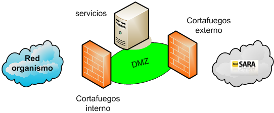
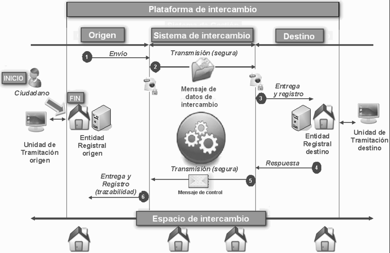
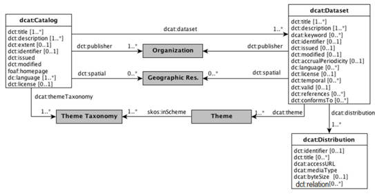

# Conceptos básicos

**ENI**: establece los principios y directrices de interoperabilidad en el
intercambio y conservación de la información electrónica por parte de
las AAPP (Real Decreto 4/2010, de 8 de enero).

**NTI**: concretan detalles para facilitar los aspectos más prácticos y
operativos de la interoperabilidad entre las AAPP y con el ciudadano.

**EIF**: Marco Europeo de Interoperabilidad, cuyas recomendaciones sobre
interoperabilidad fueron tenidas en cuenta para la elaboración del ENI y sus NTI.

**Modelo de datos**: Conjunto de definiciones (nivel conceptual),
interrelaciones (nivel lógico), y reglas y convenciones (nivel físico)
que permiten describir los datos para su intercambio.

**PGDE**: Política de gestión de documentos electrónicos.
Define las directrices para la creación y gestión de Documentos.
Su definición es la primera medida para realizar el archivo electrónico.

# Ojetivos

* Establecer los **criterios y recomendaciones** que deben seguir las AAPP
para garantizar la interoperabilidad y la no discriminación de los ciudadanos
por razón de su elección tecnológica.
* Proporcionar los **elementos comunes** para facilitar la interacción de las AAPP,
y comunicar los requisitos de interoperabilidad a la industria.
* Facilitar la **implantación de políticas de seguridad**, contribuyendo a una
favoreciendo racionalidad técnica y economía de escala.

La interoperabilidad se concibe, al igual que la seguridad, desde una perspectiva integral.

# Elementos

* **Principios básicos de interoperabilidad**: La interoperabilidad:
    * como cualidad integral presente desde la concepción y
    a lo largo de todo el ciclo de vida.
    * con carácter multidimensional (organizativo, semántico y técnico)
    * con enfoque de soluciones multilaterales para obtener las ventajas derivadas
    del escalado, de las arquitecturas modulares y multiplataforma y de compartir,
    reutilizar y colaborar
* **Interoperabilidad organizativa**:
    * establecer y publicar las condiciones para el consumo de servicios puestos
    a disposición del resto de entidades
    * ofrecer servicios a través de la **Red SARA**
    * mantener inventario de procedimientos y servicios
    * mantener relación actualizada de los órganos administrativos,
    oficinas de registro y atención al ciudadanos, y las relaciones entre ellos
* **Interoperabilidad semántica**: Identificar, inventariar y publicar
**modelos de datos** con carácter común (CISE)
* **Interoperabilidad técnica**: Uso de **estándares abiertos** y, de forma
complementaría, estándares de uso generalizado con respecto a:
    * documentos y expedientes electrónicos puestos a disposición o requeridos del ciudadano
    * aplicaciones y servicios en su relación con el ciudadano y otras entidades (ej: sede electrónica)
* **Infraestructuras y servicios comunes**:
    * enlazar infraestructuras y servicios de las AAPP con las infraestructuras
    y servicios comunes de la AGE
    * intercambio de asientos registrales a través de **ORVE** y **SIR**
* **Utilización, preferentemente, de la Red SARA**:
    * conectar la red de la entidad a la Red SARA
    * aplicar el Plan de Direccionamiento de la Administración
    * sincronizar las aplicaciones y servicios con la hora oficial a través
    del Real Instituto y Observatorio de la Armada o los servicios de la Red SARA
* **Reutilización** y transferencia de tecnología:
    * licenciar como **EUPL** (o equivalente) las aplicaciones susceptibles de ser reutilizadas
    * inventariar en el **CTT** las aplicaciones para su libre reutilización
    * reutilizar las soluciones ya disponibles en el CTT
    * publicar el código fuente con licencias de libre reutilización
* **Interoperabilidad de la firma electrónica y de los certificados**:
adopción de la política de firma electrónica y de certificados de la AGE
o uso de esta como referencia para elaborar la propia. Rige aspectos relativos a:
    * validación de certificados y firmas electrónicas
    * listas de confianza
    * aplicaciones usuarias
    * prestadores de servicios de certificación (TSL)
    * plataformas de validación de certificados y firma electrónica (ej @firma)
* **Recuperación y conservación del documento electrónico**:
    * definir y publicar la **PGDE**
    * definir los calendarios de conservación de los documentos y expedientes
    * definir normativa interna en cuanto a la generación de copias autenticas
    * definir el esquema institucional de metadatos
    * cumplir el ENS, el RGPD y el LOPD-GDD
    * utilizar preferentemente firmas longevas
    * digitalizar los documentos en soporte papel

# Las NTI

El ENI establece la serie de NTI que son de obligado cumplimiento por las AAPP
que desarrollan aspectos concretos de la interoperabilidad entre las AAPP
y con los ciudadanos.

## [Catálogo de estándares](https://administracionelectronica.gob.es/pae_Home/dam/jcr:97912041-c1c3-47c4-b517-df9f51db321d/Guia_aplicacion_Norma_Tecnica_Interoperabilidad_Catalogo_de_estandares.pdf)

**Aprobación**: BOE-A-2012-13501

**Objetivo**: Establecer el conjunto de estándares que son abiertos o de uso
generalizado por los ciudadanos.

Un **Catálogo de estándares** esta estructurado en diferentes categorías,
incluye al menos los estándares mínimos para cumplir las NTI (esto es, cualquier
estándar mencionado explícitamente en alguna NTI) e indica
el estado (*Admitido* o *En abandono*) de cada estándar dentro del ciclo de vida.

La actualización y revisión del Catálogo de estándares se realiza al menos
una vez al año.

En la Resolución se listan los estándares del catálogo:

* Accesibilidad multicanal, integrada y segura:
    * Autenticación:
        * Firma electrónica: CAdES, CMS, ETSI TS 102 176-1, PAdES, *<del>PDF Signature</del>*, <del>PKCS#7</del>, (XAdES), XML-DSig
        * Política Firma electrónica: ETSI TR 102 038, ETS TR 102 272
    * Cifrado: TLS
    * Codificación:
        * Codificación de caracteres: Base16, Base32 y Base64, UCS UTF
        * Idioma: RFC 4646, ISO 639
    * Formatos ficheros:
        * Cartografía vectorial y Sistemas de Información Geográfica: GML, WFS, WMS
        * Compresión de ficheros: GZIP, ZIP
        * Contenedores multimedia: *<del>AVI</del>*, MPEG-4, MP4 media
        * Imagen y/o texto: [CSV](https://es.wikipedia.org/wiki/Valores_separados_por_comas "Valores separados por comas"){.abbr}, HTML, CSS, JPEG, MHTML, ISO/IEC 263002006 OASIS 1.2, Strict Open XML, PDF, PDFA, PMG, *<del>RTF</del>*, SVG, TIFF, TXT
        * Sonido: *MP3. MPEG-1 Audio Layer 3*, OGG-Vorbis
        * Video: *MPEG-4*, *MP4 Video*, WebM
    * Gestión documental y archivística: *ISAAR CPF*, *ISAD (G)*, *ISDF*, *NEDA*, UNE-ISO 30300, UNE-ISO 30301, UNE-ISO 15489, UNE-ISO 23081
    * Integridad: SHA
* Infraestructuras y servicios asociados:
    * Integridad: LDAP
    * Protocolos de comunicación e intercambio:
        * Correo electrónico: MIME, SMTP
        * Tecnologías de transporte y red: DNS, HTTP, IPSec, NTP
* Integración de sistemas y servicios:
    * Autenticación:
        * Certificados: OCSP
        * Sellado de tiempo: ETSI TS 102 023
    * Protocolos de comunicación e intercambio:
        * Servicios Web: SOAP, UDDI, WSDL, WS-Security
    * Tecnologías para identificación: ASN.1, OID, URI, URL, URN
* Modelos e integración de datos:
    * Métricas: ISO 8601:2004
    * Protocolos de comunicación e intercambio:
        * Específicos a nivel de aplicación: CODICE, Facturae, SCSP, SICRES
    * Semántica: DCAT
        * Metadatos: MoReq, *PREMIS*, INSPIRE Metadata Regulation
        * Tecnologías semánticas: N3, OWL, RDF, RDFa, SKOS, SPARQL, Turtle
    * Tecnologías de integración de datos: XML, XSD

**Nota**: En cursiva los que son de tipo *Uso generalizado* y no *Abierto*,
tachados los que están en estado *En abandono* y no en *Admitido*.

## [Documento electrónico](https://administracionelectronica.gob.es/pae_Home/dam/jcr:9e80361c-2550-4a7e-b99e-20ea123b4aef/Guia_NTI_documento_electronico_EPUB_2ed_2016.epub)

**Aprobación**: BOE-A-2011-13169

Esta NTI recoge los requisitos mínimos sobre la estructura y formato de los
documentos para su intercambio y por tanto para la interoperabilidad.

**Objetivo**: describir los componentes del documento electrónico, contenido,
en su caso, firma electrónica y metadatos, así como la estructura y formato
para su intercambio.

**Ámbito**: documentos administrativos electrónicos y documentos susceptibles
de formar parte de un eExpediente. Ej:

* Documentos de decisión: resoluciones, acuerdos, contratos, convenios y declaraciones
* Documentos de transmisión: comunicaciones, notificaciones, publicaciones y acuses de recibo
* Documentos de constancia: actas, certificados y diligencias
* Documentos de juicio: informes
* Documentos de ciudadano: solicitudes, denuncias, alegaciones, recursos,
comunicaciones, facturas y otros incautados
* Otros: documentos de organizaciones / ciudadanos objeto de intercambio

Un eDoc puede estar formado por varios ficheros (ej: fichero de texto + fichero
de imagen), varias firmas asociadas y varios conjuntos de metadatos vinculados a
cada fichero individual, pero a efectos de tratamiento, gestión y conservación
constituye un único objeto electrónico.

El eDoc debe tener sentido completo y ser susceptible de identificación
y tratamiento diferenciado, y constituya evidencia de acciones.

**Componentes** del eDoc:

* Contenido: conjunto de datos del documento.
* Firma electrónica: permite detectar cambios posteriores a la firma y esta
vinculada de forma única al firmante y a los datos. todos los documentos
susceptibles de estar en un eExpediente deben tener al menos una firma, cuyo
tipo puede ser un CSV o una firma basada en certificados (base64).
* Metadatos: proporciona contexto (propiedades relativas a la gestión/conservación
de los documentos) y da caracter probatorio del eDoc en el tiempo.
El NTI no especifica la implementación pero si sus condiciones de intercambio y
reproducción.

**Metadato de gestión** de documentos: Información estructurada o semiestructurada
que hace posible la creación, gestión y uso de documentos a lo largo del tiempo.
Sirven para identificar, autenticar y contextualizar documentos, y a las personas,
los procesos y los sistemas que los crean, gestionan, mantienen y utilizan.

**Metadatos mínimos obligatorios**:

* Versión NTI: http://administracionelectronica.gob.es/ENI/XSD/v1.0/documento-e
* Identificador: ES_ORGNAO_AAAA_IDespecífico (ej: ES_E00010207_2010_MPR000000000000000000000010207)
* Órgano: Código alfanumérico único para cada órgano/unidad/oficina extraído del DIR3
* Fecha de captura: YYYY-MM-DDTHH:MM:SS (ISO 8601)
* Origen: 0 = Ciudadano, 1 = Administración
* Estado de elaboración:
    * Original (Ley 11/2007 Art. 30)
    * Copia electrónica auténtica con cambio de formato (Ley 11/2007 Art. 30.1)
    * Copia electrónica auténtica de documento papel (Ley 11/2007 Art. 30.2 y 30.3)
    * Copia electrónica parcial auténtica
    * Otros
* Nombre de formato: Formato lógico del fichero de contenido del documento electrónico
(ha de ser uno de los listados en la NTI de Catálogo de estándares)
* Tipo documental:
    * Documentos de decisión:
        * Resolución
        * Acuerdo
        * Contrato
        * Convenio
        * Declaración
    * Documentos de transmisión:
        * Comunicación
        * Notificación
        * Publicación
        * Acuse de recibo
    * Documentos de constancia:
        * Acta
        * Certificado
        * Diligencia
    * Documentos de juicio:
        * Informe
    * Documentos de ciudadano:
        * Solicitud
        * Denuncia
        * Alegación
        * Recursos
        * Comunicación ciudadano
        * Factura
        * Otros incautados
    * Otros
* Tipo de firma: CSV o alguno de los formatos de firma electrónica listados en
la NTI de Política de firma y certificados de la Administración:
* Si *Tipo firma* = CSV:
    * Valor CSV
    * Definición generación CSV: Referencia a la Orden, Resolución o documento
    que define la creación del CSV correspondiente (ej: BOE-A-YYY-XXXXX)
* Si *Estado de elaboración* = *Copia electrónica auténtica con cambio de formato (Ley 11/2007 Art.30.1)*
o *Copia electrónica parcial auténtica*:
    * Identificador de documento de origen: ES_ORGNAO_AAAA_IDespecífico

### Intercambio de Documentos electrónicos

Salvo acuerdo excepcional entre las AAPP, la estructura
consiste en un XML (definido por esquemas XSD) dividido en tres bloques: contenido (normalmente en base64),
metadatos obligatorios (salvo *Valor CSV* y *Definición generación CSV* que irán
en el bloque firma) y firma (incluye los metadatos de firma).
Preferentemente se usar la Red Sara como medio de transmisión.
Si el eDoc forma parte de un asiento registral éste será tratado como un
documento adjunto al mensaje de datos de intercambio.

Figura 1: [XSD de Documento electrónico]({filename}/posts/xsd/documentoEni.md)

**Acceso a eDocs** en eSedes debe mostrar:

* El contenido del documento electrónico cuando éste sea representable
* Descripción y valor de los metadatos mínimos obligatorios
* La información básica de cada una de las firmas del documento de la siguiente
manera:

| Tipo firma | Información   | Localización |
|:-----------|:--------------|:-------------|
| **CSV**    | valor del CSV | metadato     |
| **Firma basada en certificados (base64)** | validez de la firma | Según reglas de validación de firma de la NTI de Política de firma y certificados de la Administración |
| ^ | Información del firmante(s) del documento (persona física, jurídica o sello de órgano) | Propiedades o etiquetas de la firma |
| ^ | Emisor del certificado del firmante(s) | ^ |
| ^ | Fecha y hora de la firma(s) | ^ |

Tabla 1: Información básica de firma

## [Digitalización de documentos](https://administracionelectronica.gob.es/pae_Home/dam/jcr:2650cc88-b8d7-4e21-9bfd-b291b51ff290/Guia_NTI_digitalizacion_EPUB_2ed_2016.epub)

**Aprobación**: BOE-A-2012-13501

**Objetivo**: establecer los requisitos mínimos a cumplir en la digitalización de
documentos no electrónicos (ej: papel) a través de medios fotoeléctricos.

**Ambito**: cualquier órgano de la AP o Entidad de Derecho Público vinculada
o dependiente de aquélla sobre cualquier documento en soporte papel u otro
soporte susceptible de digitalización, independientemente de que hubiese sido
aportado por el ciudadano o generado por una organización.

Un **eDoc digitalizado esta compuesto** por:

* imagen electrónica
* metadatos mínimos obligatorios en la NTI de Documento electrónico, siendo
el metadato *Estado de elaboración* = *Copia electrónica autentica con cambio de formato*
* metadatos opcionales de la NTI de Política de gestión de eDocs (ej: resolución,
tamaño, idioma)
* si procede, firma de la imagen electrónica (eSello o CSV)

**Requisitos de la imagen electrónica**:

* Usar uno de los formatos del NTI de Catálogo de estandares (JPEG, PNG, TIFF, SVG, PDF o PDF/A)
* El nivel de **resolución** mínimo para imágenes electrónicas será de
**200 píxeles por pulgada**, tanto en blanco y negro, color o escala de grises
* La imagen será **fiel al documento** origen (respetará la geometría del original
en tamaños y proporciones y no contendrá caracteres o gráficos que no figurasen
en el original)

**Proceso de digitalización**: Conlleva las siguientes tareas:

1. Digitalización por medio fotoeléctrico
2. Si procede, optimización automática de la imagen electrónica para garantizar
su legibilidad (ej: umbralización, reorientación, eliminación de bordes negros)
3. Asignación de los metadatos
4. Si procede, firma de la imagen electrónica

Si se realiza los dos últimos pasos se obtendrá un *eDoc completamente conformado*,
en caso contrarío sera un *eDoc pendiente de completar*.

En cuanto a la destrucción de originales tras la digitalización hay que cumplir
con el **Real Decreto 1164/2002**:
La eliminación de documentos sólo podrá llevarse a cabo tras una valoración
documental por parte de la Comisión Superior Calificadora de Documentos Administrativos,
que acredite que los documentos originales no poseen valor histórico o artístico,
ni utilidad para la gestión administrativa que exija su conservación.
Además, los documentos originales cuya eliminación se propone deberán carecer de
valor probatorio para los derechos y obligaciones de las personas físicas o jurídicas.

## [Expediente electrónico](https://administracionelectronica.gob.es/pae_Home/dam/jcr:e9a3f923-6be7-49bd-b05d-fb07ecb7b1b4/Guia_NTI_expediente_electronico_EPUB_2ed_2016.epub)

**Aprobación**: BOE-A-2011-13170

**Objetivo**: establecer la estructura del eExpediente y las especificaciones
de los servicios de remisión y puesta a disposición.

**Ambito**: eExpedientes y similares, es decir,  documentos electrónicos que
se han formado mediante agregación y como resultado de una secuencia de
actuaciones coherentes que conducen a un resultado específico.

Un **expediente electrónico** es un conjunto de documentos correspondiente a un
procedimiento administrativo y esta compuesto por:

* **Documentos electrónicos**: documentos que cumplen la NTI de Documento Electrónico
(es decir, contenido + firma + metadatos). Estos documentos
pueden estar incluidos en el eExpediente de varias formas:
    * directamente como elementos independientes
    * dentro de una **carpeta** (agrupación por motivo funcional para la
      que no existe normativa especifica)
    * como parte de un **sub-eExpediente** (un sub-eExpediente evoluciona
      según su propio procedimiento con independencia del eExpediente que
      lo contiene, pero sus cambios si se reflejan en el eExpediente padre)
* **Indice electrónico**: reflejar la disposición de los documentos y otros datos
con el fin de preservar la integridad y permitir su recuperación
* **Firma** de indice: CSV o basada en certificados
* **Metadatos**

**Metadatos mínimos obligatorios**:

* Versión NTI: http://administracionelectronica.gob.es/ENI/XSD/v1.0/documento-e
* Identificador: ES_ORGNAO_AAAA_IDespecífico (ej: ES_E00010207_2010_MPR000000000000000000000010207)
* Órgano: Código alfanumérico único para cada órgano/unidad/oficina extraído del DIR3
* Fecha Apertura Expediente: YYYY-MM-DDTHH:MM:SS (ISO 8601)
* Clasificación: Procedimiento administrativo con el que se relaciona el expediente
(esquema de valores normalizado según el SIA o, si no se encuentra en SIA, *Órgano_PRO_IDPROespecífico*)
* Estado: Estado del expediente en el momento de intercambio
    * Abierto
    * Cerrado
    * Índice para remisión cerrado
* Interesado:
    * Si es ciudadano o persona jurídica: DNI, NIE, NIF o similar
    * Si es administración: *Órgano*
* Tipo de firma: CSV o alguno de los formatos de firma electrónica listados en
la NTI de Política de firma y certificados de la Administración:
* Si *Tipo firma* = CSV:
    * Valor CSV
    * Definición generación CSV: Referencia a la Orden, Resolución o documento
    que define la creación del CSV correspondiente (ej: BOE-A-YYY-XXXXX)

La definición del **ciclo de vida del eExpediente** no entra en el ámbito de
la NTI, sin embargo para facilitar la compresión sobre los eExpediente describe
dicho ciclo en las siguientes fases:

* **Apertura**:
    * Creación del objeto administrativo digital *expediente*
    * Creación del indice electrónico
    * Inclusión en el indice de las referencias a los documentos iniciales
    (luego pueden incluirse más)
    * Asignación de metadatos mínimos
* **Tramitación**:
    * Inclusión de nuevos documentos referenciandolos en el indice
    * Cambios de estado o características, lo cual se refleja en los metadatos
    * Generación de sub-eExpedientes objeto de intercambio generalmente provocados
    por solicitudes de remisión o puesta a disposición de un expediente
    (en cualquier caso sirven para dar fijeza al estado del expediente en un
    determinado momento)
    * Adicción de metadatos complementarios
    * Cierre formal del expediente, implica:
        1. compleción del índice y metadatos del expediente
        2. foliado o indizado del expediente, esto puede añadir al indicie elementos
        como:
            * identificadores de los eDocs que componen el expediente
            * huellas digitales de los eDocs (función resumen)
            * fecha de incorporación de cada eDoc
            * orden de cada eDoc detro del expediente
            * datos generales sobre el expediente (ej: fecha de apertura, fecha de cierre)
        3. firma del indice del expediente
* **Conservación y selección**: transcurrido el periodo de validez administrativa
de un expediente, aquellos expedientes o documentos con valor efímero se eliminan
reglamentariamente, mientras que los que tienen valor a largo plazo por su
utilidad administrativa, jurídica, archivística, histórica o de investigación y social,
se conservan permanentemente cumpliendo lo establecido en la
NTI de Política de gestión de documentos electrónicos

### Intercambio de expedientes

El intercambio de expedientes electrónicos, a los efectos de remisión y puesta a
disposición, se realiza (preferentemente usando la Red SARA) siguiendo estos pasos:

1. Envió de la estructura definida por la NTI, ver figura 2 (si hay acuerdo previo entre AP pueden usar otra)
2. Envió de cada uno de los eDocs que componen el expediente en el orden indicado
en el indice

Figura 2: [XSD de Expediente Electrónico]({filename}/posts/xsd/expedienteEni.md) *VisualizacionIndice* es un elemento opcional que permite visualizar el contenido completo del expediente (contenido del índice)

Cuando la naturaleza o la extensión de las pruebas o documentos que forman parte
del expediente electrónico no permitan o dificulten notablemente su inclusión
en una de las estructuras establecidas, se incorporará al expediente electrónico
un documento en el que se especifique cuales son estas pruebas o documentos.
Dichas pruebas o documentos serán custodiados por el órgano gestor y podrán ser
aportadas de forma separada cuando así se requiera.

El índice electrónico de los expedientes incluirá al menos:

* la fecha de generación del índice
* de cada documento electrónico:
    * identificador
    * huella digital, la función resumen utilizada para su obtención
    * opcionalmente, la fecha de incorporación al expediente y el orden del documento dentro del expediente

Figura 3: [XSD del contenido del indice de un Expediente Electrónico]({filename}/posts/xsd/IndiceContenidoExpedienteEni.md) 
*ExpedienteIndexado* equivale al *IndiceContenido* de otro expediente 
*CarpetaIndexada* es similar pero en lugar de tener un *FechaIndiceElectronico*
tiene un *IdentificadorCarpeta*

Si el eExpediente forma parte de un asiento registral, éste será tratado como
adjunto del mensaje de datos de intercambio según lo establecido en la
NTI de Modelo de Datos para el intercambio de asientos entre las Entidades Registrales.

En caso de intercambio de eExpedientes entre AAPP que suponga una transferencia
de custodia o de responsabilidad de gestión, la entidad transferidora verificará la
autenticidad e integridad del expediente en el momento del intercambio.

## [Política de firma electrónica y de certificados de la Administración](https://administracionelectronica.gob.es/pae_Home/dam/jcr:94d16f9b-40be-4966-ac76-b21c5cb7a013/Guia_NTI_politica_firma_electr_EPUB_2ed_2017.EPUB)

**Nota**: También llamada *Política de firma y sello electrónicos y de certificados de la Administración*

**Aprobación**: BOE-A-2016-10146

**Objetivo**: establecer criterios comunes de la AP para autenticar y reconocer
mutuamente firmas y sellos electrónicos basados en certificados.

La NTI no es la política en si misma, si no las directrices generales para definir
esa política.

Toda **política de firma electrónica** basada en certificados incluirá:

* Definición del alcance y ámbito de aplicación (incluye *reglas comunes* y
  *reglas de confianza*)
* Datos identificativos del documento y el responsable de su gestión:
      * Nombre documento, versión, identificador, URI, fecha expedición,
      ámbito de aplicación y periodo de validez
      * ID gestor y dirección de contacto
* Identificación de los actores involucrados, que pueden ser:
    * firmante
    * verificador
    * PSC
    * Emisor y gestor de la política de firma
* Usos de la firma electrónica: Condiciones pera la aplicación de la eFirma como
podrían ser:
    * firma de transmisión de datos, que garantiza autenticación de los
    actores involucrados, integridad y no repudio del mensaje
    * firma de contenido (equivalente a firma manuscrita), también garantiza
    autenticidad, integridad y no repudio del contenido pero no implica
    necesariamente transmisión de datos
* Interacción con otras políticas:
    * Posibilidad de acogerte o basarse en una política marco en vez de
    desarrollar una propia
    * Obligación de se interoperable con la
    Política Marco de Firma Electrónica basada en Certificados
    * Las reglas de la política deben estar disponible en XML y ASN.1.
    para que las aplicaciones puedan interpretarlas
* Gestión de la política: mantener actualizada la política
* Archivad y custodia: definición de condiciones y responsabilidades para el archivado y custodia de las firmas electrónicas en sus diferentes aplicaciones
(ej: firmas longevas)

Las **reglas comunes** para el firmante y verificador de la firma electrónica
han de incluir:

* Formatos admitidos de firma electrónica (XAdES, CAdES y PAdES) y reglas de uso
de algoritmos: (el perfil mínimo de formato es el [EPES]({filename}01-firma.md#prefil-formato))
* Reglas de creación de firma
* Reglas de validación de firma

*Nota* Concretamente los
[formatos de firma electrónica]({filename}01-firma.md#formatos-de-firma-(hash-y-cifrado-asimétrico))
de contenido (el cual vendrá identificado en el metadato *Tipo de firma* como se
indico en la NTI Documento electrónico) pueden ser:

* XAdES internally detached signature
* XAdES enveloped signature
* CAdES detached/explicit signature
* CAdES attached/implicit signature
* PAdES
* XAdES (Decision 1506) detached
* XAdES (Decision 1506) enveloped
* CAdES (Decision 1506) detached
* CAdES (Decision 1506) attached
* PAdES (Decision 1506)

Las **reglas de confianza** deben incluir los requisitos establecidos para
certificados, sellos de tiempo y firmas longevas.

Adicionalmente se pueden añadir reglas como:

* Reglas específicas de compromisos: características específicas de
la firma para cada uno de los servicios que la organización presta a fin de
que se acepten como válidas
* Reglas de certificados de atributos: la organización
establece información adicional a añadir a los certificados digitales
(atributos) en función de las necesidades y el contexto

## Protocolos de intermediación de datos

**Aprobación**: BOE-A-2012-10049

**Objetivo**: establecer las especificaciones para el intercambio intermediado de
datos entre organismos.

Los **intercambios intermediados** son el modelo recomendado por la UE, la OCDE y
la ONU como herramienta de interoperabilidad que permite la normalización y
reutilización de los servicios de intercambio.

La NTI define los roles de los agentes que participan en los intercambios intermediados
de datos, y las condiciones relativas a los proceses de intercambio intermediado
a través de la plataforma de intermediación del MINHAP (también se puede aplicar
a las de otras AP)

Los agentes son:

* **Cedente**: cualquier organización que posea datos relativos a los ciudadanos
que otra pueda necesitar
    * facilita la información para el catálogo o registro de sus servicios de
    intercambio
    * establece los métodos de consulta, protocolos y condiciones de acceso
    * justifica los casos de rechazo o denegación de una solicitud
    * define la política de auditoría y las realiza
    * puede delegar todo lo anterior en el Emisor o en un nodo de interoperabilidad
* **Emisor**: el que facilita la cesión de los datos desde un punto de vista tecnológico
    * establece las condiciones técnicas de acceso a los servicios de intercambio
    * proporciona los datos de cada consulta con garantía de integridad y confidencialidad
    * Define el ANS
* **Cesionario**: cualquier organización autorizada a consultar determinados datos
de los ciudadanos en poder de un Cedente
    * solicita información al Cedente cumpliendo sus condiciones
    * recaba el consentimiento del interesado, salvo que la ley le exima de ello
* **Requirente**: el que facilita la consulta de los datos desde un punto de vista
tecnológico
    * cumple las condiciones de accesos del Emisor
    * comprobara la completitud de las consultas y de los datos del Cesionario
    * asegura la seguridad y confidencialidad de las consultas
    * solo almacena la información personal del ciudadano mínima necesaria y
    durante el mínimo tiempo posible

Teniendo en cuenta, que en el ámbito de la norma:

* Un Cedente que facilita la cesión de sus propios datos actuá a la vez como Emisor
* Un Cesionario que realiza directamente la consulta de datos actuá a la vez como
Requirente

La **plataforma de intermediación del MINHAP**:

* gestiona los Cesionarios y Requirentes según las condiciones establecidas por cada Cedente
* no almacena información personal de ningún ciudadano derivada del intercambio de datos
* asegura la confidencialidad e integridad de la información intercambiada
* mantiene un portal web informativo con toda la documentación relativa a la Plataforma
donde, entre otras cosas, esta publicado el catalogo de servicios
* los servicios web que implemente se diseñan en base a:
    * definiciones mediante WSDL
    * mensajes en formato XML con XSD públicos
    * TSL con autenticación de cliente a nivel de transporte o aplicación
* de forma general, en los servicios de intercambio se utiliza la
versión 3.0 del protocolo SCSP
* para garantizar la trazabilidad de los intercambios producidos,
se asocia a cada consulta un identificador único que permite reproducir la
secuencia de operaciones llevadas a cabo

## [Relación de modelos de datos](https://administracionelectronica.gob.es/pae_Home/dam/jcr:c06755c7-3cb8-4854-941c-606d5527ba50/GuiaAplicacion_NTI_RelacionModelosDatos_2%C2%AAed_EPUB_NIPO_630-14-236-5.epub)

**Aprobación**: BOE-A-2012-10050

**Objetivo**: establecer las condiciones para crear y publicar modelos de datos
que se puedan usar a través del CISE. Dichas condiciones son la definición de
formatos y modelos de datos, y su identificación, codificaciones y documentación.

La NTI esta alineada con la SEMIC.EU y el JOINUP de la Comisión Europea.

Los **modelos de datos** han de publicar su **estrucutra** en el CISE con
activos semánticos (XSD) y *Guías explicativas* (PDF). Tales modelos vendrán
identificados por metadatos. El modelo de datos también puede contener las
tablas y códigos asociados que sean necesarios (por ej: tabla de provincias,
comunidades...), de hecho, algunos modelos de datos son solo dichas tablas.

En los modelos, la codificación de los organismos de la AP se hace con DIR3.

Ejemplo: [Este XSD](xsd/activosemantico.xsd) es el *activo semantico*
(o, a efectos prácticos, modelo de datos) de [estos datos](xsd/datos.xml).

Lo que convierte un *activo semántico* en un *modelo de datos* es la inclusión
de este ultimo en el CISE cumpliendo el nivel explicación y formato de detalle
que pide la NTI.

La estructura del modelo de datos con la que se entrega al
CISE esta basada en la del Expediente electrónico y sus metadatos mínimos
obligatorios son:

* Nombre: Nombre identificativo del expediente electrónico
* Órgano: DIR3
* Interés Estadístico
* Localización: URL donde se ubica el expediente electrónico
* Correo-e de la unidad generadora

El CISE posibilita la carga masiva de los modelos de datos a través de la
Red SARA.

## [Política de gestión de documentos electrónicos](https://administracionelectronica.gob.es/pae_Home/dam/jcr:742af184-2b25-4431-a9c6-0681945bcad3/Guia_NTI_Politica_Gestion_DocElect_EPUB_2ed_2016.epub)

**Aprobación**: BOE-A-2012-10048

**Objetivo**: detallar los elementos que debe incluir una PGDE, e indicar directrices
para su desarrollo.

Una PGDE debe contener:

* Definición del **alcance y ámbito** de aplicación
* **Roles** de los actores involucrados
* Directrices para la estructuración y desarrollo de los **procedimientos de gestión documental**
* Acciones de **formación**
* Actuaciones de **supervisión y auditoría** periódicas de los procesos de gestión de documentos
* Proceso de **revisión** de la política para adecuarla a los cambios que surjan
en la gestión de documentos

**Actores** en un PGDE:

* La alta dirección (aprueban e impulsan la PGDE)
* Los responsables de procesos de gestión (aplican la PGDE)
* El personal responsable del programa de tratamiento de documentos (implementan la PGDE)
* El personal implicado en tareas de gestión de eDocs (Usan la PGDE)

La PGDE debe contener un **programa de tratamiento de eDocs** que detalle
el diseño, desarrollo e implantación de los procesos, técnicas y operaciones de
gestión de eDocs, garantizando su ACID-T y permitiendo la
protección, recuperación y conservación física y lógica de los documentos y su contexto.

Según la NTI los **procesos de gestión** de documentos electrónicos mínimos son:

* **Captura** de docs. Incluye tratamiento de metadatos mínimos definidos en
la NTI de Documento Electrónico
* **Registro legal** de docs. Definido en RJSP y PAC. Incluye cumplir la NTI de Digitalización de documentos.
* **Clasificación** de docs con criterios de formación de expedientes según
la NTI de expediente electrónico y clasificación funcional según la organización
* **Descripción** de docs. Asignación de los **metadatos** y la recuperación de la información
* **Acceso** de docs. Regulación, recuperación y trazabilidad
* **Calificación** de docs. Incluye:
    * Determinación de los documentos esenciales
    * Valoración de documentos y determinación de plazos de conservación
    * Dictamen de la autoridad calificadora
* **Conservación** de docs en función de su valor y tipo de dictamen de la autoridad
calificadora y definición de calendarios de conservación
* **Transferencia** de docs entre repositorios y responsabilidades (custodia)
* Destrucción o **eliminación** de docs, según normativa aplicable en
materia de eliminación de Patrimonio Documental y el ENS

Para la **asignación de metadatos** se puede usar de referencia el **e-EMGDE**,
que incluye los metadatos mínimos obligatorios
(NTI de Documento electrónico y Expediente electrónico)
y otros metadatos complementarios pertinentes en una PGDE.

El e-EMGDE se basa en un modelo entidad-relación (*documento*, *agente*,
*actividad*, *regulación* y *relación* son entidades) donde las relaciones y eventos
dejan constancia del contexto. Es decir, las relaciones entre los documentos y
el resto de elementos del sistema son tratadas como una entidad más.

## [Requisitos de conexión a la Red de comunicaciones de las Administraciones Públicas españolas](https://administracionelectronica.gob.es/pae_Home/dam/jcr:fe3103e2-4906-47cb-b9cd-ddaf091cc618/2011-Guia-NT-requisitos-conex-red-AA-PP-esp.pdf)

**Aprobación**: BOE-A-2011-13173

**Objetivo**: establecer las condiciones para acceder a la Red SARA, que permiten
acceder a todas las AP. También permite conectar, a través de sTESTA, con las
Instituciones Europeas y las administraciones de los EEMM.

La Red SARA es administrada por el MPTAP y ofrece los siguientes servicios
(listado no exhaustivo):

* Servicios de Red:
    * Conectividad: Transporte cifrado (VPLS):
        * VoIP
        * Videoconferencia
        * Datos de aplicaciones de negocio
    * Servicios telemáticos básicos: proporcionados a través de *Áreas de Conexión*
    instaladas en los PAS donde la Red SARA tenga presencia
        * DNS
        * SMTP
        * NTP (hora de España)
        * Proxy y Proxy inverso
    * Seguridad perimetral:
        * cortafuegos
        * IDS
        * análisis de vulnerabilidades
        * correlación de logs
* Servicios horizontales de las AP: servicios comunes promovidos directamente
por la DGIAE del MPTAP
    * @Firma
    * SVD
    * CTT
    * Correo multidominio
    * ACCEDA
    * ORVE
    * Inside
    * SIR
    * REÚNETE
    * NOTIFICA
    * SIA
    * ARCHIVE
* Servicios verticales de las AP: propios de cada AP y bajo su responsabilidad
que utilizan la Red SARA como mecanismo para su interoperabilidad.

La conexión a la Red SARA se realiza a través de un PdP, que puede ser de
uno de los tipos siguientes:

* PAS: Organización en cuyas dependencias se implementa una *área de conexión*
para sus órganos dependientes
* CPDs de SARA (MPTAP)
* la red sTESTA
* centros de monitorización externa
* PSC (ej: FNMT y ANCERT)
* Otros, como ventanillas únicas empresariales ubicadas en las Cámaras de Comercio

Generalizando, los intervinientes de una conexión a la Red Sara son
el MPTAP, un PAS, y la propia organización que es el usuario final.

* La *área de conexión* de un PAS funciona como punto único de conexión entre
la red de la AP a la Red SARA y a la Red sTESTA.
* La estructura de la *área de conexión* tiene un esquema DMZ delimitada
por un subsistema de seguridad externo (de cara a la Red SARA) y un subsistema
de seguridad interno (de cara a la Red del organismo)
* El subsistema de seguridad externos es el que establece la VPN hacia el resto
de las sedes de la Red SARA
* En la DMZ debería estar lo mínimo, pero el PAS puede añadir elementos que
considere necesarios si cumple las condiciones del Centro de Soporte de la Red SARA del MPTAP

Figura 4: Esquema lógico de un Área de Conexión

Las organizaciones que se conecten a la Red Sara deben aplicar el
Plan de Direccionamiento de la Administración establecido por la DGIAE

## [Procedimientos de copiado auténtico y conversión entre documentos electrónicos](https://administracionelectronica.gob.es/pae_Home/dam/jcr:6708c782-ee1d-4ea1-bf5d-dd44d7d55e3d/Guia_NTI_procedimientos_copiado_autentico_EPUB_2ed_2016.epub)

**Aprobación**: BOE-A-2011-13172

**Objetivo**: establecer las reglas para la generación de copias electrónicas
auténticas, copias papel auténticas de documentos públicos administrativos
electrónicos y para la conversión de formato de documentos electrónicos.

**Ambito** cualquier órgano de la AP o Entidad de Derecho Público vinculada
o dependiente de aquélla en sus procedimientos de generación de copias auténticas
y en las conversiones de formato de documentos electrónicos.

En la gestión de documentos, hay tres grados de perfección:

* **Borrador**: versiones previas a la versión definitiva validada.
* **Original**: documento definitivo, genuino, validado por su autor.
El documento original es eficaz por sí mismo, sin referencia a otro documento anterior.
* **Copia**: nuevo documento, reproducción del original, y con diferentes grados de perfección,
en relación con su finalidad y con su aproximación al original.

Una **copia auténtica** es un copia de un documento realizada por un funcionario
habilitado para ello y que valor probatorio pleno y la misma validez y eficacia
que el documento original a efectos administrativos. Tipos:

* Copia autentica: *idem*
* Copia autentica **con cambio de formato**: original y copia son electrónicos
pero ha habido un cambio de versión o formato
(*Estado de elaboración* = *Copia electrónica auténtica con cambio de formato*)
* Copia electrónica auténtica **de documentos papel**: copia de un original en
papel a través de medios fotoeléctricos
(*Estado de elaboración* = *Copia electrónica auténtica de documento papel*)
* Copia electrónica **parcial** auténtica: original y copia son electrónicos
pero la copia, por motivos de confidencialidad, representa solo parcialmente
al original (*Estado de elaboración* = *Copia electrónica parcial auténtica*)
* Copia papel auténtica **de documento público administrativo** electrónico:
el origen es un eDoc público administrativo y la copia es en papel.
Ha de incluir impresa la información básica del CSV y/o eFirma (ver [tabla 1](#tb1))

Los metadatos del eDoc copia no tienen por qué coincidir con los del original,
ya que se asignan en función de las propiedades específicas del documento copia,
por ejemplo, la firma, sus metadatos, y en el metadato *Organo* identificaran
al organismo que hace la copia, no al que creo el original.

## [Modelo de Datos para el intercambio de asientos entre las Entidades Registrales](https://administracionelectronica.gob.es/pae_Home/dam/jcr:05989e7c-6f76-40c2-b07d-fe5278e905e5/2013_ENI_GuiaAplicacion_NTI_SICRES_3_0__2_edicion_NIPO_630-13-095-X.pdf)

**Aprobación**: BOE-A-2011-13174 **OJO**, se acaba de actualizar en BOE-A-2021-13749
a SICRES4.

**Objetivo**: normalizar el intercambio de asientos registrales entre distintas
oficinas de registro (físicas y electrónicas) de documentos de entrada y salida.

Para ello se usa la especificación SICRES3, que define le información mínima,
su estructura y los requisitos mínimos tecnológicos necesarios para realizar el intercambio.

SICRES3 se compone de dos mensajes (XML):

* Mensaje de datos de intercambio: creado y emitido por la Entidad Registral de
Origen y alberga, además de campos para el control e identificación,
la información del asiento registral y los documentos correspondientes adjuntos
(ver [SICRES3_INTERCAMBIO_APL.xsd]({filename}/posts/xsd/SICRES3_INTERCAMBIO_APL.md))
* Mensaje de control: emitido por la Entidad Registral destino o
por el propio sistema de intercambio y proporcionan información de estado
para la gestión de la operación de intercambio
(ver [SICRES3_MENSAJE_APL.xsd]({filename}/posts/xsd/SICRES3_MENSAJE_APL.md))

Figura 5: Modelo conceptual de intercambio SICRES3

## [Reutilización de recursos de información](https://administracionelectronica.gob.es/pae_Home/dam/jcr:2314e955-cda1-4314-a764-5af00afe6475/Guia_NTI_EPUB_Reutilizacion_recursos_informacion_2ed.epub)

**Aprobación**: BOE-A-2013-2380

**Objeto**: determinar las pautas básicas para la reutilización de documentos y
recursos de información elaborados o custodiados por el sector público a los que
se refiere el art 3 de la Ley 37/2007.

Una estrategia RISP comprende tres aspectos:

1. **Datos**: la materia prima del RISP
2. **Sitio web**: El medio principal de publicación
3. **Soporte**: Evaluación, formación y promoción

La NTI se centra en el primer punto, es decir, en los pasos de selección y
exposición de la información reutilizable y su posterior publicación.

**Selección**:

* Se consideran prioritarios los recursos de mayor relevancia y potencial
social y económico
* Los recursos reutilizables han de ser primarios, es decir, sin transformación
posterior al origen
* El nivel de granular ha de ser el mínimo posible evitando agregaciones
(excepción: uso de disociación no reversible para proteger datos personales)
* Los recursos han de ser, o tener asociados, información estructurada que permita
el procesamiento automatizado
* Para recursos relevantes pero difícilmente reutilizables (imágenes, videos, etc)
se plantea como alternativa tratar como reutilizable el inventario de esos recursos
y sus metadatos
* Los documentos de elaboración o recogida periódica estarán actualizados a sus últimas
versiones, y se indicará la fecha última actualización y el periodo de la misma

La **identificación de los recursos** de información esta basada en URIs
que cumplen:

* ser únicas y unívocas, estables, extensibles, persistentes en el tiempo y con
garantías de procedencia
* usar HTTP o HTTPS
* el servidor, según la cabecera HTTP, devolverá la representación del recurso
adecuada (xml, xls, pdf...)
* cumple el formato 
`http://{base}/{carácter}[/{sector}][/{dominio}][/{concepto}][.{ext}]` o 
`http://{base}/{carácter}[/{sector}][/{dominio}][.{ext}][#{concepto}]` donde:
    * base: identifica al organismo que gestiona la URI y apunta al espacio dedicado
    a los datos abiertos (por orden de preferencia: `www.sede.gob.es/datosabiertos` o
    `organismo.gob.es/datosabiertos` o `organismo.gob.es`)
    * carácter: representa la naturaleza de la información identificada:
        * catalogo: catálogos de información (`http://{base}/catalogo/{dataset}`)
        * def: vocabulario u ontología, definidos mediante RDF-S y OWL (`http://{base}/def/{sector}/{dominio}/{propiedad|Clase}`, `http://datos.gob.es/def/turismo/hosteleria/horario`)
        * kos: taxonomías, diccionarios o tesauros, normalmente representados con SKOS
        (`http://{base}/kos/{sector}/{dominio}/{Concepto}`, `http://datos.gob.es/kos/turismo/tipo-hotel/5-estrellas`)
        * recurso: recurso u objeto físico o conceptual (instancias de los
          conceptos que se definen en los vocabularios)
          (`http://{base}/recurso/{sector}[/{dominio}]/{clase}/{ID}`, `http://datos.gob.es/recurso/turismo/Hotel/000019278`)
    * sector: concepto que mejor clasifica al recurso según una taxonomía
    predefinida (ej: medio-ambiente)
    * dominio: temática más específica
    * concepto: identifica de forma concreta el recurso en el caso de que sea
    necesario distinguirlo entre otros individuos
    * ext: tipo de formato en el que se representa el documento (ej: html, rdf)
* Siguiendo la filosofía *Linked Data* cualquier recurso semántico tendrá tres URIs:
    * URI abstracto que identifica conceptualmente al recurso en sí
    * URI del documento para personas (HTML o similar)
    * URI de la descripción semántica (expresado en cualquier notación de RDF)
* Si un recurso cambia de localización o es eliminado, se ha de mantener la URI
e informar de la situación usando [códigos HTTP](https://es.wikipedia.org/wiki/Anexo:C%C3%B3digos_de_estado_HTTP)
(3XX para redirecciones, 410 si el recurso ha desaparecido permanentemente)
* La URI debe tener información semántica autocontenida (viendo la URI se sabe a qué recurso accedes)
* La URI no debe mostrar la tecnología de implementación (evitar extensiones: jsp, php,...)
* Idioma: según la norma ISO 639-1 se pondrá después de la base (ej:
`http://organismo.gob.es/es-ES/datosabiertos`). No necesario al gestionar recursos
semánticos porque una sola URI admite varios idiomas para el mismo recurso
* Para facilitar la reutilización y publicación de vocabularios de metadatos se usará el CISE
* En cuanto a los caracteres usados para las URI,:
    * los identificadores alfanuméricos han de ser cortos únicos, representativos, intuitivos y semánticos
    * usar siempre minúsculas, salvo en los casos en los que se utilice el nombre de la clase o concepto
    (EjemploConcepto)
    * Eliminar todos los acentos, diéresis y símbolos de puntuación, a excepción del guión (-)
    que puede usarse como separador de palabras
    * Eliminar conjunciones y artículos en los casos de que el concepto a representar contenga más de una palabra
    * Evitar abreviaturas de palabras salvo que sean intuitivas
    * Los términos que componen los URI usaran las lenguas oficiales

| Ejemplo  |  URI  |
|:-------- | :---- |
| Catálogo de datos | `http://{base}/catalogo` `http://datos.gob.es/catalogo` |
| Conjunto de datos correspondiente al listado de los centros sanitarios en el año 2011 | `http://{base}/catalogo/{dataset}` `http://datos.gob.es/catalogo/centros-sanitarios-2011` |
| ^ | `http://{base}/catalogo#{dataset}` `http://datos.gob.es/catalogo#centros-sanitarios-2011` |
| Vocabulario de centros sanitarios | `http://{base}/def/{sector}/{dominio}` `http://datos.gob.es/def/salud/centros-sanitarios` |
| Clase hospital definida en el vocabulario de centros sanitarios | `http://{base}/def/{sector}/{dominio}/{Clase}` `http://datos.gob.es/def/salud/centros-sanitarios/Hospital` |
| ^ | `http://{base}/def/{sector}/{dominio}#{Clase}` `http://datos.gob.es/def/salud/centros-sanitarios#Hospital` |
| Propiedad especialidad clínica definida en el vocabulario de centros sanitarios | `http://{base}/def/{sector}/{dominio}/{propiedad}` `http://datos.gob.es/def/salud/centros-sanitarios/especialidad` |
| ^ | `http://{base}/def/{sector}/{dominio}#{propiedad}` `http://datos.gob.es/def/salud/centros-sanitarios#especialidad` |
| Esquema de conceptos de tipos de centros educativos | `http://{base}/kos/{sector}/{dominio}` `http://datos.gob.es/kos/educacion/tipo-centro` |
| Concepto de colegio público dentro del esquema de centros educativos | `http://{base}/kos/{sector}/{dominio}/{Concepto}` `http://datos.gob.es/kos/educacion/tipo-centro/Colegio-Publico` |
| ^ | `http://{base}/kos/{sector}/{dominio}#{Concepto}` `http://datos.gob.es/kos/educacion/tipo-centro#Colegio-Publico` |
| Instancia de una entidad orgánica de la AGE | `http://{base}/recurso/{sector}[/{dominio}]/{Clase}/{ID}` `http://datos.gob.es/recurso/sector-publico/Organismo/E02963104` |
| ^ | `http://{base}/recurso/{sector}[/{dominio}]/{Clase}#{ID}` `http://datos.gob.es/recurso/sector-publico/Organismo#E02963104` |
| Documento HTML que describe una instancia de una entidad orgánica | `http://{base}/recurso/{sector}[/{dominio}]/{Clase}/{ID}.{ext}` `http://datos.gob.es/recurso/sector-publico/Organismo/E02963104.html` |
| ^ | `http://{base}/recurso/{sector}[/{dominio}]/{Clase}.{ext}#{ID}` `http://datos.gob.es/recurso/sector-publico/Organismo.html#E02963104` |
| Representación RDF - N3 que describe una instancia de una entidad orgánica | `http://{base}/recurso/{sector}[/{dominio}]/{Clase}/{ID}.{ext}` `http://datos.gob.es/recurso/sector-publico/Organismo/E02963104.n3` |
| ^ | `http://{base}/recurso/{sector}[/{dominio}]/{Clase}.{ext}#{ID}` `http://datos.gob.es/recurso/sector-publico/Organismo.n3#E02963104` |

Tabla 2: Ejemplos de aplicación del esquema URI

La **descripción de la información** se hace a traves de los **metadatos**
obligatorios mínimos usando **DCAT** y **DCMI**, pudiéndose ampliar con otros.

La representación semántica del catálogo y de los conjuntos de recursos
se basa en el vocabulario **DCAT** (usa el espacio de nombres [dcat](http://www.w3.org/ns/dcat#))
de la W3C. Un catálogo de documentos y recursos de información se representa
mediante instancias de la clase dcat:Catalog e incluye una colección de conjuntos
de recursos de información dcat:Dataset.

Figura 6: Diagrama de clases y conceptos para la definición de metadatos

Para los **formatos de documentos** se deben usar estándares abiertos,
y de forma complementaria, estándares que sean de uso generalizado por los
ciudadanos, (NTI del catálogo de estándares) salvo que el formato u origen
desaconseje o imposibilite la transformación a estos formatos.

Se debe incluir un aviso legal de **términos y de uso** que indique:

* Condiciones generales para la reutilización (ej: prohibición de desnaturalizar
el sentido de la información, obligatoriedad de citar la fuente de los datos)
* Exclusión de responsabilidad del organismo publicador.
* Responsabilidad del agente reutilizador.
* Información sobre cómo reflejar la atribución.

Cada organismo deberá proporcionar información sobre su catálogo de datos
reutilizables en un espacio dedicado para ese fin, preferentemente localizado en:
`http://www.sede.gob.es/datosabiertos`.

<!--
## Reutilización y transferencia de tecnología

## Declaración de conformidad con el Esquema Nacional de Interoperabilidad
-->

# Bibliografía

* PreparaTic27 - Pack1/045
* PreparaTic27 - Pack1/046
* [administracionelectronica.gob.es - ENI](https://administracionelectronica.gob.es/ctt/eni)
* [administracionelectronica.gob.es - Interoperabilidad](https://administracionelectronica.gob.es/pae_Home/pae_Estrategias/pae_Interoperabilidad_Inicio.html)
* [geoslab.com - El reto de los PID](https://www.geoslab.com/es/blog/el-reto-de-los-identificadores-persistentes)
* [programminghistorian.org - Introducción a los Datos abiertos enlazados](https://programminghistorian.org/es/lecciones/introduccion-datos-abiertos-enlazados)
