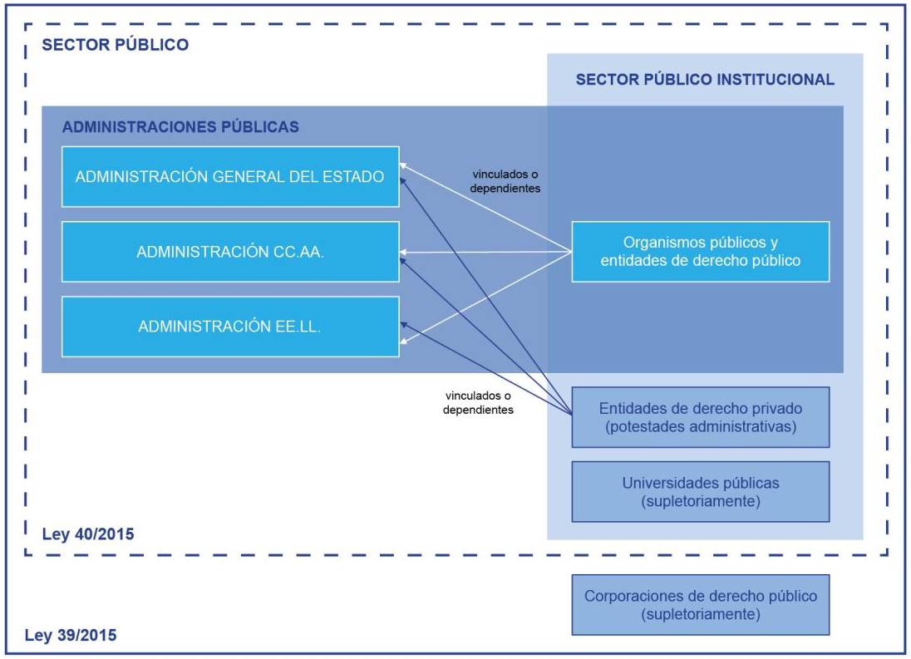

# Conceptos básicos

**ENS**: establece la política de seguridad en la utilización de medios
electrónicos y está constituido por **principios básicos** y **requisitos mínimos**
que permitan una protección adecuada de la información. Fue aprobado en
el Real Decreto 3/2010, de 8 de enero.

**ACID-T**: Dimensiones de seguridad contempladas por el ENS; Autenticidad,
Confidencialidad, Integridad, Disponibilidad y Trazabilidad.

**Política de seguridad**: Todos los órganos superiores de las AAPP
deben tener una que siga los principios básicos y requisitos mínimos
del ENS

**[Guías 800 de seguridad CCN-STIC](https://www.ccn-cert.cni.es/guias/guias-series-ccn-stic/800-guia-esquema-nacional-de-seguridad.html)**:
normas, instrucciones, guías y recomendaciones para aplicar el ENS.

# [Principios básicos](https://www.boe.es/buscar/act.php?id=BOE-A-2010-1330#a4)

* Seguridad integral
* Gestión de riesgos
* Prevención, reacción y recuperación
* Líneas de defensa: estrategia de protección constituida por varias capas
(constituidas por medidas de naturaleza organizativa, física y lógica) para:
    * ganar tiempo para racionar a los incidentes que no han podido evitarse
    * reducir la probabilidad de que el sistema sea comprometido en su conjunto
    * minimizar el impacto final sobre el mismo
* Reevaluación periódica
* Función diferenciada: En los sistemas de información se diferenciará el
responsable de la información, el responsable del servicio y el responsable de
la seguridad de manera que:
    * el responsable de la información determina los requisitos de la información tratada
    * el responsable del servicio determina los requisitos de los servicios prestados
    * el responsable de seguridad determina las decisiones para satisfacer los
    requisitos de seguridad de la información y de los servicios

Este último punto implica que la responsabilidad de la seguridad de los sistemas
de información estará diferenciada de la responsabilidad sobre la prestación
de los servicios, y que la política de seguridad debe detallar las atribuciones
de cada responsable y los mecanismos de coordinación y resolución de conflictos.

# [Requisitos mínimos](https://www.boe.es/buscar/act.php?id=BOE-A-2010-1330#a11)

* Organización e implantación del proceso de seguridad: la política de seguridad
debe ser conocida por todos e identificar a sus responsables
* Análisis y gestión de los riesgos: se han de usar metodologías reconocidas
internacionalmente
* Gestión de personal:
    * formación del personal relacionado con la información
    * para corregir o exigir responsabilidades, se identifica de forma única
    quien recibe derechos de acceso, de que tipo y quien ha realizado determinada acción
* Profesionalidad: contar con personal cualificado
* Autorización y control de los accesos
* Protección de las instalaciones: mínimo salas cerradas y control de llaves
* Adquisición de productos
* Seguridad por defecto:
    * los sistemas deben solo ofrecer la funcionalidad mínima necesaria
    * una utilización insegura debe requerir de un acto consciente por parte del usuario
* Integridad y actualización del sistema: toda actualización requiere una autorización
formal
* Protección de la información almacenada y en tránsito:
    * se considera como entornos inseguros los equipos portátiles, PDAs,
    dispositivos periféricos y redes abiertas o con cifrado débil
    * la información en soporte no electrónico derivada de información electrónica
    también debe ser objeto de seguridad
* Prevención ante otros sistemas de información interconectados: el sistema ha
  de proteger el perímetro, en particular, si se conecta a redes públicas
* Registro de actividad: registro de la actividad de los usuarios (respetando el RGPD)
para monitorizar, analizar, investigar y documentar actividades indebidas o no autorizadas,
permitiendo identificar en cada momento a la persona que actúa
* Incidentes de seguridad: detección, reacción y registro de incidentes
* Continuidad de la actividad: copias de seguridad y alta disponibilidad
* Mejora continua del proceso de seguridad

Las medidas a tomar para cumplir los requisitos básicos dependen de la
categoría del sistema y las dimensiones de seguridad (ACID-T).

# Ámbito del ENS

La Guía CCN-STIC-830 desarrolla el ámbito de aplicación del ENS.

1. Ámbito objetivo o material: hardware, software, soporte de información,
comunicaciones, instalaciones, personal y servicios de terceros,
que formen parte de sistemas que gestionen las competencias de entidades públicas
y/o contribuyan a desarrollar el procedimiento administrativo.
2. Ámbito subjetivo: el *sector público* como se detalla en la
[Ley 40/2015](https://www.boe.es/buscar/act.php?id=BOE-A-2015-10566#a2) y
la [Ley 39/2015](https://www.boe.es/buscar/act.php?id=BOE-A-2015-10565#a2):
    * AGE
    * CCAA
    * EELL
    * Sector público institucional:
        * organismos públicos y entidades de derecho público vinculados o dependientes de las AAPP
        * entidades de derecho privado vinculadas o dependientes de las AAPP
        * universidades públicas
    * corporaciones de Derecho Público
3. pudiendo quedar excluidos los sistemas que determinen las AAPP si estos
no esta relacionados con:
    * el ejercicio de derechos ni cumplimiento de
    deberes por medios electrónicos
    * el acceso por medios electrónicos de los
    ciudadanos a la información y al procedimiento administrativo

Figura 1: Ámbito de aplicación subjetivo del ENS

La adecuación de los sistemas al ENS se detalla en CCN-STIC-806.

# [Categoría de un sistema](https://www.boe.es/buscar/act.php?id=BOE-A-2010-1330#ani)

La categoría de un sistema se basa en cuan grave sería un incidente que afectara
a la seguridad de los activos en alguna dimensión ACID-T. Se busca determinar
el equilibrio entre la importancia del activo y el esfuerzo de seguridad requerido
(proporcionalidad entre los riesgos y las medidas de seguridad).

La operativa para designar la categoría es la siguiente:

1. Asignar un nivel (bajo, medio o algo) a cada dimensión de seguridad:
    * el responsable de la información valora el nivel de los activos de información
    * el responsable del servicio valora el nivel de los activos de servicio
2. El responsable de sistema asigna la categoría en función del máximo nivel alcanzado:
    * nivel alto -> categoría alta
    * nivel medio -> categoría media
    * nivel básico -> categoría básica

|                            | BAJO            | MEDIO             | ALTO          |
|:---------------------------|:----------------|:------------------|:--------------|
| **Tipo de perjuicio**      | **LIMITADO**    | **GRAVE**         | **MUY GRAVE** |
| **<abbr title="Reducción de forma apreciable de la capacidad de la organización para atender eficazmente con sus obligaciones corrientes">Red. capacidad</abbr>** | apreciable pero sin interrupción |  significativa pero sin interrupción | anulación de la capacidad |
| **Daño en activos**        | menor           | significativo     | muy grave o irreparable |
| **Incumplimiento de ley o regulación**   | formal subsanable | material o formal no subsanable | grave |
| **Prejuicio al individuo** | menor reparable | significativo de difícil reparación | grave de difícil o imposible reparación |

Tabla 1: Asignación de niveles en función del tipo de perjuicio

## Guiá CCN-STIC-803: Valoración de sistemas

En la guiá CCN-STIC-803 dan indicaciones de como valorar el nivel de seguridad
de cada dimensión. Para ello propone:

1. Comenzar con la valoración de los activos de tipo **información**
2. Valorarlos en este **orden**: confidencialidad, integridad, trazabilidad, autenticidad
y, si fuera relevante,  disponibilidad (no suele serlo en el tipo *información*)
3. Continuar con los activos de tipo **servicio**, concretamente la dimensión
*disponibilidad* ya que las otras suelen venir impuestas por lo establecido en el
punto anterior para el tipo *información*
4. Asignar a cada dimensión el valor máximo de los activos que comprenda
5. La categoría del sistema corresponderá al nivel máximo de todas las dimensiones

### Criterios comunes para todas las dimensiones

1. Disposición legal: que exista una disposición legal o administrativa que
condicione el nivel de la dimensión
2. Valorar los criterios de la [Tabla 2](#tb2) haciéndose pregunta
*¿Qué consecuencias tendría...*
por cada dimensión (la respuesta será una de las celdas de la tabla):
    * Confidencialidad: ...la revelación de información a personas no autorizadas?
    * Integridad: ...la modificación de información por alguien no autorizado?
    * Trazabilidad: ...no poder comprobar a posteriori quien ha accedido o modificado cierta información?
    * Autenticidad: ...que la información no fuera auténtica?
    * Disponibilidad: ...que una persona o sistema autorizado no pudiera usar
    el servicio?

| Criterio           | < | BAJO | MEDIO | ALTO |
|:-|:-|:-|:-|:-|
| **Perjuicio directo al ciudadano** | < | alguno | importante pero subsanable | grave de difícil o imposible reparación |
| **Incumplimiento de una norma** | **legal/administrativa** | leve subsanable | material o formal no subsanable | material y formal grave |
| ^ | **regulatoria** | incumplimiento | sanción significativa | sanción grave y/o perdida de licencia para operar |
| ^ | **contractual** | formal leve | material o formal | material o formal grave |
| ^ | **interna** | ^ | ^ | ^ |
| **Pérdidas económicas** | < | < 4% presupuesto anual | del 4% al 10% | > 10% |
| **Reputación (daño)** | < | moderado | significativo | grave |
| **Protestas** | < | individuales | públicas | masivas |
| **Delitos** | < | favorecería el delitos | favorecería significativamente o dificultaría su investigación| incitaría al delito o>es un delito en si o dificultaría enormemente su investigación |

Tabla 2: Criterios comunes a información y servicios en todas las dimensiones

Para todos los casos, a parte de las contestaciones de esta tabla, puede darse
el caso de <abbr title="no aplicable">N/A</abbr>, por ejemplo, si la revelación
de información no implica perdidas económicas ese criterio quedará marcado con
<abbr title="no aplicable">N/A</abbr>.

### Criterios de *disponibilidad*

1. Periodos críticos: se ha de ajustar la valoración en cada periodo critico
2. RTO: en función del RTO deseado:
    * si RTO > 5 días: N/A
    * si RTO <= 5 días: BAJO
    * si RTO <= 1 día: MEDIO
    * si RTO <= 4 horas: ALTO

# [Medidas de seguridad](https://www.boe.es/buscar/act.php?id=BOE-A-2010-1330#anii)

Las medidas de seguridad se dividen en tres grupos:

1. Marco organizativo [org]: medidas relacionadas con la organización global de la seguridad
2. Marco operacional [op]: medidas para proteger la operación del sistema como conjunto integral de componentes para un fin
3. Medidas de protección [mp]: medidas centradas en proteger activos concretos

| <abbr title="Dimensión (vació si son todas)">Dim</abbr> | Nivel | Medida de seguridad | < |
|----------:|-------|----------------------|---|
| **Marco organizativo** |  < | < | <  |
|           | B   | org.1     | Política de seguridad |
|           | B   | org.2     | Normativa de seguridad |
|           | B   | org.3     | Procedimientos de seguridad |
|           | B   | org.4     | Proceso de autorización |
| **Marco operacional** |  <  | < | <  |
|           | <   | <         | **Planificación** |
|           | B++ | op.pl.1   | Análisis de riesgos |
|           | B++ | op.pl.2   | Arquitectura de seguridad |
|           | B   | op.pl.3   | Adquisición de nuevos componentes |
|         D | M   | op.pl.4   | Dimensionamiento/Gestión de capacidades |
|           | A   | op.pl.5   | Componentes certificados |
|           | <   | <         | **Control de acceso** |
|       A T | B   | op.acc.1  | Identificación |
|   I C A T | B   | op.acc.2  | Requisitos de acceso |
|   I C A T | M   | op.acc.3  | Segregación de funciones y tareas |
|   I C A T | B   | op.acc.4  | Proceso de gestión de derechos de acceso |
|   I C A T | B++ | op.acc.5  | Mecanismo de autenticación |
|   I C A T | B++ | op.acc.6  | Acceso local (local logon) |
|   I C A T | B+= | op.acc.7  | Acceso remoto (remote login) |
|           | <   | <         | **Explotación** |
|           | B   | op.exp.1  | Inventario de activos |
|           | B   | op.exp.2  | Configuración de seguridad |
|           | M   | op.exp.3  | Gestión de la configuración |
|           | B   | op.exp.4  | Mantenimiento |
|           | M   | op.exp.5  | Gestión de cambios |
|           | B   | op.exp.6  | Protección frente a código dañino |
|           | M   | op.exp.7  | Gestión de incidentes |
|         T | B++ | op.exp.8  | Registro de la actividad de los usuarios |
|           | M   | op.exp.9  | Registro de la gestión de incidentes |
|         T | A   | op.exp.10 | Protección de los registros de actividad |
|           | B+= | op.exp.11 | Protección de claves criptográficas |
|           | <   | <         | **Servicios externos** |
|           | M   | op.ext.1  | Contratación y acuerdos de nivel de servicio |
|           | M   | op.ext.2  | Gestión diaria |
|         D | A   | op.ext.9  | Medios alternativos |
|           | <   | <         | **Continuidad del servicio** |
|         D | M   | op.cont.1 | Análisis de impacto |
|         D | A   | op.cont.2 | Plan de continuidad |
|         D | A   | op.cont.3 | Pruebas periódicas |
|           | <   | <         | **Monitorización del sistema** |
|           | M   | op.mon.1  | Detección de intrusión |
|           | A   | op.mon.2  | Sistema de métricas |
| **Medidas de protección** |  < | < | <  |
|           | <   | <         | **Protección de las instalaciones e infraestructuras** |
|           | B   | mp.if.1   | Áreas separadas y con control de acceso |
|           | B   | mp.if.2   | Identificación de las personas |
|           | B   | mp.if.3   | Acondicionamiento de los locales |
|         D | B+= | mp.if.4   | Energía eléctrica |
|         D | B   | mp.if.5   | Protección frente a incendios |
|         D | M   | mp.if.6   | Protección frente a inundaciones |
|           | B   | mp.if.7   | Registro de entrada y salida de equipamiento |
|         D | A   | mp.if.9   | Instalaciones alternativas |
|           | <   | <         | **Gestión del personal** |
|           | M   | mp.per.1  | Caracterización del puesto de trabajo |
|           | B   | mp.per.2  | Deberes y obligaciones |
|           | B   | mp.per.3  | Concienciación |
|           | B   | mp.per.4  | Formación |
|         D | A   | mp.per.9  | Personal alternativo |
|           | <   | <         | **Protección de los equipos** |
|           | B+= | mp.eq.1   | Puesto de trabajo despejado |
|         A | M+  | mp.eq.2   | Bloqueo de puesto de trabajo |
|           | B=+ | mp.eq.3   | Protección de equipos portátiles |
|         D | M   | mp.eq.9   | Medios alternativos |
|           | <   | mp.com    | **Protección de las comunicaciones** |
|           | B=+ | mp.com.1  | Perímetro seguro |
|         C | M+  | mp.com.2  | Protección de la confidencialidad |
|       I A | B++ | mp.com.3  | Protección de la autenticidad y de la integridad |
|           | A   | mp.com.4  | Segregación de redes |
|         D | A   | mp.com.9  | Medios alternativos |
|           | <   | <         | **Protección de los soportes de información** |
|         C | B   | mp.si.1   | Etiquetado |
|       I C | M+  | mp.si.2   | Criptografía |
|           | B   | mp.si.3   | Custodia |
|           | B   | mp.si.4   | Transporte |
|         C | B+= | mp.si.5   | Borrado y destrucción |
|           | <   | <         | **Protección de las aplicaciones informáticas** |
|           | M   | mp.sw.1   | Desarrollo |
|           | B++ | mp.sw.2   | Aceptación y puesta en servicio |
|           | <   | <         | **Protección de la información** |
|           | B   | mp.info.1 | Datos de carácter personal |
|         C | B+= | mp.info.2 | Calificación de la información |
|         C | A   | mp.info.3 | Cifrado |
|       I A | B++ | mp.info.4 | Firma electrónica |
|         T | A   | mp.info.5 | Sellos de tiempo |
|         C | B   | mp.info.6 | Limpieza de documentos |
|         D | B   | mp.info.9 | Copias de seguridad (backup) |
|           | <   | <         | **Protección de los servicios** |
|           | B   | mp.s.1    | Protección del correo electrónico |
|           | B=+ | mp.s.2    | Protección de servicios y aplicaciones web |
|         D | M+  | mp.s.8    | Protección frente a la denegación de servicio |
|         D | A   | mp.s.9    | Medios alternativos |

Tabla 3: [Medidas de seguridad ENS](https://www.boe.es/buscar/act.php?id=BOE-A-2010-1330#anii)

# Instrucciones Técnicas de Seguridad

El [ENS incluye como de obligado cumplimiento las ITS](https://www.boe.es/buscar/act.php?id=BOE-A-2010-1330#dacuaa):

1. Informe del estado de la seguridad
2. Notificación de incidentes de seguridad
3. Auditoría de la seguridad
4. Conformidad con el ENS
5. Adquisición de productos de seguridad
6. Criptología de empleo en el ENS
7. Interconexión en el ENS
8. Requisitos de seguridad en entornos externalizados

De las cuales solo están [desarrolladas las 4 primeras](https://administracionelectronica.gob.es/pae_Home/pae_Estrategias/pae_Seguridad_Inicio/Instrucciones-Tecnicas.html)

## Informe del estado de la seguridad

Aprobada en BOE-A-2016-10108, establece las condiciones para la recogida,
consolidación, tratamiento y
explotación de información para confeccionar un perfil general del estado
de la ciberseguridad en las AAPP.

Para ello el CCN proporciona la herramienta INES, y las guiás
CCN-STIC-815, CCN-STIC-824 y CCN-STIC-844.

## Notificación de incidentes de seguridad

Aprobada en BOE-A-2018-5370, establece los criterios y procedimientos
para notificar impactos significativos de seguridad al CCN.

La ITS incluye:

* los criterios para determinar el nivel de impacto
* cuando es obligatorio notificar:
    * cuando el incidente afecte datos personales, o
    * cuando el nivel del incidente sea *alto*, *muy alto* o *crítico*
* las evidencias que podrá recabar el CCN-CERT para la investigación
* la obligación de las AAPP de elaborar estadísticas de seguridad
y enviarlas al CCN-CERT
* Las herramientas automatizadas disponibles, en especial LUCIA (guía CCN-STIC-817)

## Auditoría de la seguridad

Aprobado en BOE-A-2018-4573, establece las condiciones para realizar auditorias
con el fin de determinar el nivel de conformidad con el ENS.

En caso de incumplimientos los responsables deben subsanar las deficiencias
encontradas para poder obtener la **Certificación de Conformidad**.

Los sistemas de categoría *baja* solo necesitan pasar una *autoevaluación*,
pero los sistemas de categoría *media* o *alta* deben ser auditados al menos
cada dos años, y siempre que se haya producido una modificación sustancial en
el sistema. Los informes de estas auditorias puedes ser requeridos por el CCN-CERT.

Para esta ITS se aplica las guías CCN-STIC-802, CCN-STIC-804 y CCN-STIC-808

## Conformidad con el ENS

Aproado en BOE-A-2016-10109, establece los mecanismos de obtención
y publicidad de las declaraciones de conformidad con el ENS (guía CCN-STIC-809).

Los sistemas de categoría *basica* obtienen la conformidad simplemente con
una *autoevaluación*, pero los de categoría *media* y *alta* han de pasar
una auditoria formal.

Para dar publicidad a la conformidad se ha de publicar en la sede electrónica el
*[distintivo de declaración/certificación de conformidad](https://ens.ccn.cni.es/es/conformidad-y-cumplimiento/distintivos-de-conformidad)* junto un enlace a dicha declaración
(*declaración* para categoría *basica*, *certificación* para categoría *media* y *alta*).

{:style="max-width:480px"}

Figura 2: Ejemplo de *distintivo de certificación de conformidad*.

# Seguridad Nacional

Desarrollo normativo: **Ley 36/2015** (ha de ser revisada cada 5 años).

**Principios rectores**:

* Unidad de acción
* Anticipación
* Eficiencia
* Resiliencia

**Amenazas**:

* Conflictos Armados
* Terrorismo
* Crimen organizado
* Proliferación de Armas de Destrucción Masiva
* Espionaje

**Desafíos**:

* Inestabilidad económica y financiera
* Vulnerabilidad energética
* Flujos migratorios irregulares
* Emergencias y catástrofes
* Epidemias y pandemias
* Efectos derivados del cambio climático

Estas amenazas y desafíos se desarrollan en los **espacios comunes globales**:

* Ciberespacio
* Espacio marítimo
* Espacio aéreo y ultraterrestre

cuyas características principales son:

* Apertura geográfica y funcional
* Ausencia de soberanía y jurisdicción por parte de los estados
* facilidad de acceso
* dificultad de atribución de las acciones que en ellos tiene lugar

**Objetivos generales**:

* Desarrollar el modelo integral de gestión de crisis
* Promover una cultura de Seguridad Nacional
* Favorecer el buen uso de los espacios comunes globales
* Impulsar la dimensión de seguridad en el desarrollo tecnológico
* Fortalecer la proyección internacional de España

Hay 15 ámbitos, cada uno con su objetivo y lineas de acción, siendo los puntos
clave en el caso del **ámbito de ciberseguridad**:

* detección, reacción, análisis, recuperación, respuesta e investigación frente
ciberataques
* promover mecanismos normativos, buenas prácticas, etc en sectores estratégicos
y público
* colaboración publico-púbico y publico-privada
* investigación, desarrollo e innovación, y participación del mundo académico
* cooperación con la UE y el derecho internacional

El **sistema de seguridad nacional** se compone de:

* **Consejo de Seguridad Nacional**: Órgano, bajo la dirección del presidente del
gobierno, que dirige y coordina las actuaciones de gestión de crisis.
* **Comite de situación**: asiste al *Consejo de Seguridad Nacional* en la
coordinación con las AAPP durante las crisis
* Órganos de apoyo:
    * Consejo nacional de ciberseguridad
    * Consejo nacional de seguridad marítima
    * Comité de inmigración
    * Comité de no proliferación de armas de destrucción masiva
    * Comité de seguridad energética
    * Consejo de seguridad aeroespacial

# Bibliografía

* PreparaTic27 - Pack1/048
* [dsn.gob.es - Qué es la Seguridad Nacional](https://www.dsn.gob.es/es/sistema-seguridad-nacional/qu%C3%A9-es-seguridad-nacional)
* [dsn.gob.es - Estrategia de Seguridad Nacional 2017](https://www.dsn.gob.es/es/estrategias-publicaciones/estrategias/estrategia-seguridad-nacional-2017#sthash.cOweiq8c.uxfs)
