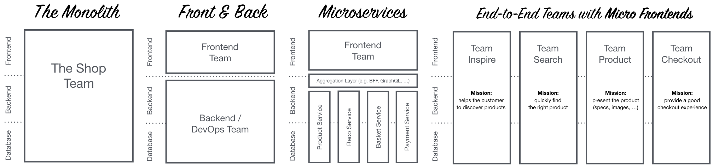

# Conceptos básicos

**Contenedor**: unidad de software estándar que empaqueta el código y todas sus
dependencias para que la aplicación se ejecute de manera rápida y se pueda portar
entre entornos.

**Microservicio**: Pequeño servicio que se ejecuta de forma independiente
y se comunica a través de una API definida.

*Nota*: Es habitual ver arquitecturas de microservicios que usan contenedores,
pero hay que recordar que no son sinónimos y que se puede implementar
microservicios sin usar contenedores.

# Evolución histórica

| Escenario        | Arquitectura             | Despliegue       | Infraestructura | Metodología de trabajo |
|-|-|-|-|-|
| **Tradicional**  | Monolítica               | Servidor físico  | Local           | En cascada |
| **Vritualizado** | Monolítica multicapa | Servidor virtual | Hosting         | Ágil       |
| **Conterizado**  | Microservicios           | Contenedores     | Nube            | DevOps     |

# Virtualización basada en contenedores

Método de virtualización en el que, sobre el núcleo del sistema operativo,
se ejecuta una capa que permite que existan múltiples instancias
aisladas de espacios de usuario, en lugar de solo uno.

Estas instancias, llamadas contenedores, pueden verse y sentirse como un servidor
real desde el punto de vista de sus dueños y usuarios.

## Tipos de contenedores

* Contenedores de infraestructura o sistema de contenedores:
Ofrecen un servicio que permite ejecutar múltiples instancias de sistemas operativos
de manera aislada. Es similar a una máquina virtual pero más rápido y ligero. (ej: LXC y LXD)
* Contenedores de procesos o **Contenedores de aplicaciones**: Ofrecen un sistema
para empaquetar aplicaciones y todas sus dependencias y, por tanto, son muy útiles
para el desarrollo y distribución de aplicaciones. (ej: Docker y systemd-nspawn)
* Contenedores sandbox. Enfocados en proveer aislamiento mediante un entorno que
permita ejecutar contenedores en un espacio escapsulado donde tiene acceso
restringido a recursos del sistema operativo o datos del usuario (sandbox).
(ej: Firejail​, nsroot​, nsjail​, FreeBSD jail, sandboxie​ y Bubblewrap)

Nota: Generalmente, cuando decimos *contenedor* a secas, nos referimos a un
*contenedor de aplicacion*.

## Ventajas e inconvenientes

**Ventajas**:

* Poca o ninguna sobrecarga porque no hay emulación ni máquina virtual intermedia
* Casi tan flexible como las máquinas virtuales tradicionales
* Se puede implementar mecanismos de copy-on-write
* No requiere un hipervisor ni ningún mecanismo de hardware
* Permite mayor contro desde el anfitrión

**Desventajas**

* Un fallo en el kernel del anfitrión puede hacer caer a todos sus contenedores
* No se puede hospedar un sistema operativo o kernel distinto al del anfitrión, aunque:
    * en algunos casos se puede alojar distintas versiones de la misma distribución
    o incluso distintas distribuciones Linux
    * Docker en Windows puede jecutar contenedores Linux gracias a la capa
    de compatibilidad WSL
* Las librerías, etc que ejecuten los servidores virtuales deben estar compilados
para el mismo juego de instrucciones y hardware que utiliza el sistema anfitrión.

## Orquestación y coreografía

Las aplicaciones en contenedores habitualmente utilizan una plataforma de
orquestación/coreografía de contenedores

# Microservicios

La arquitectura de microservicios consiste en construir una aplicación como un
conjunto de pequeños servicios, los cuales se ejecutan en su propio
proceso y se comunican con mecanismos ligeros (normalmente una API de recursos HTTP).

Cada servicio se encarga de implementar una funcionalidad completa del negocio,
es desplegado de forma independiente y puede estar programado en distintos
lenguajes y usar diferentes tecnologías de almacenamiento de datos.

## Ventajas e inconvenientes

**Ventajas**:

* Despliegue: los ciclos de desarrollo pueden ser más cortos
* Fiabilidad: los fallos en un microservicio no tienen porque afectar al resto
* Disponibilidad: se puede desplegar una nueva versión de un microservicio sin
reiniciar la aplicación/servidor.
* Escalabilidad: en cada momento se pueden aumentar las instancias de los
microservicios que soporten más carga de trabajo
* Modificabilidad: los microservicio tienen bajo acoplamiento por lo que se pueden
usar distintos frameworks
* Gestión: los equipos grandes pueden dividirse en tareas independientes y pasar
a ser autonomos
* Facilidad para comprender cada microservicio individualmente
* Facilidad para probar y desplegar un microservicio individualmente (pruebas unitarias)

**Inconvenientes**:

* Despliegue:
    * se necesitas más scripts, archivos de configuración, etc.
    * se necesitan perfiles DevOps o CI/CD
    * en algunos casos, no se puede desplegar una funcionalidad de forma independiente
    debido a la interdependencia entre servicios
* Rendimiento: los microservicios emplean colas para comunicarse, mientras que los
módulos monolíticos invocan métodos
* Testeabilidad: las pruebas de integración pueden ser más complejas si los
microservicios emplean diferentes entornos
* Gestión: aumenta el esfuerzo de gestión al tener más logs, runtimes y componentes
* Duplicidades: librerías y componentes pueden estar replicados en varios microservicios
* Mayor dificultad de comprender el sistema de manera global

## Micro-frontends

Tradicionalmente las interfaces de usuario en una arquitectura microservicios
seguían siendo un monolito (por ejemplo, una servidor web MVC que genera un `front`
HTML + JavaScript, mientras que el `backend` es una arquitectura microservicios)
pero existe la alternativa de tratar la interfaz también como microservicios.

A esto se le llama Composite UI o micro-frontends y consiste en dividir la
interfaz en piezas que son generadas por separado como microservicios.

Sus **ventajas** son:

* Evita que el `fronted` pueda ser un cuello de botella
* Escala bien
* Los equipos de desarrollo puedan desarrollar su negocio de extremo
a extremo (desde el backend hasta el frontend).

Figura 2: Organización de los equipos según el enfoque

Tecnologías que pueden intervenir en el enfoque micro-frontends:

* Custom Elements: conjunto de APIs de JavaScript que permiten definir elementos (etiquetas HTML) personalizados y su comportamiento
* Server Side Includes: conjunto de directivas que se escriben en las páginas HTML y que se evalúan en el servidor web cuando se solicita la página HTML (en especial `<!--#include ... -->`)
* Edge Side Includes: permite a los servidores de edge (como las cachés de Varnish) mezclar y matchear contenido procedente de múltiples direcciones URL (`<esi:include ... />`)

Como **inconveniente** tiene que puede ser dificil mantener la consistencia de
la presentación.

## Comunicación con los microservicios

### Tipos de comunicación

La comunicación realizada puede ser:

**Síncrona** mediante petición/respuesta a la API (ej: HTTP-REST).

* Ventajas:
    * interactuá bien con una interfaz web
    * los desarrolladores están familiarizados con HTTP-REST
    * es fácil de depurar
    * facilita ofrecer APIs a terceros
* Desventajas:
    * No ofrece las ventajas de AMQP

Figura 1: Comunicación sincronía one-to-one

**Asíncrona** mediante un broker de mensajes como RabbitMQ (implementa AMQP) o Kafka

* Ventajas:
    * es muy rápido
    * es flexible
    * consume pocos recursos
    * puede priorizar unos mensajes sobre otros en la cola
    * es compatible con XA transactions
    * es tolerante a fallos
    * puede asegurar que el mensaje es entregado una sola vez
    * ofrece pub/sub interface
    * permite segmentación de mensajes y agrupado de mensajes
    * puedes tener un hilo separado para escuchar las respuestas
* Desventajas:
    * El broker pasa a ser un servicio critico

Figura 2: Comunicación asíncrona one-to-one

Figura 3: Comunicación asíncrona one-to-many

### API Gateway

El API Gateway implementa el patrón de diseño Facade para el acceso a las funcionalidades de negocio
por parte de los clientes, abstrayendo la coreografía de servicios subyacente.

Físicamente esta conformado por una serie de archivos de configuración (ej YAML)
sobre un servidor web (ej nginx) que indican la forma de diseccionar las solicitudes.
Es decir, actuá como un proxy inverso que redirige las peticiones al microservicio
adecuado.

Además puede incluir funciones de:

* autenticación
* logs
* cumplimiento de la política de seguridad
* balanceo de carga
* gestión de contratos y SLA
* gestión de caché
* resolución de dependencias

En Kubernetes, esta funcionalidad es realizada por el componente Ingress.

Ejemplo: Spring Cloud Zuul en Netflix

## Descubrimiento de servicios

La arquitectura de microservicios tiene la capacidad de balanceo de carga automática
mediante la creación de distintas replicas del microservio. Esto hace necesario
varios servidores de descubrimientos de servicios para asegurar la disponibilidad
de dichos servicios.

Cada servidor de descubrimiento mantiene las rutas de las distintas instancias
de cada microservicio y comprueba su disponibilidad a través de *latidos* para
almacenar internamente el estado de cada microservicio.

Los servicios de descubrimiento pueden ser a su ver clientes de otros
servidores de descubrimiento.

Ejemplo: Spring Cloud Eureka en Netflix

## Balanceador de cliente

A diferencia de otras arquitecturas, el balanceo de carga en una arquitectura de
microservicios se lleva a cabo por parte del cliente, no del servidor.
Es el cliente quien elije a qué instancia del microservicio enviar la
petición entre los disponibles de acuerdo a una serie de criterios de
balanceo definidos: de carga, geográficos,
Round-robin, tiempo de respuesta ponderado, etc.

El balance se puede hacer a través de un mecanismo software o hardware. En ambos casos hay un
intermediario que define la política de balanceo y hace la petición al servicio.

Ejemplo: Spring Cloud Ribbon en Netflix

## Gestión de errores en cascada

En sistemas distribuidos como una arquitectura de microservicios un punto crítico
del diseño es la gestión de errores.
Los servicios se llaman unos a otros y un error en un servicio puede deshabilitar varios servicios
por no recibir peticiones o porque estén continuamente llamando a un servicio no disponible.

Para evitar esto se puede usar el patrón de diseño **Circuit Breaker**
que evita que una aplicación intente de manera reiterada una operación
que con probabilidad va a fallar devolviendo el error directamente sin
hacer la llamada.

Ejemplo: Spring Cloud Histrix en Netflix

## Ejemplo arquitectura Netflix

Figura 4: Arquitectura Netflix

Se puede ver una descripción más en detalle en *[josephcodes.dev - Netflix y la nueva arquitectura de microservicios](https://josephcodes.dev/2020/11/04/netflix-y-la-nueva-arquitectura-de-microservicios/)*,
a lo que se puede añadir que además se usa Feign para abstraer los detalles de
implementación de los API REST y del propio protocolo HTTP, de forma que los
servicios se enfoquen en la lógica de negocio y cuando consuman otros servicios
el código no gestione peticiones HTTP explícitamente,
desacoplando la lógica de negocio de la capa de comunicación. Un ejemplo
de su uso se puede ver en *[adictosaltrabajo.com - Spring Cloud Feign: declarative REST client](https://www.adictosaltrabajo.com/2017/09/26/spring-cloud-feign-declarative-rest-client/)*.

# Orquestación y Coreografía

Tanto para contenedores como para microservicios hay dos técnicas para coordinar
su comportamiento en conjunto, la Orquestación y la Coreografía

## Orquestación

En la orquestación un *director de orquesta* gestiona todas las interacciones
en espera de una respuesta antes de solicitar el siguiente servicio.
Es decir, la orquestación sigue un paradigma de solicitud/respuesta.

**Ventajas**:

* Fácil de gestionar mediante la centralización de los procesos empresariales
* El flujo de la aplicación se coordina eficientemente usando un procesamiento **sincrónico**

**Desventajas**

* Se genera dependencias entre servicios
* Si cae el orquestador todo se detiene

## Coreografía

En la Coreografía es un enfoque **asíncrono** en el que los servicios actúan
independientemente reaccionando a eventos. Nadie les dice que eventos escuchar
ni que hacer cuando ocurre dicho evento si no que ellos mismos están programados
para suscribirse a los eventos que deben escuchar y para reaccionar a ellos.

**Ventajas**:

* Procesamiento rápido ya que los servicios no esperan a un orquestador
* Es simple agregar servicios o actualizar desde el flujo de eventos.
* Elimina cualquier punto de falla
* Se alinea con un modelo de entrega ágil en el que los equipos pueden centrarse
en servicios específicos en lugar de toda la aplicación

**Desventajas**:

* Aumenta la complejidad de la gestión global del sistema

# Kubernetes

Kubernetes es un orquestador de contenedores, donde prácticamente todo
se puede crear y configurar mediante manifiestos yaml.

## Componentes Hardware

### Nodos

Es la unidad más pequeña del hardware informático de Kubernetes.
Se le puede considerar una máquina individual.

### Clúster

Es una colección de nodos que se agrupan para ofrecer un uso compartido
y un equilibrio inteligente de los recursos.

Cuando despliegas un programa en un cluster, Kubernetes distribuye el trabajo
entre los nodos de ese cluster. Si un nodo cae, es eliminado o se añade el cluster
requilibrara el trabajo automáticamente.

Esto es transparente y al programador no le debe importar en que nodo en
particular se esta ejecutando el código.

### Persistent Volumes

Proporcionan un sistema de archivos que se puede
montar en el clúster, sin estar asociado con ningún nodo en particular.

Son necesarios ya que:

1. Cualquier dato guardado en un nodo se pierde cuando este finaliza
2. No se puede saber a priori (ni debe importarnos) en que nodo en particular
se va a ejecutar nuestra aplicación

Cuando no se especifica que un volumen es persistente se sobreentiende
que son volúmenes que se crean y destruyen con el pod.

Nota: Un volumen solo puede ser montado como Read/Write en un único nodo,
lo que significa que si una replica de nuestro nodo cae en otro nodo
no podrá usar el volumen.

## Componentes Software

### Contenedores

Conjunto de uno o más procesos (idealmente debería ser solo uno) que incluye todos
los archivos necesarios para su ejecución, por lo que se pueden trasladar de una
máquina a otra.

### Pods

Conjunto de uno o más contenedores (cuantos menos mejor), los cuales se empaquetan
de manera que comparten los mismos recursos y red local. Esto hace que los
contenedores de un mismo pod pueda comunicarse fácilmente pues están en la mismo nodo.

El pod es la unidad de replicación, es decir, cuando kubernetes crea nuevas replicas
para atender un pico de demanda lo que se va a replicar son los pods.

Hay que tener en cuenta que cada replica de un mismo pod tiene una IP distinta,
y que todos los contenedores que están dentro de un mismo pod comparte la IP
de su pod, por lo tanto hay que evitar que dos contenedores de un mismo pod
intenten usar un mismo puerto porque eso produciría una colisión.

Ejemplos: [01-pod.yaml](https://github.com/pablokbs/peladonerd/blob/master/kubernetes/35/01-pod.yaml), [02-pod.yaml](https://github.com/pablokbs/peladonerd/blob/master/kubernetes/35/02-pod.yaml), [06-randompod.yaml](https://github.com/pablokbs/peladonerd/blob/master/kubernetes/35/06-randompod.yaml)

### Deploymets

Aunque los pods se puede crear directamente, lo optimo es es hacerlo a través
de la abstracción deployment.

El principal propósito de un deployment es especificar cuantas replicas debería
haber en todo momento de un pod, de manera que si alguna replica cae kubernetes
automáticamente cree nuevas instancias hasta llegar al numero deseado.

Ejemplo: [04-deployment.yaml](https://github.com/pablokbs/peladonerd/blob/master/kubernetes/35/04-deployment.yaml)

Variantes:

* **DaemonSet**: Igual que Deploymets pero garantiza crear un pod en cada nodo
(útil para agentes de monitoreo). Ejemplo: [03-daemonset.yaml](https://github.com/pablokbs/peladonerd/blob/master/kubernetes/35/03-daemonset.yaml)
* **StatefulSet**: Es un Deploymets que necesita garantizar el orden y unicidad
de los pods (sus volúmenes han de ser persistentes). Ejemplo: [05-statefulset.yaml](https://github.com/pablokbs/peladonerd/blob/master/kubernetes/35/05-statefulset.yaml)

### Service

Por defecto kubernetes aislá los pods del exterior, por lo tanto para
poder comunicarse con un servicio que corre en un pod hace falta abrir
un canal de comunicación.

Para ello existen distintos tipos de Service:

* ClusterIP: crea una IP (accesible desde cualquier nodo de Kubernetes) con un puerto que redirige
a los pods. Ejemplo: [07-hello-deployment-svc-clusterIP.yaml](https://github.com/pablokbs/peladonerd/blob/master/kubernetes/35/07-hello-deployment-svc-clusterIP.yaml)
* NodePort: crea un puerto en cada nodo que será redirigido a los pods. Esto nos permite acceder al pod sabiendo la IP del nodo (si el nodo tiene IP pública también podremos
acceder desde fuera de Kubernetes).
Ejemplo: [08-hello-deployment-svc-nodePort.yaml](https://github.com/pablokbs/peladonerd/blob/master/kubernetes/35/08-hello-deployment-svc-nodePort.yaml)
* LoadBalancer: crea un balanceador de carga en un proveedor de nube que redirige
el tráfico recibido en un puerto a los pods.
Esto nos permite acceder al servicio sabiendo la IP del balanceador, la cual puede
ser accesible desde internet.
Ejemplo: [09-hello-deployment-svc-loadBalancer.yaml](https://github.com/pablokbs/peladonerd/blob/master/kubernetes/35/09-hello-deployment-svc-loadBalancer.yaml)

Nota: cuando digo "redirige a los pods" quiero decir que en cada petición se
redirigirá el tráfico a una de las replicas del pod pudiendo ser cada vez una
distinta.

### Ingress

Conjunto de reglas que permite redirigir peticiones a distintos servicios en
función de distintos criterios, por ejemplo la ruta de la petición.
Ejemplo: [10-hello-v1-v2-deployment-svc.yaml](https://github.com/pablokbs/peladonerd/blob/master/kubernetes/35/10-hello-v1-v2-deployment-svc.yaml) + [11-hello-ingress.yaml](https://github.com/pablokbs/peladonerd/blob/master/kubernetes/35/11-hello-ingress.yaml).

Esta característica no viene en Kubernetes por defecto si no que se instala
como un controlador habiendo varias posibilidades, una de ellas sería
ingress-nginx que usara un nginx configurado con las reglas que determina
ingress para obtener el efecto deseado.

Por lo general ingress va a crear también un LoadBalancer y esto nos proporcionará
una IP pública.

### ConfigMap y Secrets

Básicamente son configuraciones que pueden ser referenciadas desde otros
manifiestos. Ejemplos: [12-configmap.yaml](https://github.com/pablokbs/peladonerd/blob/master/kubernetes/35/12-configmap.yaml) + [13-pod-configmap.yaml](https://github.com/pablokbs/peladonerd/blob/master/kubernetes/35/13-pod-configmap.yaml), [14-secret.yaml](https://github.com/pablokbs/peladonerd/blob/master/kubernetes/35/14-secret.yaml) + [15-pod-secret.yaml](https://github.com/pablokbs/peladonerd/blob/master/kubernetes/35/15-pod-secret.yaml).

Secrets esta pensada para valores como contraseñas ya que guarda la información
es codificada en base64, pero hay que recordar que esto es fácilmente reversible
por lo tanto no se deben hacer cosas como subir estos ficheros a un repositorio.

# Bibliografía

* PreparaTic27 - Pack3/02
* PreparaTic27 - Pack3/03
* [docs.microsoft.com - Creación de interfaces de usuario compuestas basadas en microservicios](https://docs.microsoft.com/es-es/dotnet/architecture/microservices/architect-microservice-container-applications/microservice-based-composite-ui-shape-layout)
* [micro-frontends-es.org - Micro Frontends](https://micro-frontends-es.org/)
* [desarrolloweb.com - Especificación Custom Elements, explicaciones y práctica](https://desarrolloweb.com/articulos/desarrollo-custom-elements-javascript-estandar.html)
* [docs.microsoft.com - Diferencias entre el patrón de puerta de enlace de API y la comunicación directa de cliente a microservicio](https://docs.microsoft.com/es-es/dotnet/architecture/microservices/architect-microservice-container-applications/direct-client-to-microservice-communication-versus-the-api-gateway-pattern)
* [techtarget.com - API Gateway](https://searchdatacenter.techtarget.com/es/definicion/API-Gateway-o-puerta-de-enlace-API)
* [stackoverflow.com - Service Oriented Architecture - AMQP or HTTP](https://stackoverflow.com/questions/16838416/service-oriented-architecture-amqp-or-http)
* [programmerclick.com - Descubrimiento de servicios en microservicios](https://programmerclick.com/article/1059308994/)
* [medium.com/swlh - A Design Analysis of Cloud-based Microservices Architecture at Netflix](https://medium.com/swlh/a-design-analysis-of-cloud-based-microservices-architecture-at-netflix-98836b2da45f)
* [bigdatadummy.wordpress.com - Arquitectura de Microservicios con Netflix](https://bigdatadummy.wordpress.com/2020/03/04/arquitectura-de-microservicios-con-netflix/)
* [josephcodes.dev - Netflix y la nueva arquitectura de microservicios](https://josephcodes.dev/2020/11/04/netflix-y-la-nueva-arquitectura-de-microservicios/)
* [adictosaltrabajo.com - Spring Cloud Feign: declarative REST client](https://www.adictosaltrabajo.com/2017/09/26/spring-cloud-feign-declarative-rest-client/)
* [redhat.com - ¿Qué es un pod de Kubernetes?](https://www.redhat.com/es/topics/containers/what-is-kubernetes-pod)
* [wikipedia.org - Virtualización a nivel de sistema operativo](https://es.wikipedia.org/wiki/Virtualización_a_nivel_de_sistema_operativo)
* [dineshonjava.com - Microservices Inter-Service Communication](https://www.dineshonjava.com/microservices-inter-service-communication/)
* [processmaker.com - Orquestación de procesos vs. coreografía en microservicios](https://www.processmaker.com/es/blog/process-orchestration-vs-choreography-microservices/)
* [youtube.com - Pelado Nerd - Kubernetes 2021 - De novato a pro!](https://www.youtube.com/watch?v=DCoBcpOA7W4)
* [medium.com/google-cloud - Kubernetes 101: Pods, Nodes, Containers, and Clusters](https://medium.com/google-cloud/kubernetes-101-pods-nodes-containers-and-clusters-c1509e409e16)
* [redhat.com - ¿Qué es un clúster de Kubernetes?](https://www.redhat.com/es/topics/containers/what-is-a-kubernetes-cluster)
* [github.com/pablokbs - ejemplos de plantillas](https://github.com/pablokbs/peladonerd/tree/master/kubernetes/35)
* [maquinasvirtuales.eu - Kubernetes: Servicios ClusterIP, Ingress, NodePort y LoadBalancer](https://www.maquinasvirtuales.eu/kubernetes-servicios-clusterip-ingress-nodeport-y-loadbalancer/)
* [kubernetes.io - StatefulSets](https://kubernetes.io/es/docs/concepts/workloads/controllers/statefulset/)
* [kubernetes.io - DaemonSet](https://kubernetes.io/es/docs/concepts/workloads/controllers/daemonset/)
* [platform9.com - Tutorial: Dynamic Provisioning of Persistent Storage in Kubernetes with Minikube](https://platform9.com/blog/tutorial-dynamic-provisioning-of-persistent-storage-in-kubernetes-with-minikube/)
* [medium.com/swlh - Quick Fix: Sharing Persistent Disks on Multiple Nodes in Kubernetes Using NFS](https://medium.com/swlh/quick-fix-sharing-persistent-disks-on-multiple-nodes-in-kubernetes-ef5541fd8376)
