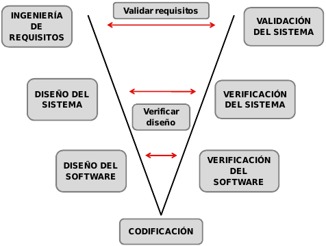

# Conceptos básicos

**Ciclo de vida**: etapas por las que pasa el software desde que se concibe
un nuevo proyecto hasta que se deja de usar. Fases:

1. Definición: obtención de requisitos
2. Desarrollo: análisis, diseño, codificación, pruebas e implantación
3. Mantenimiento

Las dos primeras comprenden el **ciclo de desarrollo**.

# Modelos de ciclo de vida

## Ciclo de vida en cascada (waterfall)

Fases en cascada (cada fase se completa antes de pasar a la siguiente):

1. Análisis de requisitos
2. Diseño del sistema
3. Diseño del programa
4. Codificación
5. Pruebas
6. Mantenimiento

Puede haber retroalimentación de una fase a otras anteriores, pero a menudo
se aplica como si fuera estrictamente lineal.

* **Ventajas**:
    * Pautas de trabajo claras
    * Facilita establecer hitos, estimación y seguimiento del progreso
    * Proporciona entregales intermedios que en conjunto es el producto final
    (documentos de análisis y diseño, etc)

* **Inconvenientes**:
    * Establecer todos los requisitos al inicio puede ser poco realista
    * Es muy rígido
    * Los problemas se detectan al final
    * Nada esta hecho hasta que todo esta hecho
    * Un cambio puede suponer un gran coste

## Ciclo de vida en V

Como el de *cascada* pero divide las fases en dos ramas:

* **actividades de desarrollo** (rama descendente): además de hacer lo propio
de esa fase, genera pruebas que en la rama ascendente sirvan para validar
lo definido en esta fase
* **actividades de prueba** (rama ascendente): además de hacer lo propio de
esa fase, valida los resultados usando las pruebas generadas en la rama descendente

Figura: Ciclo de vida en V

* **Ventajas**: las del cascada + que se consideran las pruebas lo antes posible
* **Inconvenientes**: casi tan rígido como el de cascada

## Modelo de construcción de prototipos

En cada iteración se van clarificando los requisitos mediante las fases:

1. Escuchar al usuario
2. Construir un prototipo
3. El usuario prueba el prototipo

* **Ventajas**: Ideal para obtener requisitos cuando no están claros
* **Inconvenientes**:
    * el usuario puede creer que el trabajo ya esta hecho cuando no es así
    * decisiones de baja calidad tomadas para agilizar el desarrollo del
    prototipo pueden persistir en la implementación final

# Ciclo de vida <abbr title="Rapid Application Development">RAD</abbr> o DRA

Combina desarrollo iterativo, construcción de prototipos y uso de herramientas CASE.

DRA pretende ser una versión ultrarapida del modelo en cascada con un enfoque
de construcción basado en componentes para obtener sistemas completamente
funcionales en 60-90 días.

Fases:

1. Modelado de gestión
2. Modelado de datos
3. Modelado de proceso
4. Gestión de aplicaciones
5. Pruebas y entrega

Características:

* Equipos híbridos
* Herramientas especializadas: control de versiones, componentes reutilizables,
herramientas colaborativas, APIs, etc
* Timeboxing: cada fase de desarrollo dura lo mismo
* Prototipos iterativos y evolucionarios:
* Reunión JAD

* **Ventajas**:
    * Reutilización
    * Paralelismo en el desarrollos
    * Adecuado para tecnología orientada a objetos
* **Inconvenientes**:
    * En proyectos grandes se necesitan muchos recursos humanos
    * Requiere compromiso de clientes y desarrolladores para llegar a tiempo
    * No adecuado para sistemas no descomponibles modularmente o con elevados riesgos técnicos

## Modelo incremental

Como el *cascada* pero incremental.

* **Ventajas**:
    * mayor facilidad para determinar los requerimientos para el siguiente nivel
    * los errores se detectan antes
    * mayor flexibilidad ya que el software se construye de forma que facilite
    la incorporación de nuevos requisitos
* **Inconvenientes**:
    * dificultad para determinar que es el núcleo que formará el primer incremento
    * dificultad de la definición de los incrementos
    * la solución de los incrementos anteriores pueden no ser validas para los posteriores

## [Modelo en espiral](https://es.wikipedia.org/wiki/Desarrollo_en_espiral)

Cada ciclo de la espiral representa una fase del desarrollo (no fijas) que
normalmente tienen 4 pasos:

1. Determinar objetivos, alternativas y restricciones
2. Evaluar alternativas, considerando el análisis de riesgos
3. Desarrollo del siguiente nivel del producto
4. Planificación del siguiente ciclo

Figura: Modelo en espiral

La dimensión radial en la figura refleja los costes acumulativos en los que incurre
el proyecto, y la dimensión angular el progreso del mismo.
Durante cada fase se puede seleccionar el ciclo de desarrollo
que se desee: cascada, V etc.

* **Ventajas**:
    * Permite adaptar el proceso de desarrollo a las necesidades cambiantes del proyecto y al
conocimiento que se va adquiriendo
    * Permite el manejo de prototipos, enlazándolo con el análisis de riesgos
    * Gestiona los riesgos de forma explícita
* **Inconvenientes**:
    * Requiere de una considerable habilidad para la consideración del riesgo
    * La evaluación de riesgos puede disparar el coste
    * Complejidad del modelo
    * Incertidumbre en el número de iteraciones necesarias

## [Proceso unificado](https://es.wikipedia.org/wiki/Proceso_unificado)

## Otros

* **Codificación directa** (code and fix): consiste en no aplicar ningún modelo
de ciclo de vida, es decir, en empezar a codificar a lo loco, sin documentación
ni nada.
* **Modelo evolutivo**: tiene en cuenta la naturaleza evolutiva del software
(se puede combinar con modelos incrementales)
* **Agile Inception**
* **Modelo concurrente**
* **Adaptative Software Development** (ASD)
* **Modelo por etapas** (Stage-Wise)
* **Modelos basados en transformaciones**
* **SCRUM**
* **Kaban**

# Bibliografía

* PreparaTic27 - Pack1/037
* PreparaTic27 - Pack1/085
* PreparaTic27 - Pack1/087
* https://www.youtube.com/watch?v=i8CPD1dW88k
* https://www.youtube.com/watch?v=fHKsufzM7qQ
* https://www.youtube.com/watch?v=HhC75IonpOU
* https://www.youtube.com/watch?v=CfROfwnQgps
* https://es.wikipedia.org/wiki/Kanban_(desarrollo)
* https://www.youtube.com/watch?v=Kxz0_rDmRho
* https://es.wikipedia.org/wiki/Manifiesto_%C3%A1gil
* https://es.wikipedia.org/wiki/Programaci%C3%B3n_extrema
