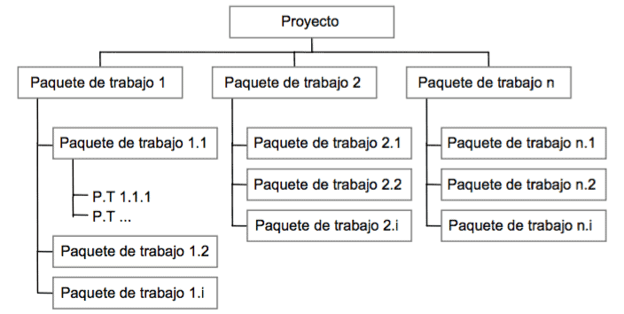
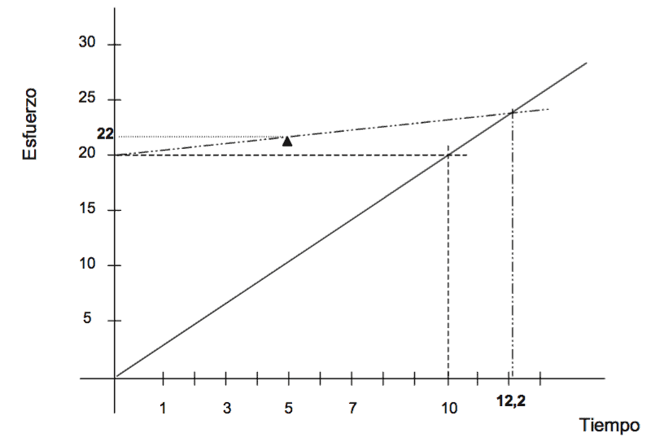

# PMBOK del PMI

Divide el proyecto en **48 procesos** agrupados en 10 **áreas de conocimiento**:

1. Integración
2. Alcance
3. Tiempo
4. Costes
5. Calidad
6. Recursos
7. Comunicación
8. Riesgos
9. Adquisiciones e Interesados

y 5 **grupos de procesos**:

1. Iniciación.
2. Planificación.
3. Ejecución
4. Seguimiento y Control
5. Cierre

Ofrece dos técnicas de compresión de la planificación temporal:

* **Fast tracking**: paralizar tareas
* **Crashing** o compresión: meter más recursos

# Diagrama de Gantt

Representar las diferentes fases, tareas y actividades programadas como parte de
un proyecto. Se pueden marcar hitos como puntos sin duracción que no consumen recursos.

Según Métrica v3 ha de ser completado con un histograma de recursos.

Figura: Ejemplo Diagrama de Gantt

Figura: Histograma de recursos

# Diagrama de PERT

Son un grafo que permite representar las dependencias entre las actividades y/o
eventos. Hay dos variantes:

Figura: Ejemplo ADM

Figura: Ejemplo PDM

Conceptos usados en PERT:

* **Camino critico**: camino de mayor duración entre el evento de inicio y final
del proyecto (puede haber varios). Marca el tiempo minio para realizar el proyecto.
* **Holgura**:
    * **Holgura total**: retraso máximo en la ejecución de una actividad sin
    afectar la duración total del proyecto
    * **Holgura libre**: tiempo que puede alargarse la ejecución de una actividad
    sin afectar a las siguientes
    * **Holgura independiente**: como la libre pero presuponiendo que las anteriores
    han terminado lo más tarde posible
    * **Holgura condicional**: como la libre pero presuponiendo que el evento
    origen y final se dan lo más tarde posible

# Tipos de [Métricas](https://es.wikipedia.org/wiki/M%C3%A9trica_del_software)

* Métrica del producto: miden aspectos del software obtenido
* Métrica del proceso: miden atributos que hacen referencia al entorno de desarrollo
y tienen en cuenta la manera de construirlo
* Métrica de calidad (indirectas y subjetivas): funcionalidad, complejidad, eficiencia,
fiabilidad, facilidad e mantenimiento...
* Métrica de productividad (directas y objetivas): lineas de código o puntos de función

Un [**Punto de función**](https://es.wikipedia.org/wiki/M%C3%A9trica_de_punto_funci%C3%B3n)
es una unidad de medida empírica que mide el tamaño del SW en términos de funcionalidad.
tiene la ventaja de que es medible durante los primeros pasos del desarrollo,
no siendo necesario disponer de información histórica, y es independiente del
lenguaje de programación. Sin embargo es indirecta y subjetiva.

Por el contrario, las [**lineas de código**](https://en.wikipedia.org/wiki/Source_lines_of_code)
son una medida directa y objetiva
pero no puede ser medida hasta que la codificación haya terminado.
Se necesita información histórica y es dependiente del lenguaje de programación.

* LOC o SLOC: líneas de código
* KLOC: miles de líneas de código
* DSI: instrucciones de código fuente realmente entregadas
* NCSS: líneas de código fuente sin tener en cuenta los comentarios
* NSLOC: nuevas líneas de código fuente

# Métodos de estimación

* [**Método Albretch**](https://manuel.cillero.es/doc/metodologia/metrica-3/tecnicas/tecnicas-de-estimacion/metodo-albrecht/): basado de puntos de función
* [**Método MARK II**](https://manuel.cillero.es/doc/metodologia/metrica-3/tecnicas/tecnicas-de-estimacion/metodo-mark-ii/): como el anterior pero pero con 23 atributos (el Albretch tiene 14)
* Walston-Felix: modelo estadístico
* Putnam: basado en teorías
* COCOMO: combina intuición, análisis estadístico y juicio de experto y tiene tres
niveles (básico, intermedio y detallado)
* Esterling: modelo de estudio temporal, mide el tiempo de trabajo útil por jornada
y persona
* [Staffing Size](https://manuel.cillero.es/doc/metodologia/metrica-3/tecnicas/staffing-size/):
conjunto de métricas para estimar el numero de personas necesarias para el proyecto
y el tiempo que estarán dedicadas a él (se basa en nº de *clases clave* y *clases secundarías*)
* Método Karner: estima basándose en [puntos de caso de uso](https://es.wikipedia.org/wiki/Puntos_de_caso_de_uso) (como el *Albretch* con *puntos de función* pero para *casos de uso*).

# Herramientas automáticas de estimación

* BYL, WICOMO y DECPlan: basadas en COCOMO
* SLIM: se basa en la curva de Rayleigh-Norden para el ciclo de vida del software
y en el modelo de estimación de Putnam
* ESTIMACS: basado en Puntos de Función
* SPQR/20: conjunto de sencillas preguntas y respuestas

# Factores críticos de éxito (FCE)

So los medios o condiciones que se deben cumplir si o si para poder alcanzar
los objetivos. Los FCE son temporales, subjetivos, vitales y específicos de
la organización, y están influenciados por el contexto.

Todo proceso que pueda afectar a los FCE se considera estratégico. Los FCE
están directamente relacionados con las Debilidades, Amenazas, Fortalezas y Oportunidades
de la organización (DAFO).

Los FCE se obtienen de la siguiente manera:

1. Elaborar una lista de los objetivos de la organización
2. Depurar la lista de objetivos
3. Identificar los factores de éxito
4. Eliminar los factores de éxito no críticos
5. Agrupar los factores de éxito de acuerdo con los objetivos
6. Identificar los componentes de estos factores de éxito
7. Seleccionar los factores críticos de éxito
8. Finalizar el estudio de los factores críticos de éxito

# Estructura de Descomposición de Trabajo (WBS)

Descomposición de las actividades de un proyecto según su naturaleza cuya
forma jerárquica permite una
fácil identificación de los elementos finales, llamados *Paquetes de Trabajo*.

Figura: Ejemplo WBS

El WBS cumple lo siguiente:

* Regla del 100%: el WBS debe incluir el 100% del trabajo definido en el
alcance del proyecto, incluyendo todos los entregables, y debe cumplirse
en todos los niveles, es decir, la suma del trabajo de los procesos
hijos debe ser igual al trabajo del proceso padre.
* El WBS planifica entregables, no acciones
* Se usa un esquema numerado: sirve para usar cada identificador
numérico como si fuera una *cuenta* a la que se le asignan los costes
* Elemento terminal: son las hojas del árbol lo que se estima (plazo,
coste, requisitos y recursos) y se analizan las dependencias entre ellos

# Diagrama de Extrapolación

Técnica para realizar un seguimiento de los proyectos software.
Con ella se obtienen previsiones de desviaciones en la duración
del desarrollo del proyecto.

Figura: Un proyecto, estimado en 20 mil horas y 10 meses, es vuelto a estimar en el 5º mes obteniendo 22 mil horas, por lo tanto (tras calcular la desviación) el total de meses será ahora 12,2

# Diagrama de Ishikawa (cola de pescado o espina de pez)

Usado para visualizar las causas de un problema

Figura: Diagrama de Ishikawa

# [Análisis/Gestión del valor ganado](https://es.wikipedia.org/wiki/Gesti%C3%B3n_del_valor_ganado)

Teniendo:

* La estructura de tareas (WBS)
* El calendario de ejecución (PMS) o diagrama de Gantt
* El costo presupuestado del trabajo planificado (BCWS) o valor planificado (PV): *¿Cuánto trabajo debería estar terminado?*
* El costo presupuestado del trabajo realizado (BCWP) o valor ganado (EV): *¿Cuánto trabajo está realmente terminado?*

Se puede llevar a realizar una gestión del valor ganado que permite consiste
en comparar la cantidad de trabajo ya completada en un momento dado con la estimación
realizada antes del comienzo del proyecto.

Con esta metodología se puede estimar en cuanto tiempo se completaría el proyecto
si se mantienen las condiciones con las que se elaboró el cronograma o considerando
si se mantienen las condiciones que se presentaron durante el desarrollo del proyecto.
También se puede estimar el costo total del proyecto.

# Bibliografía

* PreparaTic27 - Pack1/035
* PreparaTic27 - Pack1/036
* PreparaTic27 - Pack1/098
* PreparaTic27 - Pack1/033
* <strike title="Se solapa con otros temas">PreparaTic27 - Pack1/086</strike>
