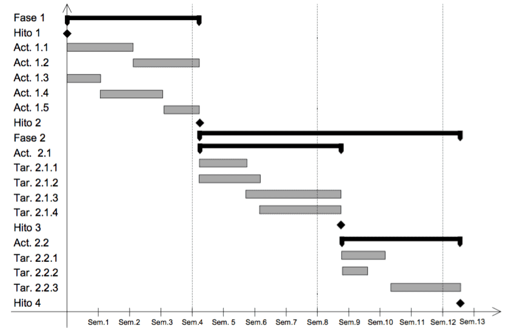
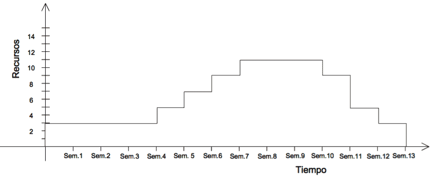

# PMBOK del PMI

Divide el proyecto en **48 procesos** agrupados en 10 **áreas de conocimiento**:

1. Integración
2. Alcance
3. Tiempo
4. Costes
5. Calidad
6. Recursos
7. Comunicación
8. Riesgos
9. Adquisiciones e Interesados

y 5 **grupos de procesos**:

1. Iniciación.
2. Planificación.
3. Ejecución
4. Seguimiento y Control
5. Cierre

Ofrece dos técnicas de compresión de la planificación temporal:

* **Fast tracking**: paralizar tareas
* **Crashing**: meter más recursos

# Diagrama de Gantt

Representar las diferentes fases, tareas y actividades programadas como parte de
un proyecto. Se pueden marcar hitos como puntos sin duracción que no consumen recursos.

Según Métrica v3 ha de ser completado con un histograma de recursos.

Figura: Ejemplo Diagrama de Gantt

Figura: Histograma de recursos

# Diagrama de PERT

Son un grafo que permite representar las dependencias entre las actividades y/o
eventos. Hay dos variantes:

Figura: Ejemplo ADM

Figura: Ejemplo PDM

Conceptos usados en PERT:

* **Camino critico**: camino de mayor duración entre el evento de inicio y final
del proyecto (puede haber varios). Marca el tiempo minio para realizar el proyecto.
* **Holgura**:
    * **Holgura total**: retraso máximo en la ejecución de una actividad sin
    afectar la duración total del proyecto
    * **Holgura libre**: tiempo que puede alargarse la ejecución de una actividad
    sin afectar a las siguientes
    * **Holgura independiente**: como la libre pero presuponiendo que las anteriores
    han terminado lo más tarde posible
    * **Holgura condicional**: como la libre pero presuponiendo que el evento
    origen y final se dan lo más tarde posible

# Tipos de [Métricas](https://es.wikipedia.org/wiki/M%C3%A9trica_del_software)

* Métrica del producto: miden aspectos del software obtenido
* Métrica del proceso: miden atributos que hacen referencia al entorno de desarrollo
y tienen en cuenta la manera de construirlo
* Métrica de calidad (indirectas y subjetivas): funcionalidad, complejidad, eficiencia,
fiabilidad, facilidad e mantenimiento...
* Métrica de productividad (directas y objetivas): lineas de código o puntos de función

Un [**Punto de función**](https://es.wikipedia.org/wiki/M%C3%A9trica_de_punto_funci%C3%B3n)
es una unidad de medida empírica que mide el tamaño del SW en términos de funcionalidad.
tiene la ventaja de que es medible durante los primeros pasos del desarrollo,
no siendo necesario disponer de información histórica, y es independiente del
lenguaje de programación. Sin embargo es indirecta y subjetiva.

Por el contrario, las [**lineas de código**](https://en.wikipedia.org/wiki/Source_lines_of_code)
son una medida directa y objetiva
pero no puede ser medida hasta que la codificación haya terminado.
Se necesita información histórica y es dependiente del lenguaje de programación.

* LOC o SLOC: líneas de código
* KLOC: miles de líneas de código
* DSI: instrucciones de código fuente realmente entregadas
* NCSS: líneas de código fuente sin tener en cuenta los comentarios
* NSLOC: nuevas líneas de código fuente

# Bibliografía

* PreparaTic27 - Pack1/035
* PreparaTic27 - Pack1/036
* PreparaTic27 - Pack1/098
* PreparaTic27 - Pack1/033
* PreparaTic27 - Pack1/086
