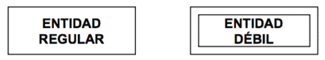
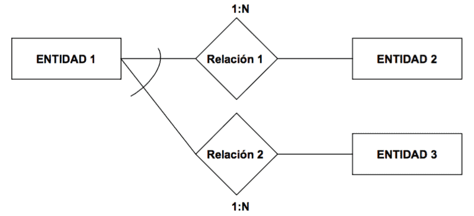
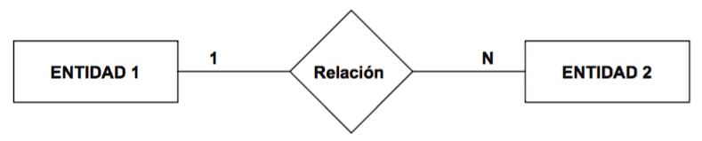
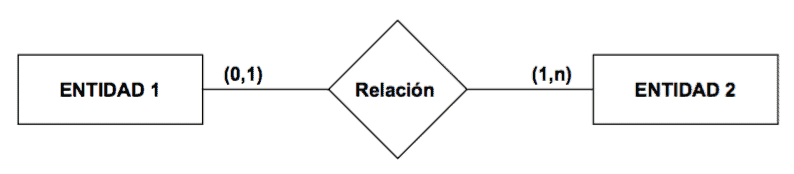
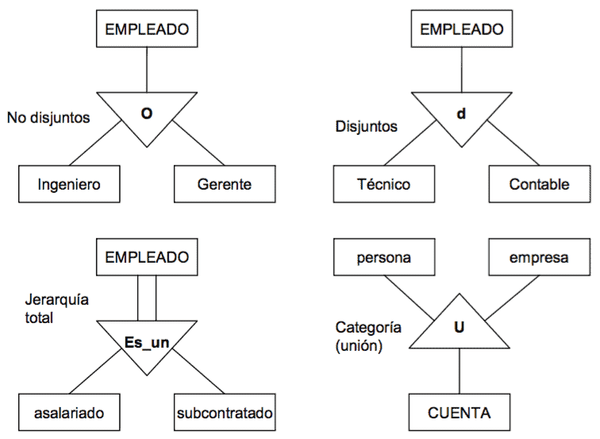
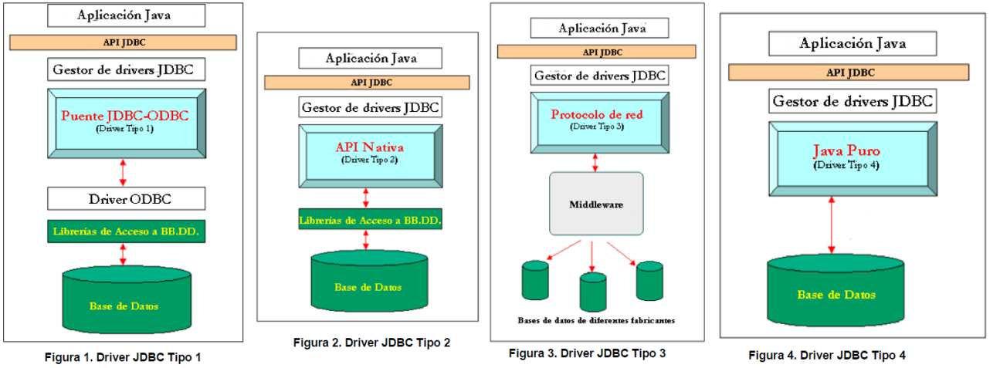

# Conceptos básicos

Lenguaje de definición/manipulación/control de datos:

* **DDL**: creación, manipulación o borrado de tablas y de todo lo relacionado con ellas como
los atributos, índices o reglas de integridad (ej: CREATE, DROP, ALTER)
* **DML**: consultas, inserciones, modificaciones o borrados de los datos
(ej: SELECT, INSERT, UPDATE, DELETE)
* **DCL**: controla el acceso a los datos (ej: GRANT, REVOKE)

Propiedades **ACID**:

* **A**tomicidad: la transacción tiene efecto o no en su totalidad, nunca parcialmente
* **C**onsistencia: se debe preservar la integridad y consistencia de la BD
* A**i**slamiento: los cambios no son visibles hasta ejecutar el *commit*
* **D**uradero: los cambios se hacen persistente una vez ejecutado el *commit*

# SGDB

## Arquitectura ANSI/X3/SPARC

1. **Nivel físico** o interno: describe cómo los datos se almacenan en la base
de datos y en el hardware del equipo
2. **Nivel conceptual**: describe los datos que se almacenan dentro de la BD y
cómo los datos están relacionados entre sí (el DBA trabaja en este nivel)
3. **Nivel lógico** o externo: formado por las *vistas de usuario*, que excluye datos
irrelevantes y datos que el usuario no está autorizado a acceder (el usuario trabaja en este nivel)

ANSI establece 3 familias de modelos de datos:

* Modelo **relacional**: al que nos referimos cuando hablamos de SGDB sin concretar
* [Modelo **codasyl**](https://es.wikipedia.org/wiki/CODASYL): estructura en red
donde se establecen relaciones n:m
* Modelo **jerárquico**: presenta una estructura en árbol donde nodos y ramas siguen una relación
del tipo 1:n

## Concurrencia

Los problemas que pueden surgir a raíz de distintas transacciones concurrentes
(T1 y T2):

* **Lectura no repetible**: T1 lee dos veces un valor y no coincide porque entre
medias T2 lo ha cambiado
* **Lectura sucia**: T1 lee un dato modificado por T2 antes de que este haya hecho
el *commit* de manera que si T2 falla (rollback) o vuelve a modificar el dato, T1
habría leído un dato que nunca llego a ser valido
* **Lectura fantasma**: T1 hace dos veces la misma consulta y en la segunda obtiene
más datos porque entre medias T2 añadió nuevas filas

Esto esta relacionado con los niveles de aislamiento:

* **Lectura no comprometida**: Los cambios realizados por las transacciones se encuentran
disponibles inmediatamente
* **Lectura comprometida**: Los cambios solo están disponibles después del *commit*.
Precie *lecturas sucias*
* **Lectura repetible**: las filas leídas o actualizadas por una transacción quedan
bloqueadas hasta que finaliza dicha transacción. Previene la *lectura sucia* y
la *lectura no repetible*
* **Serializable**: las transacciones ejecutadas de manera simultanea producen los
mismos efectos que si se ejecutaran en serie. Previene todos los problemas

| Nivel de aislamiento | Lectura | < | < |
|-|-|-|-|
| ^            | sucia | no repetible | fantasma |
| Lectura **no** comprometida | SI | SI | SI |
| Lectura comprometida        | NO | SI | SI |
| Lectura repetible           | NO | NO | SI |
| Serializable                    | NO | NO | NO |

Tabla: Niveles de aislamiento

El mecanismo de control más usado es el [**Two-phase-locking**](https://es.wikipedia.org/wiki/Bloqueo_de_dos_fases) que garantiza la serialización de las transaciones.
Su funcionamiento consiste en que cada transacción debe emitir todas las solicitudes
de bloqueo antes de que pueda emitir cualquier solicitud de desbloqueo. Las **fases** son:

* Fase de expansión (crecimiento): la transacción emite cualquier nueva solicitud
de bloqueo que se requiera. Las solicitudes de desbloqueo no están permitidas en esta fase.
* Fase de reducción: la transacción libera bloqueos adquiridos en la fase de expansión.
Las nuevas solicitudes de bloqueo no están permitidas en esta fase.

# [Modelo relacional](https://es.wikipedia.org/wiki/Modelo_relacional)

Propuesto por E.F. Codd en 1970, es un modelo basado en el concepto matemático
de la teoría de conjuntos, donde los datos se estructuran en forma de relaciones
modeladas mediante tablas.

Para manipular la información se utiliza un lenguaje relacional:

* [**Álgebra relacional**](https://es.wikipedia.org/wiki/%C3%81lgebra_relacional) permite describir la forma de realizar una consulta
* [**Cálculo relacional**](https://es.wikipedia.org/wiki/C%C3%A1lculo_relacional)
lenguaje declarativo que permite construir expresiones equivalentes a
las del álgebra relacional y es la base del lenguaje SQL

| Álgebra relacional | SQL |
|-|-|
| Selección `c(R)`               | select * from R where c |
| Proyección `a1, a2 ... an (R)` | select a1, a2 ... an from R |
| Producto cartesiano `RxS`      | select * from R, S |
| Join natural `R ⋈ S`          | select * from R,S where Pk(R)=Fk(S) |
| Unon `R ∪ S`                   | select * from R union select * from S |
| Intersección `R ∩ S`           | select * from R instersect select * from S |
| Diferencia `R - S`             | select * from R minus select * from S |
| Cociente `R/S`                 | no existe en sql, hay que hacerlo combinando otros operadores |

Tabla: Equivalencia álgebra relacional - sentencias SQL

## Reglas de Codd

1. La regla de la **información**: Toda la información en un RDBMS está explícitamente representada de una sola manera por valores en una tabla
2. La regla del **acceso garantizado**: Cada ítem de datos debe ser lógicamente accesible al ejecutar una búsqueda que combine el nombre de la tabla, su clave primaria y el nombre de la columna
3. **Tratamiento sistemático de los valores nulos**: La información inaplicable o faltante puede ser representada a través de valores nulos
4. La regla de la **descripción de la base de datos**: La descripción de la base de datos es almacenada de la misma manera que los datos ordinarios, esto es, en tablas y columnas, y debe ser accesible a los usuarios autorizados
5. La regla del **sub-lenguaje integral**: Debe haber al menos un lenguaje que sea integral para soportar la definición de datos, manipulación de datos, definición de vistas, restricciones de integridad, y control de autorizaciones y transacciones
6. La regla de la **actualización de vistas**: Todas las vistas que son teóricamente actualizables, deben ser actualizables por el sistema mismo
7. La regla de **insertar y actualizar**: La capacidad de manejar una base de datos con operandos simples se aplica no sólo para la recuperación o consulta de datos, sino también para la inserción, actualización y borrado de datos
8. La regla de **independencia física**: El acceso de usuarios a la base de datos a través de terminales o programas de aplicación, debe permanecer consistente lógicamente cuando quiera que haya cambios en los datos almacenados, o sean cambiados los métodos de acceso a los datos
9. La regla de **independencia lógica**: Los programas de aplicación y las actividades de acceso por terminal deben permanecer lógicamente inalteradas cuando quiera que se hagan cambios (según los permisos asignados) en las tablas de la base de datos
10. La regla de la **independencia de la integridad**: Todas las restricciones de integridad deben ser definibles en los datos, y almacenables en el catálogo, no en el programa de aplicación
11. La regla de la **distribución**: El sistema debe poseer un lenguaje de datos que pueda soportar que la base de datos esté distribuida físicamente en distintos lugares sin que esto afecte o altere a los programas de aplicación
12. Regla de la **no-subversión**: Si el sistema tiene lenguajes de bajo nivel, estos lenguajes de ninguna manera pueden ser usados para violar la integridad de las reglas y restricciones expresadas en un lenguaje de alto nivel (como SQL)

## [Normalización de una base de datos](https://es.wikipedia.org/wiki/Normalizaci%C3%B3n_de_bases_de_datos)

Es el proceso de rediseño de las tablas de una BD con el objetivo de minimizar
la redundancia de datos.

Siendo:

* Una **superclave** es cualquier conjunto de atributos que permita distinguir a
todas las filas de una tabla
* Una **clave candidata** es una superclave mínima, es decir, que si se le quita
algún atributo deja de ser superclave
* Un **atributo primario** es aquel que pertenece a una *clave candidata* y un
**atributo secundario** el que no
* una dependencia transitiva es una dependencia funcional X → Z en la cual Z
no es inmediatamente dependiente de X, pero sí de un tercer conjunto de
atributos Y, que a su vez depende de X, es decir, X → Z por virtud de X → Y e Y → Z
* un **determinante** es un atributo que determina completamente a otro
* una tabla con una **dependencia multivaluada** es una donde la existencia de
dos o más relaciones independientes muchos a muchos causa redundancia

Tenemos que:

1. **1FM**:
    * todos los atributos son atómicos
    * no debe existir variación en el número de columnas
    * los campos no clave deben identificarse por la clave (dependencia funcional)
    * el significado es independiente del orden de filas o columnas
2. **2FM**: 1FM + todos los atributos dependen de forma completa de la clave (dependencia completamente funcional)
3. **3FM**: 2FM + ningún atributo secundario depende transitivamente de la clave.
Otra forma de definirlo es que para cada una de sus dependencias funcionales
X → A se ha de dar una de las siguientes condiciones:
    * X contiene A, ó
    * X es una superclave, ó
    * A es un atributo primario
4. **FNBC**: 3FM + todo determinante es clave candidata
5. **4FN**: (3FM o FNBC) + no poseer dependencias multivaluadas no triviales
5. **5FN**: 4FN + no existen relaciones *join* no triviales que no se generen
desde claves

## Modelo Entidad/Relación Extendido

Se compone de **Entidades**:

* regulares: existe por si mismas
* débiles: su existencia depende de otra entidad

y **Relaciones**:

* relaciones regulares
* relaciones débiles:
    * dependencia de existencia: las ocurrencias de la entidad débil
    no pueden existir sin la ocurrencia de la entidad regular de la que dependen
    * dependencia de identificación: además de lo anterior, las ocurrencias del
    la entidad débil no se pueden identificar sólo mediante sus propios atributos,
    sino que se les tiene que añadir el identificador de la entidad regular de la
    que dependen
* relaciones exclusivas: su existencia entre dos entidades implica la no existencia
de otras relaciones

Las **relaciones** se caracterizan por su:

* **Tipo de correspondencia**: número máximo de ocurrencias de una entidad que
pueden intervenir en una ocurrencia de la relación:
    * relaciones **1:1**: cada ocurrencia de una entidad se relaciona con una y
    solo una ocurrencia de la otra entidad
    * relaciones **1:N**: cada ocurrencia de una entidad puede estar relacionada
    con cero, una o varias ocurrencias de la otra entidad
    * relaciones **M:N**: cada ocurrencia de una entidad puede estar relacionada
    con cero, una o varias ocurrencias de la otra entidad y viceversa
* **Cardinalidad**: el número máximo y mínimo de ocurrencias de una entidad que
pueden estar interrelacionadas con una ocurrencia de otro entidad

La **cardinalidad máxima** coincide con el **tipo de correspondencia**.

Figura: Representación de la correspondencia

Figura: Representación de la cardinalidad

Las extensiones del modelo E/R consisten en:

* **Generalización**: se abstrae una entidad de nivel superior a partir de
varias entidades (ej: de *profesor* y *estudiante* a *persona*)
* **Especialización**: inversa de *generalización* (ej: de *empleado* a
*secretario*, *técnico* e *ingeniero*)
* **Categorías**: subtipo que aparece como resultado de la unión de varios
tipos de entidad (ej: teniendo *persona* y *compañia* se crea subtipo
*propietario* para relacionarlo con *vehículo*)
* **Agregación**: construir un nuevo tipo de entidad como composición de otros
y sus relaciones (ej: teniendo *empresa* y *solicitante* relacionados por
*entrevista* se crea el tipo compuesta *empresa-entrevista-solicitante* para
relacionarla con *oferta*)
* **Desagregación**: inverso de la *agregación*
* **Asociación**: relacionar dos tipos de entidades que normalmente son de dominios
independientes, pero coyunturalmente se asocian

Estas extensiones dan lugar a jerarquías entre tipos y subtipos

Figura: **d** = los subtipos son disjuntos 
**O** = los subtipos pueden solaparse 
**U** = uniones por categorías 
La presencia de una jerarquía total se representa con una doble línea entre el
supertipo y el triángulo

# Estándares ODBC, JDBC, .NET y PHP

**ODBC**: estándar de acceso a BD que proporciona una interfaz a las aplicaciones.
Para ello necesita una capa intermedia (<abbr title="Call-Level Interface">CLI</abbr>)
entre la aplicación y el SGDB, que se encarga de traducir las consultas de datos
desde la aplicación a comandos para ese SGDB concreto.

**JDBC**: conecta aplicaciones Java con un gestor de BD desde el lenguaje de
programación Java. Tipos de drivers:

* Tipo 1 (Puente JDBC-ODBC): convierte el método JDBC a una llamada a una función ODBC.
Utiliza los drivers ODBC para conectar con la BD.
* Tipo 2 (Driver parcialmente nativo): convierte el método JDBC a llamadas a una API nativa que
debe estar en el cliente que accede a la BD.
* Tipo 3 (JDBC middleware): el cliente cuenta con un driver JDBC puro que conecta con un
servidor intermedio encargado de traducir los métodos JDBC al lenguaje específico del SGBD.
* Tipo 4 (Driver Java puro): desarrollado en Java, utiliza directamente el protocolo de la BD.
Ofrece mejor rendimiento pero está ligado a un SGBD concreto.

Figura: Tipos de drives JDBC

**.NET** ofrece ADO.NET que incorpora la posibilidad de cachear la información
obtenida, y es habitual que se integre con Entity Framework que es un mapeador
objeto-relacional de Microsoft (La alternativa anterior era OLE DB y esta deprecada).

**PHP** ofrece PDO para drivers para las bases de datos más habituales.

# Bibliografía

* PreparaTic27 - Pack1/063
* PreparaTic27 - Pack1/064
* <strike title="Se solapa con otros temas">PreparaTic27 - Pack1/088</strike>
* [manuel.cillero.es - Modelo Entidad/Relación Extendido](https://manuel.cillero.es/doc/metodologia/metrica-3/tecnicas/modelo-entidad-relacion-extendido/)
* [glosarioit.co - Bloqueo de dos fases](https://www.glosarioit.com/Bloqueo_de_dos_fases)
* [conceptosbasededatos-adsi.blogspot.com - Jerarquías: Generalizaciones y Especializaciones](http://conceptosbasededatos-adsi.blogspot.com/2013/11/jerarquias-generalizaciones-y.html)
