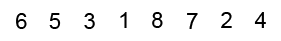
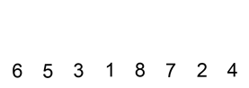
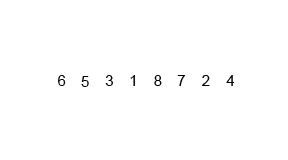

# Conceptos básicos

**TAD**:
conjunto de valores y de operaciones definidos
mediante una especificación independiente de cualquier representación.

**Algoritmo**: conjunto de pasos o instrucciones que se deben seguir para realizar
una determinada tarea.

# [Cota superior asintótica](https://es.wikipedia.org/wiki/Cota_superior_asint%C3%B3tica)

Concepto matemático usado para estimar el **tiempo o coste de ejecución** de un algoritmo
(también puede aplicar a las operaciones de la implementación de TAD) en función
del tamaño del dato de entrada.

Por ejemplo, el *ordenamiento por inserción* crece cuadráticamente a medida que
aumenta el tamaño de entrada, por lo tanto este algoritmo es de tipo `O(n²)`
(orden de n cuadrado).

| Notación      | Nombre |
|---------------|--------|
| O(1)          | Orden constante |
| O(log log n)  | Orden sublogarítmico |
| O(log n)      | Orden logarítmico |
| O(√n)         | Orden sublineal |
| O(n)          | Orden lineal o de primer orden |
| O(n log n)    | Orden lineal logarítmica |
| O(n²)         | Orden cuadrática o de segundo orden |
| O(n³), ...    | Orden cúbica o de tercer orden, ... |
| O(c^n), n > 1 | Orden exponencial |
| O(n!)         | Orden factorial |

Tabla: Ordenes de complejidad de menor a mayor 

Pero la complejidad no solo depende del tamaño del dato de entrada, si no
de que dato en concreto es, por lo tanto [tenemos 3 casos](https://es.wikipedia.org/wiki/Casos_peor,_mejor_y_promedio)
(ej: buscar secuencialmente un elemento en una lista):

* el **caso mejor**: `Ω(1)` = el elemento buscado es el primero
* el **caso peor**: `O(n)` = el elemento buscado es el último
* el **caso esperado o promedio**: `Θ(n/2)` = puesto que todas la posiciones son equiprobables

Por lo general, se considera el caso promedio.

También se puede medir la **[complejidad espacial](https://en.wikipedia.org/wiki/Space_complexity)**,
que es la cantidad de memoria requerida para ejecutar el algoritmo.

| Algoritmo      | Caso  | <        | <    | Observaciones |
|----------------|-------|----------|------|---------------|
| ^              | mejor | promedio | peor | ^             |
| Quicksort      | Ω(n log n) | Θ(n log n) | O(n²) | |
| Mergesort      | Ω(n log n) | Θ(n log n) | O(n log n) | |
| Timsort        | Ω(n) | Θ(n log n) | O(n log n) | |
| Heapsort       | Ω(n log n) | Θ(n log n) | O(n log n) | |
| Bubble Sort    | Ω(n) | Θ(n²) | O(n²) | |
| Insertion Sort | Ω(n) | Θ(n²) | O(n²) | |
| Selection Sort | Ω(n²) | Θ(n²) | O(n²) | |
| Tree Sort      | Ω(n log n) | Θ(n log n) | O(n²) | |
| Shell Sort     | Ω(n log n) | Θ(n log²n) | O(n log²n) | |
| Bucket Sort    | Ω(n+k) | Θ(n+k) | O(n²) | k = nº de buckets |
| Radix Sort     | Ω(nk) | Θ(nk) | O(nk) | k = nº de digitos |
| Counting Sort  | Ω(n+k) | Θ(n+k) | O(n+k) | k = max - min |
| Cubesort       | Ω(n) | Θ(n log n) | O(n log n) | |

Tabla: Complejidad de algoritmos de ordenación 

| TAD | Acceso | Búsqueda | Inserción | Borrado |
|-----|--------|----------|-----------|---------|
| Array          | Θ(1) | Θ(n) | Θ(n) | Θ(n) |
| Lista enlazada | Θ(n) | Θ(n) | Θ(1) | Θ(1) |
| Skip List | Θ(log n) | Θ(log n) | Θ(log n) | Θ(log n) |
| └─ *caso peor*                                       | O(n)      | O(n)      | O(n)      | O(n) |
| Tabla Hash | | Θ(1) | Θ(1) | Θ(1) |
| └─ *caso peor*                                         | | O(n) | O(n) | O(n) |
| Árbol binario de búsqueda | Θ(log n) | Θ(log n) | Θ(log n) | Θ(log n) |
| └─ *caso peor*                                                                                 | O(n)     | O(n)     | O(n)     | O(n) |
| Árbol cartesiano | | Θ(log n) | Θ(log n) | Θ(log n) |
| └─ *caso peor*                                                          | | O(n)     | O(n)     | O(n) |
| B-Tree | Θ(log n) | Θ(log n) | Θ(log n) | Θ(log n) |
| Árbol rojo-negro | Θ(log n) | Θ(log n) | Θ(log n) | Θ(log n) |
| Árbol biselado | | Θ(log n) | Θ(log n) | Θ(log n) |
| Árbol AVL | Θ(log n) | Θ(log n) | Θ(log n) | Θ(log n) |
| Árbol KD | Θ(log n) | Θ(log n) | Θ(log n) | Θ(log n) |
| └─ *caso peor*                                          | O(n)     | O(n)     | O(n)     | O(n) |

Tabla: Complejidad de operaciones sobre TAD (*caso peor* omitido cuando coincide con el *caso promedio*)  

# TAD

Tienen tres tipos de operaciones:

* Creación
* Transformación: asignación de valores, permutas, etc
* Análisis: consultar valor, búsquedas, recorridos, etc

## Array (o vector o matriz o tabla)

Estructura homogeneiza que almacena datos del mismo tipo,
pudiendo ser unidimensional (`Array[N]`) o multidimensional (`Array[N, M, ...]`)
que ocupan posiciones contiguas de memoria.

Habitualmente son implementados como Array estáticos (es decir, con longitud fija)
pero también pueden ser dinámicos.

La operación fundamental es la de acceso (`O(1)`) y esta especialmente indicado
para situaciones en las que se requiere acceso aleatorio.
En otro caso es probable que sea mejor usar una lista enlazada.

## Lista enlazada

Secuencia de nodos, en los que se guardan campos de datos arbitrarios y una o dos
referencias, enlaces o punteros al nodo anterior o posterior.

El orden de los elementos enlazados puede ser diferente al orden de almacenamiento
en la memoria o el disco, permitiendo que el orden de recorrido de la lista sea
diferente al de almacenamiento.

Según los enlaces entre nodos pueden ser:

* **Lista enlazada simple**: cada nodo tiene un único enlace que apunta al siguiente nodo
* **Lista enlazada doblemente**: cada nodo tienen dos enlaces, uno al siguiente nodo y otro al anterior
* **Skip List**: lista enlazada que tienen capas de enlaces adicionales para ir
de un elemento a otro mas alejado de manera directa

De ambos tipos hay una versión **circular** que consiste en considerar el primer
nodo como el *siguiente* del último nodo, y el último nodo como el *anterior* del primer nodo.

Las listas no permiten acceso aleatorio (como los Array) si no acceso secuencial (`O(n)`),
a cambio tenemos inserciones y eliminaciones más rápidas (`O(1)`).

Las listas que restringen sus operaciones de inserción y eliminación
a uno de los extremos son:

* **[Pila](https://es.wikipedia.org/wiki/Pila_(inform%C3%A1tica))** (LIFO): El último elemento en entrar es el primero en salir
* **[Cola](https://es.wikipedia.org/wiki/Cola_(inform%C3%A1tica))** (FIFO): El primer elemento en entrar es el primero en salir

## Grafo

Conjunto de nodos (o vértices) cuyas relaciones se establecen por un conjunto de
aristas (o arcos).

En función de las aristas pueden:

* ser **dirigidos** (el arco `A -> B` es distinto al arco `B -> A`) o **no dirigido**
* **ponderado** (las aristas tienen un coste o un peso asociado) o **no ponderado**
* **conexo** cuando si existe un camino entre cualesquiera dos nodos
* **completo** si tiene todas las aristas posibles, **disperso** si
tiene pocas aristas y **denso** si tiene la mayoría

Además:

* Un **puente** es una arista de un grafo **conexo** que si se elimina deja de serlo
* Un **árbol de expansión** de un grafo es su reducción al árbol con número mínimo
de aristas que contiene todos los nodos del grafo
* Una **red** es un grafo dirigido y ponderado

## Árbol

Es un grafo conexo dirigido que no tiene ciclos, o lo que es lo mismo, entre cada par de
nodos solo existe un camino (esto implica que un nodo solo tiene como máximo un padre).
Se utilizan habitualmente en búsquedas.

El árbol empieza en el nodo raíz (nivel 0) y acaba en sus hojas (nodos sin hijos).

Tipos:

* Árbol **binario**: Cada nodo tiene como máximo dos hijos
* Árbol **balanceado**: Entre todos sus nodos hoja no hay una diferencia de nivel superior a 1

Un [árbol binario se puede recorrer](https://es.wikipedia.org/wiki/Recorrido_de_%C3%A1rboles):

* [en **amplitud**](https://es.wikipedia.org/wiki/%C3%81rbol_binario#Recorridos_en_amplitud_(o_por_niveles)) o por niveles:
empezando por el nivel 1, se recorre todos los nodos de cada nivel de izquierda a derecha
(se puede implementar con una cola)
* [en **profundidad**](https://es.wikipedia.org/wiki/%C3%81rbol_binario#Recorridos_en_profundidad)
(se implementa recursivamente o con una pila):
    * **preorden** (primero la raíz): <u>raíz</u>, izquierdo, derecho
    * **inorden** (la raíz en medio): izquierdo, <u>raíz</u>, derecho
    * **postorden** (la raíz lo último): izquierdo, derecho, <u>raíz</u>

| Recorrido | Árbol | < | < | < | < | < | < | < | < |
|-----------|-------|---|---|---|---|---|---|---|---|
|  | < | < | < | < | < | < | < | < | < |
| **Amplitud**  | F | B | G | A | D | I | C | E | H |
| **Preorden**  | F | B | A | D | C | E | G | I | H |
| **Inorden**   | A | B | C | D | E | F | G | H | I |
| **Postorden** | A | C | E | D | B | H | I | G | F |

Tabla: [Recorridos de un árbol binario](https://es.wikipedia.org/wiki/Recorrido_de_%C3%A1rboles)

Nota: Estos métodos de recorrido se puede generalizar para grafos y arboles no binarios.

Para regenerar un árbol a partir de su recorrido se necesita:

* si no se repiten nodos: 2 recorridos en profundidad
* si se repiten: 3 recorridos en profundidad

Algunos ejemplos de árboles son:

* **Árbol binario de búsqueda**: para cada nodo, el subárbol izquierdo contiene
valores menores que dicho nodo, y el subárbol derecho contiene valores superiores
* **Montículo**: Árbol binario casi completo donde cada nodo padre es mayor/menor (heap max/heap min) que cualquier que sus hijos
* **Árbol cartesiano**: Representación de una lista de elementos mediante un montículo cuyo recorrido en inorder da dicha lista
* **B-Tree**: Como un *árbol binario de búsqueda* pero pudiendo tener más de dos hijos
(ej, `árbol-B 2-3` o `árbol 2-3` es un árbol que cada nodo puede tener 2 o 3 hijos)
* **Árbol B+**: Un *B-Tree* donde la información solo se encuentra en los nodos
hojas (siendo los demás punteros y claves), las cuales están todas en el mismo nivel
* **Árbol AVL**: Árbol binario de búsqueda equilibrado (se equilibra con rotaciones)
* **Árbol rojo-negro**: Árbol binario de búsqueda equilibrado donde la raíz y
todas las hojas son *negras*, todo nodo *rojo* debe tener dos hijos *negros*
y todo camino desde un nodo a sus hojas tiene el mismo número de nodos negros
* **Árbol biselado**: Árbol binario de búsqueda equilibrado pensado para que los
nodos accedidos recientemente sean más rápidos de volver acceder, es decir,
cuando se lee un nodo el árbol se reordena (como el AVL) para *subir* ese nodo de nivel
* **Árbol KD**: Árbol de K dimensiones

## Otros

* Conjunto
* Bolsa: Como el conjunto pero puede tener elementos repetidos

# Algoritmos

## [Técnicas](https://es.wikipedia.org/wiki/Categor%C3%ADa:Algoritmos)

* **Divide y vencerás**
* **Programación dinámica**: mientras divide el problema en subproblemas guarda
el resultado de dichos subproblemas para en caso de volver a aparecer no tener
que repetir el calculo, o incluso precalcular a priori soluciones de subproblemas
para usarlas luego
* **Algoritmo voraz**: en cada paso se toma el optimo local con la esperanza
de que eso nos lleve a la mejor solución (lo cual no esta garantizado, pero
nos conformarnos porque intentar obtener la mejor solución con certeza tendría
un alto coste)
* **Backtracking** o vuelta atrás: se van creando todas las posibles combinaciones
de elementos para obtener una solución (no tiene porque ser la mejor, basta con
que cumpla las condiciones exigidas), si se encuentra una alternativa incorrecta,
la búsqueda retrocede hasta el paso anterior y toma la siguiente alternativa
* **Ramificación y poda**: como *Backtracking* pero optimizado para no probar
(podar) caminos que se prevén no llevarán a soluciones optimas

## Ordenación

### Selection Sort

Se busca el elemento más pequeño y se pone en la primera posición, luego,
entre los restantes, se busca el más pequeño y se coloca en segunda posición,
y así hasta terminar.

Si tenemos N elementos, el número de comprobaciones que hay que hacer es de
`N*(N-1)/2`, por lo tanto este algoritmo es `O(N²)`.

### Bubble Sort

Se comparan pares de elementos adyacente intercambiándolos entre si en caso
de estar desordenados. Tras la primera pasada, el último elemento esta ya
colocado, así que se vuelve a repetir los pasos hasta el penúltimo elemento,
y así sucesivamente.

Figura: Bubble Sort

Para completar el algoritmo hay que hacer `N-1` pasadas, siendo `(N-i-1)` el
número de comparaciones en la pasada `i`, es decir, hay que hacer
un total de `N(N-1)/2` compradores, por lo tanto este algoritmo es `O(N²)`.

### Insertion Sort

Se van recorriendo los elementos y comparándolos con el de su izquierda, de manera
que si esta mal colocado se inserta en el lugar correcto del inicio de la lista
desplazando elementos si es necesario.

Figura: Insertion Sort

Se necesitan `(N*(N+1)/2)-1` comparaciones, por lo tanto este algoritmo es `O(n²)`.

### Shell Sort

Es como el *Insertion Sort* pero en vez de comparar con el elemento adyacente
a la izquierda, se compara con un elemento X (salto) lugares a la izquierda.
El *salto* inicialmente es de N/2 y cuando una pasada no desencadene ningún
cambio se reduce el *salto* a la mitad y se vuelve a empezar.

Esto mejora el rendimiento, siendo el peor caso `O(n log²n)`.

### Quicksort

Algoritmo recursivo basado en la técnica *divide y vencerás* que consiste en:

1. elegir un valor de la lista como *pivote*
2. mover los demás elementos de la lista a cada lado del *pivote*,
de manera que a un lado queden todos los menores que él, y al otro los mayores
3. mover el pivote a la posición que le corresponde (entre las dos grupos que hemos formado en el paso anterior)
3. tratar cada lado del *pivote* como una nueva lista y repetir el proceso con ellas

La eficiencia del algoritmo depende de la elección del pivote y en el peor caso
es `O(n²)`, pero en el promedio es `Θ(n log n)`.

### Mergesort

Algoritmo recursivo basado en la técnica *divide y vencerás* que consiste en:

1. Dividir la lista en dos sublistas de aproximadamente la mitad de tamaño
2. Ordenar cada lista con mergesort
3. Mezclar ambas listas en una sola lista ordenada

Figura: Mergesort

Su complejidad es `O(n log n)`.

### Heapsort

Algoritmo recursivo que consiste en almacenar todos los elementos en un
montículo y luego extraer el nodo raíz en sucesivas iteraciones.

Su complejidad es `O(n log n)`.

### Otros

* **Timsort**: Híbrido de Mergesort e Insertion Sort. Es el algoritmo por defecto
en Python y, para arrays de tipos no primitivos, en Java
* **Tree Sort**: Se construye un árbol binario de búsqueda y luego se recorre en *inorder*
* **Bucket Sort**: Se dividen los elementos por intervalos en distintos casilleros,
luego se ordena cada casillero (repitiendo el proceso o usando otro algoritmo de ordenación)
y finalmente se devuelve los elementos de cada casillero en orden
* **Radix Sort**: Ordena número enteros procesando sus dígitos de manera individual
* **Counting Sort**: Ordena números enteros mediante el conteo de cuantas ocurrencias hay de cada uno
* **Cubesort**: algoritmo paralelo que usa búsqueda binaria

## Búsqueda

* Búsqueda **secuencial**: complejidad `O(N)`
* [Búsqueda **binaria**](https://es.wikipedia.org/wiki/B%C3%BAsqueda_binaria)
o dicotómica: tiene como prerequisito que la lista este ordenada, complejidad `O(log n)`
* Dijkstra: encuentra el camino mínimo entre dos nodos de un grafo, complejidad
`O(|A| + |V| log |V|)` usando un montículo de Fibonacci
* [**Búsquedas no informadas**](https://es.wikipedia.org/wiki/B%C3%BAsquedas_no_informadas):
se evalúa el siguiente estado sin conocer a priori si este es mejor o peor que el anterior
    * **Búsqueda en profundidad** (DFS): consiste en ir expandiendo todos y cada uno de los
    nodos que va localizando en un camino concreto y cuando no hay más en ese camino,
    regresa (backtracking) para repetir el mismo proceso con cada uno de los hermanos
    del nodo ya procesado, su complejidad es `O(b^m)` siendo `b` es el factor de
    ramificación (número promedio de ramificaciones por nodo) y `m` la máxima profundidad
    del espacio de estados. No es completo ni optimo
    * **Búsqueda en anchura** (BFS): se visitan los nodos de izquierda a derecha y al
    terminar se pasa al siguiente nivel. Es completo y optimo
    * **Búsqueda en profundidad iterativa** (BPI): como el anterior pero llegando solo hasta
    cierta profundidad limitada que luego se va aumentando sucesivamente hasta alcanzar
    `d` la profundidad del estado objetivo de menor profundidad. La complejidad es `O(b^d)`.
    Es completo y optimo
    * **Búsqueda de costo uniforme** (BCU): busca el camino con costo más bajo en un
    grafo ponderado (Dijkstra es igual pero no buscando un nodo en concreto, si no
    trazando caminos mínimos para todos). Solo funciona si todos los pesos son `>=0`

# Bibliografía

* [gsitic.wordpress.com - B3]({filename}/posts/gsitic.wordpress.com/bloque_3.md#tablas,-listas-y-arboles)
* [webdiis.unizar.es - Los Tipos Abstractos de Datos](http://webdiis.unizar.es/~elvira/eda/material0304/TADespec/TAD.pdf)
* [cs.us.es - Análisis de la complejidad de los algoritmos](https://www.cs.us.es/~jalonso/cursos/i1m-19/temas/tema-28.html)
* [infor.uva.es - Complejidad algorítmica](https://www2.infor.uva.es/~jvalvarez/docencia/tema5.pdf)
* [bigocheatsheet.com](https://www.bigocheatsheet.com/)
* [youtube.com - BettaTech - 6 estructuras de datos que todo ingeniero debería conocer](https://www.youtube.com/watch?v=5k2DWMRTXMM)
* [geeks.ms - ¿Qué significa un problema P o NP?](https://geeks.ms/etomas/2019/02/02/que-significa-un-problema-p-o-np/)
* [cs.us.es - Apuntes, temas y códigos de "Informática (2019-20)"](https://www.cs.us.es/~jalonso/cursos/i1m/temas.php)
* [youtube.com - Rafael Rivera - Búsqueda por costo uniforme](https://www.youtube.com/watch?v=78yAPE5TwDI)
* [/es.wikipedia.org- Glosario de teoría de grafos](https://es.wikipedia.org/wiki/Anexo:Glosario_de_teor%C3%ADa_de_grafos)
