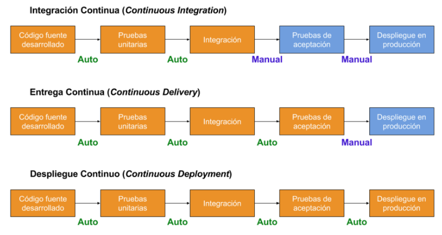
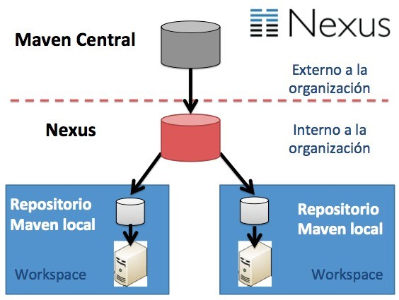
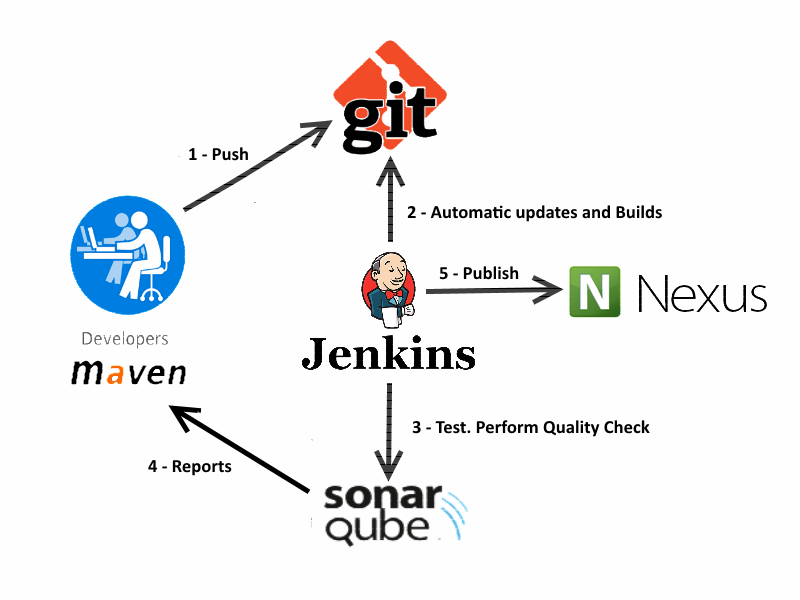

# Conceptos básicos

**Integración continua**: es una práctica de desarrollo de software mediante la
cual los desarrolladores combinan los cambios en el código en un repositorio
central de forma periódica, tras lo cual se ejecutan versiones y pruebas automáticas.

**Entrega continua**: consiste en que los equipos de desarrollo producen software en ciclos cortos, asegurando que el software puede ser liberado en cualquier momento de forma confiable
(no implica necesariamente un despliegue).

**Despliegue continuo**: consiste en que los equipos de desarrollo entregan funcionalidades de software de forma frecuente a través de la automatización de despliegues.

**CI/CD**: Integración continua + Entrega continua o Despliegue continuo.

**DevOps**: conjunto de prácticas que agrupan el desarrollo de software (Dev) y
las operaciones de TI (Ops). Su objetivo es hacer más rápido el ciclo de vida del
desarrollo de software y proporcionar una entrega continua.

**Metodologías de desarrollo ágil**: enfoque para la toma de decisiones en los
proyectos de software, basados en el desarrollo iterativo e incremental,
donde los requisitos y soluciones evolucionan con el tiempo.
El trabajo es realizado mediante la colaboración de equipos autoorganizados
y multidisciplinarios, inmersos en un proceso compartido de toma de decisiones
a corto plazo.

**Nightly build**: construcción de la última versión de un programa
que se realiza todas las noches tras pasar pruebas automáticas. Sirve para:

* Saber que en el último día no se ha introducido ningún error que impida la
construcción del proyecto
* Si la versión Nightly es pública, obtener feedback temprano

**Cobertura de código**: medida porcentual que mide el grado en que el código
fuente de un programa ha sido comprobado con pruebas de software.
Sirve para determinar la calidad de los test​ y para determinar las partes
críticas del código que no han sido comprobadas y las partes que ya lo fueron.

**Code quality gates**: mínimos de calidad requeridos que si no
se superan provocan que la ejecución se considere fallida. Ejemplos:

* un mínimo del 80% de cobertura de código
* un máximo de 10 días de Deuda Técnica según Sonar

# Objetivos de CI/CD

* La integración continua busca asegurar que el código subido al control de
versiones no rompe nada
* La entrega continua busca automatizar el despliegue en un entorno de
preproducción/staging y automatiza el set de pruebas de aceptación
* El despliegue continuo busca automatizar todos los pasos hasta el final,
esto exige pruebas de gran calidad (no solo unit testing si no sobre todo
pruebas funcionales E2E). Habitualmente se se combina con Canary deployment.

Figura 1: Diferencias entre CI, CD y DC

# Ventajas e inconvenientes

## Ventajas

* La automatización de tareas disminuye los errores humanos
* La automatización de pruebas conlleva la posibilidad de realizar análisis
sobre los resultados y verlo en un tablero de control
* Se establecen métricas y procedimientos para optimizar tiempos y calidad
* Facilita la obtención de informes de cada prueba, lo que permite informar
fácilmente del estado del proyecto
* Mejora la visibilidad de todos los proyectos y sus dependencias
* Proporciona un repositorio centralizado tanto de códigos fuentes como
de artefactos finales, y permite diferenciar entre versiones en desarrollo
y versiones liberadas
* Reduce el tiempo necesario para liberar cambios a producción

## Desventajas

* Se requiere invertir tiempo adicional en preparación de herramientas antes de
comenzar a desarrollar el proyecto en si
* Se requiere desarrollar una buena colección de test automáticos, tanto
unit-test como test funcionales

# Herramientas para implementar CI/CD

1. **Herramientas para construcción de proyectos**: automatiza la compilación
y/o construcción del proyecto. Algunos son:
    * Make (el más antiguo)
    * Apache Ant (Java):
        * el fichero de configuración se llama `build.xml`
        * integra fácilmente JUnit
        * tiene soporte de Jenkins
    * Apache Maven (Java, .Net Framework, C/C++, etc)
    * Gradle (Java, Groovy y Scala, etc)
    * Rake (Ruby)
2. **Sistema de control de versiones**: git, Subversion, Mercurial, ClearCase, Perforce, etc
3. **Repositorio de artefactos**: almacena archivos binarios o paquetes compilados
derivados del código construido con la herramienta de construcción. Ejemplos:
    * Sonatype Nexus (soporta Bower, Docker, Git LFS, Maven, npm, NuGet, PyPI, Ruby Gems, Yum, APT, Conan, R, CPAN, Raw (Universal), P2, Helm, ELPA, Go)
    * JFrog Artifactory (soporta paquetes de Maven, Gradle e Ivy, etc)
    * Apache Archiva (soporta paquetes Maven, Continuum y Continuum Ant, etc)
4. **Herramienta para pruebas** de calidad y análisis de código. Ejemplo: SonarQube.
5. **Servidor de integración continua**: orquestado de CI que automatiza, por ejemplo,
la construcción y la ejecución de pruebas mostrando los resultados. Ejemplos:
    * Open Soruce: Jenkins, Hudson, <strike title="descontinuado">CruiseControl</strike>, <strike title="descontinuado">Apache Continuum</strike>
    * Propietario: Bamboo, Azure DevOps Server

## Apache Maven

Es similar en su funcionalidad a Apache Ant, pero con un modelo de configuración
de construcción más simple.

Maven utiliza un Project Object Model (POM) para describir el proyecto de software
a construir, sus dependencias de otros módulos y componentes externos,
y el orden de construcción de los elementos. Para ello cada proyecto tiene la
información de su ciclo de vida en un descriptor XML llamado por defecto `pom.xml`.

Su arquitectura esta basada en plugins y le permite utilizar cualquier aplicación
controlable a través de la entrada estándar. Por lo tanto se pueden crear
plugins para compiladores, herramientas de pruebas unitarias, cualquier lenguaje, etc.

Las partes principales del ciclo de vida de un proyecto Maven son:

1. **compile**: genera los ficheros `.class` compilando los fuentes `.java`
2. **test**: ejecuta los test automáticos de JUnit, abortando el proceso si alguno de ellos falla
3. **package**: genera el fichero `.jar` con los `.class` compilados
4. **install**: copia el fichero `.jar` a un repositorio local de forma que esos
`.jar` pueden utilizarse en otros proyectos Maven en el mismo equipo
5. **deploy**: copia el fichero `.jar` a un servidor remoto, poniéndolo disponible
para cualquier proyecto Maven con acceso a ese servidor remoto

Los objetivos perseguidos con Maven son:

* Facilitar el proceso de construcción.
* Proporcionar un sistema de construcción uniforme: todos los proyectos Maven
funcionan de la misma forma, por lo que el esfuerzo de aprendizaje sólo se hace una vez
* Proporcionar información útil sobre el proyecto:
    * lista de cambios desde el control de versiones
    * dependencias transitivas
    * informes de la ejecución de pruebas unitarias, etc
* Ayudar a utilizar las mejores prácticas de desarrollo
* Permitir introducir nuevos servicios de forma sencilla

## Repositorios de artefactos

Se usan tanto para subir tus propios artefactos como para descargar librerías
de terceros que podemos usar como dependencias.

Estos repositorios permiten tener distintas versiones de cada artefacto.

Los repositorios de artefactos como Nexus o Artifactory se utilizan para no tener
que depender de algo externo siempre y poder mantener controladas las librerías
propias de la organización. También pueden usarse como caches de manera que no
haga falta siempre acudir al exterior de la organización para obtener una librería.

Figura 2: Repositorio de artefactos interno

## SonarQube

Herramienta de análisis de código en base a un conjunto de reglas adoptadas por
la comunidad. El análisis nos dice cómo de bueno es nuestro código,
los errores que tiene, los tipos de errores encontrados y las causas, y añade una
serie de posibles soluciones.

También, califica la calidad del código, valor que se actualiza continuamente tras cada
modificación del código del proyecto, por lo que puede evolucionar tanto positiva
como negativamente. Esto permite supervisar de forma continua la calidad del código
del software de cada proyecto, y analizar tendencias.

Características principales de la herramienta:

* Compatible con Maven, por lo que puede generarse un informe complementario dentro
del ciclo de build y mediante el uso de un servidor de integración continua
* Integra herramientas de medición de la calidad de código (Findbugs, Checkstyle, PMD, CPD)
mediante plugins y ofreciendo un resumen tipo cuadro de mando. Clasifica las
incidencias en base a su severidad y a su naturaleza: fiabilidad, usabilidad, eficiencia, mantenimiento,
portabilidad (matriz de radar del gráfico)
* Permite navegar por el código y ver los errores dentro del mismo,
ayudando a disponer de un entorno de mejora continua
* Dispone de medidas de:
    * complejidad ciclomática
    * LCOM4 (medida de cohesión de métodos)
    * RFC (Response for Class)
    * nº de comentarios
    * nº de las líneas de código que no se ejecutan
    * código duplicado
* Permite disponer de una matriz de dependencia entre paquetes, donde
fácilmente se encuentran referencias cíclicas (falta de desacoplo en el diseño de nuestra aplicación)
* Permite disponer de medidas de cobertura de las clases de prueba sobre código
de la aplicación
* Informa sobre estándares de codificación, pruebas unitarias, posibles errores y diseño del software

# Ejemplo de secuencia típica de trabajo en Jenkins

1. Se configura el repositorio del GIT que almacenará el proyecto.
2. Se sube el código al repositorio de control de versiones GIT (push)
3. El anterior paso anterior dispara un job en Jenkins.
4. El job invoca un Maven para realizar la construcción del software,
lo que incluye la descarga de las dependencias del repositorio de artefactos.
5. El plugin JUnit de Jenkins realiza las pruebas unitarias.
6. El plugin Sonar de Jenkins analiza el código para determinar su calidad,
complejidad ciclomática, nº de comentarios o partes de código que no se ejecutan.
7. Jenkins realiza el despliegue en el servidor donde se van a realizar las pruebas.
8. Se realiza la ejecución automatizada de pruebas funcionales y pruebas de regresión (Selenium, Espresso, Appium).
9. Una vez validado todo, se sube al repositorio de artefactos la nueva versión recién validada.

Adicionalmente:

* Se mantiene un historial de las ejecuciones para ver quién lo realizo y cuáles archivos fueron manipulados
* Se publican reportes de los resultados de las pruebas realizadas
* si hay errores o el resultado no es el esperado en alguno de los pasos,
Jenkins lanza una notificación para que se solucione lo antes posible

Figura 3: Cuando el programador hace `push` en la rama `main` del repositorio remoto,
Jenkins lo detecta, compila la aplicación, llama a Sonar para ejecutar los test
y realizar el análisis de la calidad del código y, si todo ha ido bien,
publica un WAR del proyecto en Nexus.

# Estrategias de despliegue

## Blue/Green deployment

1. El despliegue de la nueva versión se hace sobre un entorno de producción *oculto*
2. Se realizan las pruebas en dicho entorno, y si todo va bien
3. Mediante un balanceador de carga se mueve el tráfico de usuario al nuevo entorno

Con esto se consigue un despliegue sin pérdida de servicio (Zero Downtime), y si
algo sale mal se puede volver rápidamente al estado anterior.

## Dog Fooding

Técnicamente similar al anterior, pero permitiendo a los propios empleados
acceder a las nuevas funcionalidades antes que nadie para recoger feedback
interno antes de abrir a usuarios finales.

## Canary deployment

En vez de abrir las nuevas funcionalidades a todos los usuarios finales,
se hace de forma progresiva y controlada. Por ejemplo, se abre la nueva
funcionalidad a sólo el 5% de usuarios finales y toma feedback
antes de seguir abriendo progresivamente al resto de usuarios.

En caso de problemas se vuelve a la anterior versión sin que el resto de
usuarios note nada.

# Automatización de la seguridad

En los últimos años la Integración Continua ha evolucionado para introducir
análisis automatizado de Seguridad mediante dos tipos de herramientas:

* Análisis estático de seguridad del código: similar a SonarQube, pero analizando vulnerabilidades conocidas
* Análisis dinámico de seguridad: sobre el aplicativo desplegado, se lanzan ataques automatizados

# Bibliografía

* PreparaTic27 - Pack1/096
* [ilimit.com - Integración continua, entrega continua y despliegue continuo](https://www.ilimit.com/blog/integracion-continua-entrega-continua-despliegue-continuo/)
* [programacionymas.com - Los diferentes tipos de testing en el desarrollo de software](https://programacionymas.com/blog/tipos-de-testing-en-desarrollo-de-software)
* [paradigmadigital.com - Estrategias para desplegar con éxito en producción](https://www.paradigmadigital.com/dev/estrategias-desplegar-exito-produccion/)
* [semaphoreci.com - What Is Canary Deployment?](https://semaphoreci.com/blog/what-is-canary-deployment)
* [redhat.com - ¿Qué son la integración/distribución continuas (CI/CD)?](https://www.redhat.com/es/topics/devops/what-is-ci-cd)
* [alexmarket.medium.com - Herramientas para construcción de proyectos en Java](https://alexmarket.medium.com/herramientas-para-construcci%C3%B3n-de-proyectos-en-java-7cd8733b1ca9)
* [bogotobogo.com - DevOps Artifacts - Artifactory, Sonatype Nexus, Maven Artifact Repository, and Apache Archiva](https://www.bogotobogo.com/DevOps/DevOps_Artifacts_Artifactory_Sonatype_Nexus_Maven_Artifact_Repository_Apache_Archiva.php)
* [irontec.com - Seleccionando y utilizando un repositorio de artefactos privado: Nexus OSS](https://blog.irontec.com/utilizando-repositorio-artefactos-privado-nexus-oss/)
* [itdo.com - Te presento a Jenkins, ¿conoces la Integración Continua?](https://www.itdo.com/blog/integracion-continua-con-jenkins/)
* [ndepend.com - Quality Gates and Build Failure](https://www.ndepend.com/docs/quality-gates)
* [stackexchange.com - What does 'Nightly Builds' mean?](https://softwareengineering.stackexchange.com/questions/56490/what-does-nightly-builds-mean)
* [ummp.wordpress.com - LCOM4 y la falta de cohesión en las clases](https://jummp.wordpress.com/2010/05/22/lcom4-y-la-falta-de-cohesion-en-las-clases/)
* [oreilly.com - The Response for Class metric](https://www.oreilly.com/library/view/sonar-code-quality/9781849517867/ch09s04.html)
* [aivosto.com - Cohesion metrics](https://www.aivosto.com/project/help/pm-oo-cohesion.html)
