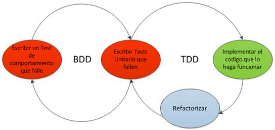

# Tipos de pruebas según Métrica v3

Pruebas **unitarias**: compruebas el correcto funcionamiento de una unidad de código

Pruebas de **integración**: compruebas que las unidades de código funcionan
correctamente en grupo.  Se centra principalmente en probar la comunicación
entre los componentes y sus comunicaciones ya sea hardware o software.

Pruebas del **sistema**: Pruebas de integración del sistema de información completo, y permiten probar el sistema en su conjunto y con otros sistemas con los que se relaciona para verificar que las especificaciones funcionales y técnicas se cumplen.

Pruebas de **implantación**: comprueban el funcionamiento correcto del sistema
integrado de hardware y software en el entorno de operación, y permiten al usuario
que, desde el punto de vista de operación, realice la aceptación del sistema
una vez instalado en su entorno real y en base al cumplimiento de los requisitos
no funcionales especificados.

Pruebas de **aceptación**: Valida que el sistema cumpla con el funcionamiento
esperado y permite al usuario que determine su aceptación, desde el punto de
vista de su funcionalidad y rendimiento.

Pruebas de **regresión**: Valida que los cambios sobre un componente no
introducen nuevos errores o un comportamiento no deseado en otros componentes
no modificados.

# Pruebas de caja...

Pruebas de **caja blanca**: el esfuerzo se concentra en encontrar casos de
prueba que permitan comprobar cómo funciona el código en cualquier situación,
lo que supone, como mínimo, recorrer todos sus caminos con un conjunto tan
amplio de datos de prueba como sea necesario. En resumen, se trataría de
recorrer exhaustivamente todos los caminos posibles.

Pruebas de **caja negra**: Se trata al programa desde el punto de vista de las
entradas que recibe y las salidas que produce, sin tener en cuenta su
funcionamiento interno, buscando circunstancias en las que el programa no se
comporte de acuerdo con las especificaciones.

Pruebas de **caja gris**: El tester tiene un conocimiento limitado de los
detalles internos del programa, se utilizan comúnmente en las
pruebas de **penetración**.

# Pruebas estáticas y dinámicas

Pruebas **estáticas**: se realizan sin ejecutar el código de la aplicación.

Pruebas **dinámicas**: requieren la ejecución de la aplicación, permitiendo
medir con mayor precisión el comportamiento de la aplicación desarrollada.

# Funcionales y no funcionales

Pruebas **funcionales**: basadas en la ejecución, revisión y retroalimentación
de las funcionalidades previamente diseñadas para el software (requisitos funcionales).
Pueden ser:

* Pruebas unitarias
* Pruebas de integración
* Pruebas de sistema
* Pruebas de aceptación
* Pruebas de regresión
* Pruebas **alpha**: hay varias definiciones
    * pruebas realizadas por el usuario con el desarrollador como observador en un entorno
controlado
    * pruebas para validar un prototipo antes de implementar la versión real
    * última prueba realizada por los equipos de prueba en el sitio de desarrollo después de la prueba de aceptación y antes de lanzar el software para la prueba beta
* Pruebas **beta**: pruebas realizadas sobre una versión beta por usuarios finales
o betatester.

Pruebas **no funcionales**: verifican criterios usados para juzgar la operación
de un sistema (requisitos no funcionales) como por ejemplo la disponibilidad,
accesibilidad, usabilidad, mantenibilidad, seguridad, rendimiento.
Se pueden clasificar según el tipo de requisito que abarcan:

* Pruebas de compatibilidad
* Pruebas de seguridad
* Pruebas de carga
* Pruebas de usabilidad
* Pruebas de rendimiento
* Pruebas de internacionalización y localización
* Pruebas de escalabilidad
* Pruebas de mantenibilidad
* Pruebas de instalabilidad
* Pruebas de portabilidad

# Desarrollo guiado por pruebas (TDD)

El TDD es una técnica de desarrollo donde los pasos a seguir son:

1. Se elige un requisito
2. Se escriben las pruebas que validan el requisito que se debe implementar.
Generalmente son pruebas unitarias.
3. Se verifica que la prueba falla, lo cual significa que el requisito aún no se
ha implementado
4. Se escribe el código que hace que la pruebas no fallen
5. Se valida el código con las pruebas
6. Se refactoriza para eliminar duplicidades y obtener la versión final
(por cada cambio se vuelven a lanzar las pruebas para verificar que todos
sigue bien)
7. Se actualiza la lista de requisitos

Este enfoque se complementa bien con integración continua y metodologías ágiles
ya que se puede automatizar ejecutar toda la batería de pruebas en cada subida
de código al repositorio central.

## Ventajas e inconvenientes

**Ventajas**:

* Además de validad requisitos, guiá el diseño del programa
* Hacer primero las pruebas implica un análisis en profundidad de los requisitos
y escenarios
* Busca implementar unicamente el código necesario para resolver cada caso,
por lo cual en principio hay menos redundancia y código superfluo

**Desventajas**:

* Implica un mayor esfuerzo inicial (aunque luego se puede ir más rápido)
* No todos los requisitos se pueden validar con pruebas unitarias, y otros
tipos de prueba pueden ser muy costosas o lentas

# Desarrollo guiado por comportamiento (BDD)

El BDD es una técnica de desarrollo ágil con las misma filosofía y fases que TDD
(1º pruebas, 2º código, 3º refactorizar) pero con pruebas que verifican el
código desde el punto de vista del negocio, es decir, del comportamiento de la
aplicación.

BDD puede ser combinado con TDD (más enfocado en pruebas unitarias).

Figura 1: BDD + TDD

El comportamiento deseado de la aplicación se describe en una plantilla
(basándose en *historias de usuario*) con las siguientes partes:

1. Titulo: breve, claro y explico
2. Narrativa: la *historia de usuario*, típicamente formulada como
«Como (rol) quiero (algo) para poder (beneficio)» y que responde a las preguntas:
    * ¿quién se beneficia?
    * ¿qué se quiere?
    * ¿cuál es el beneficio?
3. Criterios de aceptación o escenarios, típicamente formulado como
«Dado (1) Cuando (2) Entonces (3)» siendo:
    1. Condición inicial, la cual es asumida como verdadera al inicio del escenario.
    Esto puede consistir en una causa o varias
    2. Declaración de cuál es el evento que causa el inicio del escenario
    3. Declaración del resultado esperado, en una o más cláusulas

# Herramientas

## Open Soruce

1. Herramientas de gestión de pruebas:
    * Bugzilla Testopia
    * FitNesse
    * qaManager
    * qaBook
    * RTH (open source)
    * Salome-tmf
    * Squash TM
    * Test Environment Toolkit
    * TestLink
    * Testitool
    * XQual Studio
    * Radi-testdir
    * Data Generator
2. Herramientas para pruebas funcionales
    * Selenium
    * Soapui
    * Watir (Pruebas de aplicaciones web en Ruby)
    * WatiN (Pruebas de aplicaciones web en .Net)
    * Capedit
    * Canoo WebTest
    * Solex
    * Imprimatur
    * SAMIE
    * ITP
    * WET
    * WebInject
3. Herramientas para pruebas de carga y rendimiento
    * FunkLoad
    * FWPTT load testing
    * loadUI
    * JMeter
4. Entre los frameworks para realizar pruebas unitarias
    * XUnit: JUnit, NUnit, RUnit, PHPUnit...
    * TestNG: Creado para suplir algunas deficiencias en JUnit.
    * JTiger: Basado en anotaciones, como TestNG.
    * CPPUnit
    * Visual Studio UnitTesting

## Comerciales

1. Herramientas de gestión de pruebas
    * HP Quality Center/ALM
    * QA Complete
    * qaBook
    * T-Plan Professional
    * SMARTS
    * QAS.Test Case Studio
    * PractiTest
    * SpiraTest
    * TestLog
    * ApTest Manager
    * Zephyr
2. Herramientas para pruebas funcionales
    * QuickTest Pro
    * Rational Robot
    * Sahi
    * SoapTest
    * Test Complete
    * QA Wizard
    * Squish
    * vTest
    * Internet Macros
3. Herramientas para pruebas de carga y rendimiento
    * HP LoadRunner
    * LoadStorm
    * NeoLoad
    * WebLOAD Professional
    * Forecast
    * ANTS - Advanced .NET Testing System
    * Webserver Stress Tool
    * Load Impact

# Bibliografía

* PreparaTic27 - Pack3/07/21
* [manuel.cillero.es - Pruebas](https://manuel.cillero.es/doc/metodologia/metrica-3/tecnicas/pruebas/)
* [testermoderno.com - Caja blanca vs Caja negra](https://www.testermoderno.com/caja-blanca-vs-caja-negra/)
* [wikipedia.org - Pruebas de software](https://es.wikipedia.org/wiki/Pruebas_de_software)
* [myservername.com - Pruebas alfa y beta (una guía completa)](https://es.myservername.com/alpha-testing-beta-testing)
* [wikipedia.org - Pruebas de validación](https://es.wikipedia.org/wiki/Pruebas_de_validaci%C3%B3n)
