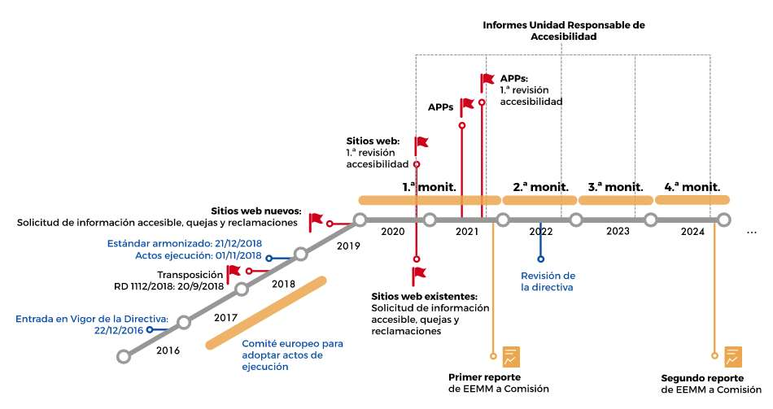

# Conceptos básicos

**WAI**: comité integrado en W3C que tiene como objetivo promocionar criterios
de accesibilidad para la Web.

**MWBP**: grupo de buenas practicas de la W3C para promover la accesibilidad de
la web en los dispositivos móviles.

**Directiva (UE) 2016/2102**: establece las condiciones de accesibilidad que
deben cumplir todos los sitios webs y aplicaciones móviles del sector público
(estatal, regional, local, universitario, centros sanitarios, educativos,
bibliotecas, tribunales, etc).

**Real Decreto 1112/2018**: Traspone la Directiva (UE) 2016/2102 a la legislación española.

[**Observatorio de Accesibilidad Web**](https://administracionelectronica.gob.es/pae_Home/pae_Estrategias/pae_Accesibilidad/pae_Observatorio_de_Accesibilidad.html):
Organismo responsable del seguimiento y presentación de informes con respecto al cumplimiento de este Real Decreto y de la Directiva 2016/2102.

**EN 301 549**: estándar europeo de accesibilidad cuya versión española es
la **UNE-EN 301549**, estando ambas basadas en la WCAG.

| EN | UNE-EN | WCAG | Vigencia |
|-|-|-|-|
| [EN 301 549 v3.2.1](https://www.etsi.org/deliver/etsi_en/301500_301599/301549/03.02.01_60/en_301549v030201p.pdf):2021 | | WCAG 2.1 | |
| [EN 301 549 v3.1.1](https://www.etsi.org/deliver/etsi_en/301500_301599/301549/03.01.01_60/en_301549v030101p.pdf):2019 | [UNE-EN 301549:2020](https://www.une.org/encuentra-tu-norma/busca-tu-norma/norma/?c=N0063691) | WCAG 2.1 | 2020-04-22 .. Vigente |
| [EN 301 549 v2.1.2](http://www.etsi.org/deliver/etsi_en/301500_301599/301549/02.01.02_60/en_301549v020102p.pdf):2018 | [UNE-EN 301549:2019](https://www.une.org/encuentra-tu-norma/busca-tu-norma/norma/?c=N0061677) | WCAG 2.1 | 2019-04-10 .. 2020-04-22 |

Tabla: Correspondencia estándares

# WAI

Sus lineas de trabajo son:

* Asegurar que las tecnologías web soporten la accesibilidad web.
* Desarrollar guías de accesibilidad.
* Mejorar las herramientas para evaluar y reparar la accesibilidad web.
* Desarrollar material para educación y superación.
* Coordinación de la investigación y desarrollo en estos temas.

WAI desarrolla las siguientes guias:

* **ATAG**: para desarrolladores de herramientas de creación de páginas web
* **UAAG**: para desarrolladores de navegadores web
* **WCAG**: para desarrolladores de páginas webs

Entre sus grupos de trabajo se encuentra el **WAI-ARIA**, centrado en desarrollar
tecnologías que mejoran la accesibilidad de los contenidos web.

## WCAG 2.1

Se compone de:

* **4 principios**: proporcionan los fundamentos de la accesibilidad web
(perceptible, operable, comprensible y robusto)
* **13 pautas**: proporcionan los objetivos básicos que los autores deben lograr
con el fin de crear un contenido más accesible para los usuarios con distintas discapacidad
* **78 criterios de conformidad**: desarrollan las pautas y pueden usarse para
comprobar la conformidad de los contenidos con respecto a WCAG

Las *pautas* no son verificables, pero proporcionan el marco y los objetivos generales
que ayudan a los autores a comprender los *criterios de conformidad* (que si son verificables)
y a implementar mejor las técnicas.

### 1. Perceptible

La información y los componentes de la interfaz de usuario deben ser mostrados
a los usuarios en formas que ellos puedan entender.

* 1.1 **Texto alternativo**: Proporciona texto alternativo para el contenido que no sea textual, así podrá ser transformado en otros formatos que la gente necesite, como caracteres grandes, lenguaje braille, lenguaje oral, símbolos o lenguaje más simple.
* 1.2 **Contenido multimedia dependiente del tiempo**: Proporcione alternativas sincronizadas para contenidos multimedia sincronizados dependientes del tiempo.
* 1.3 **Adaptable**: Crear contenido que pueda ser presentado de diferentes formas sin perder ni información ni estructura.
* 1.4 **Distinguible**: Facilitar a los usuarios ver y escuchar el contenido incluyendo la distinción entre lo más y menos importante.

### 2. Operable

Los componentes de la interfaz de usuario y la navegación debe ser manejable.

* 2.1 **Teclado accesible**: Poder controlar todas las funciones desde el teclado.
* 2.2 **Tiempo suficiente**: Proporciona tiempo suficiente a los usuarios para leer y utilizar el contenido.
* 2.3 **Ataques epilépticos**: No diseñar contenido que pueda causar ataques epilépticos.
* 2.4 **Navegación**: Proporciona formas para ayudar a los usuarios a navegar, a buscar contenido y a determinar donde están estos.
* 2.5 **Modalidades de entrada**: Facilitar a los usuarios operar la funcionalidad a través de varios métodos de entrada además del teclado.

### 3. Comprensible

La información y las operaciones de usuarios deben ser comprensibles.

* 3.1 **Legible**: Hacer contenido de texto legible y comprensible.
* 3.2 **Previsible**: Hacer la apariencia y la forma de utilizar las páginas web previsibles.
* 3.3 **Asistencia a la entrada de datos**: ayudar a los usuarios a evitar y corregir errores.

### 4. Robustez

El contenido deber ser suficientemente robusto para que pueda ser bien interpretado
por una gran variedad de agentes de usuario, incluyendo tecnologías de asistencia.

* 4.1 **Compatible**: Maximiza la compatibilidad con los agentes de usuario actuales y futuros, incluyendo tecnologías de asistencia.

### Conformidad

Se considera que un contenido web es conforme con WCAG 2.1 si se cumplen los
siguientes **5 requisitos**:

1. **Nivel de conformidad**: para cumplir determinado nivel (A, AA o AAA) se debe
cumplir todos los criterios de conformidad de ese nivel e inferiores, o proporcionar
una versión alternativa que si lo cumpla
2. **Páginas completas**: la conformidad solo se aplica a páginas completas, no
obstante, si existen alternativas accesibles directamente desde una página,
pueden considerarse como parte de la página con vistas a cumplir la
conformidad
3. **Procesos completos**: si para completar un proceso es necesario seguir varias páginas, la
conformidad de cada página será la misma que la del proceso en su
totalidad
4. **Uso de tecnologías compatibles con la accesibilidad**: las tecnológicas de
las que dependa el contenido o funcionalidad han de ser usadas de un modo que sea
compatible con la accesibilidad o, en su lugar, hay que proporcionar esa información
de un modo que si lo sea
5. **Sin interferencia**: si un contenido usa una tecnología de un modo no compatible
con la accesibilidad, o que no cumple con los demás requisitos de conformidad, este
contenido no tiene que impedir el acceso al resto de contenidos de la página

#### Declaración de conformidad

Si una página, o grupo de páginas, cumple con todos los requisitos de conformidad,
se puede incluir una declaración de conformidad que debe contener:

1. **Fecha** de la declaración
2. **Titulo de pautas, versión y URI** (ej: WCAG 2.1 en https://www.w3.org/TR/WCAG21/)
3. **Nivel de conformidad satisfecho** (ej: Nivel AA)
4. **Descripción concisa de las páginas web** para las que se hace la declaración (ej: lista de urls)
5. **Lista de tecnologías de contenido web de las que depende**

# [Diseño universal](https://es.wikipedia.org/wiki/Dise%C3%B1o_universal)

Diseño de productos y entornos de fácil uso para el mayor número de personas posible,
sin la necesidad de adaptarlos o rediseñarlos de una forma especial.

Consta de **7 principios**:

1. Uso equitativo
2. Uso flexible
3. Simple e intuitivo
4. Información fácil de percibir
5. Tolerante a errores
6. Que exija poco esfuerzo físico
7. Dimensiones apropiadas

# Tipos de diseño web

## Diseño web líquido o fluido

* Usa porcentajes o <abbr title="unidad de medida tipográfica">ems</abbr> en vez de pixeles
* El resultado puede parecer atractivo en pantallas medianas (ordenadores y tablets]
pero se producen muchos problemas en las pantallas grandes y pequeñas (televisores y móviles)
* No es recomendable usar este método ya que la usabilidad se ve muy perjudicada y
representa un fallo de ergonomía que afecta negativamente a la experiencia de usuario

## Adaptive web design (AWD)

* Se crean distintas versiones para distintos dispositivos (ordenador, móvil, etc)
* El servidor decide que versión de la web mandar al usuario basándose en parámetros como el
tamaño de pantalla o la resolución
* Esta aproximación puede ser válida si se cuenta con un presupuesto reducido, ya que implica
sólo desarrollar las plantillas para algunas pantallas, en vez de planificar una experiencia óptima
a través de ellas
* Ofrece un bajo nivel de usabilidad y muestra una versión reducida de los contenidos en
móviles

## Diseño responsivo (RWD)

* El diseño y el contenido se ordenan en bloques que se reorganizan según las características
de la pantalla y el navegador que se utiliza
* El usuario ve una presentación de los contenidos distinta en cada dispositivo,
pudiéndose en todo caso acceder a todos los contenidos
* Para ello se utilizan las [media queries de CSS3](https://es.wikipedia.org/wiki/Media_query)
que permiten ajustar la
representación del contenido a características del dispositivo como la resolución de pantalla

# Real Decreto 1112/2018

Real Decreto 1112/2018, de 7 de septiembre, sobre accesibilidad de los sitios web y aplicaciones para
dispositivos móviles del sector público.

Traspone la Directiva (UE) 2016/2102 a la legislación española. Sustituye y mejora
las condiciones que se exigían en el Real Decreto 1494/2007.

Los cambios más significativos que se introducen son los siguientes:

* equiparación de los requisitos de accesibilidad españoles al estándar europeo
EN 301 549 (equiparable a WCAG 2.1)
* inclusión de intranets o extranets nuevas o que se renueven sustancialmente
(>=23 de septiembre de 2019)
* adaptación de webs ya creadas y mecanismo de quejas y solicitudes de información
(>=23 de septiembre de 2020)
* inclusión de las aplicaciones móviles (>=23 de junio de 2021)
* cada portal deberá incluir una declaración de accesibilidad incluyendo un mecanismo
para reclamaciones, reportar errores y solicitar información
* se realizarán reportes públicos a la Comisión Europea cada 3 años del estado
de la aplicación de la directiva (el 1º será el 23 de diciembre de 2021)
* inclusión de portales que reciben financiación pública para su mantenimiento
y aquellos que proveen servicios públicos mediante algún régimen contractual con
las AAPP
* Cada entidad que tenga que cumplir accesibilidad formará una
**unidad responsable de accesibilidad** encargada de coordinar dar seguimiento
y hacer efectivas las medidas a tomar para cumplir accesibilidad

Figura: Entrada en vigor

# Bibliografía

* PreparaTic27 - Pack1/044
* <strike title="No aplica">PreparaTic27 - Pack1/065</strike>
* <strike title="No aplica">PreparaTic27 - Pack1/132</strike>
* [accesibilidadweb.dlsi.ua.es - Pautas de accesibilidad del contenido en la Web 2.1](http://accesibilidadweb.dlsi.ua.es/?menu=wcag-2.1)
* [accesibilidadweb.dlsi.ua.es - Legislación nacional e internacional](http://accesibilidadweb.dlsi.ua.es/?menu=legislacion)
* [olgacarreras.blogspot.com - EN 301 549: Norma Europea de Accesibilidad para Productos y Servicios de Tecnologías de la Información y Comunicación (TIC) V3.2.1 (2021-03). Última versión en español UNE-EN 301549:2020](https://olgacarreras.blogspot.com/2014/02/en-301-549-primera-norma-europea-de.html)
