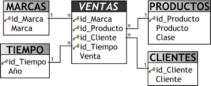
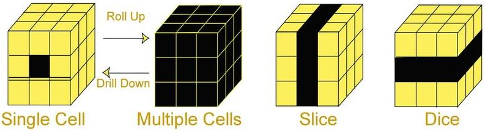
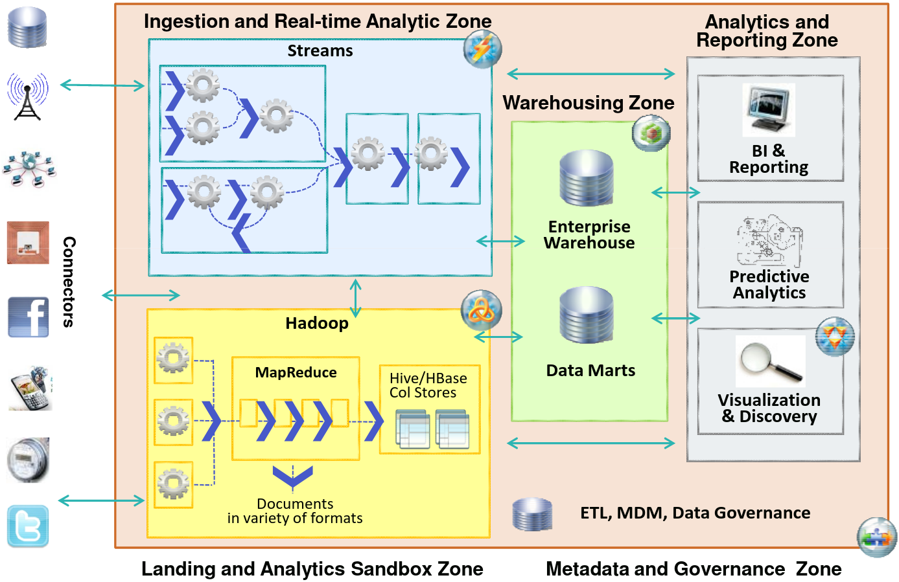

# Conceptos básicos

**Data lake**: repositorio de datos al natural (sin modificaciones)
de todo tipo (estructurados, semi-estructurados, no estructurados, binarios, etc).

**Data Warehouse** (DW): base de datos corporativa caracterizada por la
integración y depuración de información procedente de múltiples fuentes de datos
tanto internas como externas a la organización.
Su fin es el de procesar la información para poder analizarla.

**Data Mart**: almacenes de datos especializados por áreas o temas.

**Big data**: conjuntos de datos tan grandes y complejos que precisan de aplicaciones
informáticas no tradicionales de procesamiento de datos para tratarlos adecuadamente.

**Minería de datos**: extracción de patrones o de información implícita u oculta
contenida en los datos.

# Data Warehouse

Un DW se caracteriza por ser **OVNI**:

* estar **O**rientado a temas
* son **V**arriantes en el tiempo: toda información tiene una referencia temporal
* son **N**o volátiles, pues la información solo es de consulta, ni se puede borrar
ni modificar.
* son una solución **I**ntegral, pues la información procedente de diversas fuentes.

## Aprovisionamiento del DW

Para poblar de datos un DW desde distintas fuentes se hace uso de herramientas ETL:
(ej: Pentaho Data Integration, Scriptella, Ab Initio o AWS Glue).

Hay dos enfoques posibles:

* Bottom Up: Se aprovisionan almacenes temáticos (Data Mart) y del conjunto de ellos se crea
el DW.
* Top Down: Se aprovisiona el DW y, si se requiere especialización temática, se aprovisionan a
partir del DW los Data Marts.

## Explotación del DW

Los DW, a diferencia de los sistemas transaccionales (OLTP), se basan en
el uso de estructuras multidimensionales que permiten la manipulación y
visualización de los datos de manera más eficiente (OLAP).
Son una variante de los modelos relacionales tradicionales y se componen de:

* Tablas de **hechos**: donde se almacena la información propiamente dicha (ej: Ventas)
* Tablas de **dimensiones**: perspectivas de alto nivel acerca de los datos
(ej: Marcas, Productos, Clientes y Tiempo).

Figura 1: Tablas de hechos y dimensiones

Este modelo permite representar la información mediante Cubos OLAP (o dimensionales)
donde cada eje representa las dimensiones requeridas para las búsquedas.

Las operaciones  habituales de este modelo son:

* **Slice-and-dice**: permite obtener los datos seleccionando un valor fijo de una dimensión
* **Drill-down**: permite ver datos de nivel inferior (aumenta nivel de detalle)
* **Roll-up**: permite ver datos con mayor nivel de agregación (disminuye nivel de detalle)
* **Pivot**: permite cambiar los ejes
* **Drill-across**: similar a drill-down, con la diferencia de que su forma de ir de lo general a lo
específico es agregar un atributo a la consulta como nuevo criterio de análisis
* **Drill-through**: permite visualizar los datos relacionados al valor de un Indicador en su máximo
nivel de detalle

Figura 2: Operaciones OLAP Roll Up, Drill Down, Slice and Dice

# Arquitectura OLAP

Su objetivo es agilizar la consulta de grandes cantidades de datos, por lo que es
lo más rápido para ejecutar sentencias SQL de tipo SELECT.

Se usa en:

* Data Warehouse
* Sistemas de soporte a decisiones (DSS)
* Sistemas de información ejecutiva (EIS)
* Inteligencia de negocios (o Business Intelligence)

Tipos de sistemas OLAP:

* **ROLAP**: a nivel físico la información se almacena de forma relacional,
pero para su explotación se construyen cubos dinámicamente.
* **MOLAP**: la información se almacena directamente de forma multidimensional (cubos).
* **HOLAP**: mezcla de los dos anteriores.

Algunos ejemplos de BBDD que permiten almacenar cubos MOLAP/HOLAP son:
Hbase, Oracle OLAP o SQL Server Analysis Services.

# Minería de datos

El concepto minería de datos abarca:

* la etapa de análisis en bruto
* aspectos de gestión de datos y de bases de datos
* el procesamiento de los datos, del modelo y de las consideraciones de inferencia
* la generación de métricas de intereses
* el post-procesamiento de las estructuras descubiertas, su visualización y la actualización en línea

Para definir modelos relacionados con los análisis predictivos y la minería de
datos que puedan ser intercambiados por distintas aplicaciones se usa
el lenguaje de marcado **PMML** creado por el Data Mining Group.

Las características principales de la minería de datos son:

* Trabaja con la información oculta
* Suelen ser soluciones con una arquitectura cliente-servidor
* Poseen gran variedad de herramientas para la extracción de la información
* Es habitual hacer uso de un procesamiento paralelo que acelere el proceso
* Produce cinco tipos de información:
    * Asociaciones
    * Secuencias
    * Clasificaciones
    * Agrupamientos
    * Pronósticos

Algunas de las técnicas de aprendizaje automático usadas son:

* Redes neuronales
* Árboles de decisión
* Algoritmos genéticos
* Clustering o agrupamiento

Dichas técnicas se clasifican en:

* De **verificación**: verifica la validez de la información que se le presenta
* **Supervisados**: cuentan con una fase de entrenamiento para construir el modelo,
es decir, predicen un dato desconocido a priori a patir de otros conocidos
( regresión, árboles de decisión, redes neuronales, estadísticos, etc)
* **No supervisados**: no cuentan con esa fase de entrenamiento, es decir,
se descubren patrones y tendencias en los datos (clustering, redes de asociación, etc)

# Big Data

Se caracteriza por las siguientes **V**s (principalmente las 3 primeras):

* **Volumen**: se trabaja con gran cantidad de datos
* **Velocidad**: los datos están en movimiento como consecuencia de la creación de datos en tiempo real
* **Variedad**: diferentes tipos de fuentes y de datos
* **Veracidad de los datos**: en referencia a la incertidumbre de los datos, es decir, al grado de
fiabilidad de la información
* **Viabilidad**: capacidad de una organización para utilizar de forma eficaz el gran volumen de datos
que maneja
* **Visualización de los datos**: la forma en que los datos son presentados una vez que se procesan
* **Valor de los datos**: se refiere al valor que se puede obtener de ellos cuando se transforman en
información

Los datos puedes ser:

* estructurados: bases de datos
* semi-estructurados: XML, JSON, etc
* no estructurados: texto random, contenido multimedia, etc

y pueden ser procesados mediante:

* **batch** o lotes: procesamiento de forma espaciada en el tiempo (ej: cada 15 minutos)
* **stream** o tiempo (semi-)real: procesamiento de los datos (casi) en el momento
en que estos se producen (ej: cada segundo)

## Fases y procesos de Big Data

1. **ETL**
2. **Análisis de los datos**. Algunos tipos:
    * Análisis **descriptivo**: explica la situación de lo qué ha pasado
    * Análisis **diagnóstico**: explica la situación del por qué ha pasado
    * Análisis **predictivo**: anticipa lo qué pasará
    * Análisis **prescriptivo**: recomienda qué podemos hacer para que pase
3. Visualización de datos. Ejemplo de herramientas a tal propósito:
    * Tableau
    * IBM Watson Analytics
    * MS Power BI
    * Qilk
    * Microstrategy

# Apache Hadoop

Hadoop es un entorno de trabajo para programar aplicaciones distribuidas que manejen
grandes volúmenes de datos.

Para ello hace uso de tres servicios:

* Almacenamiento fiable de datos utilizando HDFS
* Procesamiento de datos en paralelo para sistemas de alto rendimiento mediante MAP-REDUCE
* Hadoop Common: Conjunto de utilidades para la integración de subproyectos de Hadoop.

Figura 3: Ejemplo de arquitecturas Big Data con Hadoop

# Bibliografía

* <strike title="Inteligencia artificial es un tema relacionado con BigData, pero en el temario no aparece explícitamente">PreparaTic27 - Pack1/070</strike>
* <strike title="Conocimiento experto es un tema relacionado con BigData, pero en el temario no aparece explícitamente">PreparaTic27 - Pack1/071</strike>
* PreparaTic27 - Pack1/075
* PreparaTic27 - Pack1/076
* PreparaTic27 - Pack3/07/23
* [blog.powerdata.es - Data Lake vs Data Warehouse. Veamos sus principales diferencias](https://blog.powerdata.es/el-valor-de-la-gestion-de-datos/data-lake-vs-data-warehouse.-veamos-sus-principales-diferencias)
* [campusbigdata.com- Data Mining vs Big Data](https://www.campusbigdata.com/big-data-blog/item/82-data-mining-vs-big-data)
* [geographica.com - Qué es Business Intelligence y cómo se relaciona con el Big Data](https://geographica.com/es/blog/business-intelligence-se-relaciona-big-data/)
* [autoritas.net - Escala de valor en la analítica de datos. By Gartner](https://www.autoritas.net/2016/05/16/escala-de-valor-en-la-analitica-de-datos-by-gartner/)
