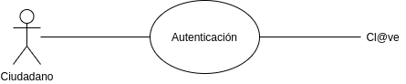
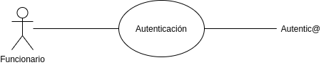
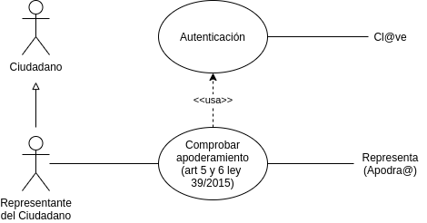
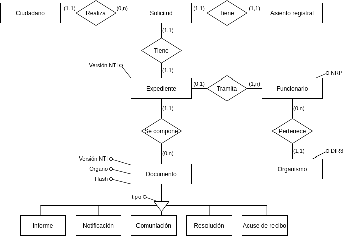

# ¿Cuando?

* Hay plazos
* Hay que responder y notificar
* Genera algún derecho

# Mencionar

| <abbr title="Ambito">Amb</abbr> | <abbr title="Normativa, estándar, guiá...">Ley...</abbr> | <abbr title="Artículo">Art</abr> | Titulo |
|-|-------------:|----:|-----|
|  WEB |  EU 2016/2102 |      | Accesibilidad de los sitios web y aplicaciones para dispositivos móviles de los organismos del sector público |
|  WEB |  RD 1112/2018 |      | Accesibilidad de los sitios web y aplicaciones para dispositivos móviles del sector público (EN 301 549 V3.2.1) |
|  WEB |      ISO 9241 |      | Recomendaciones sobre Usabilidad |
|  ENS |     RD 3/2010 |      | Esquema Nacional de Seguridad en el ámbito de la Administración Electrónica |
|  ENI |     RD 4/2010 |   10 | Activos semánticos |
|  ENI |     RD 4/2010 |   17 | Directorios de aplicaciones reutilizables |
|  PAC |   Ley 39/2015 |    9 | Sistemas de identificación de los interesados en el procedimiento |
|  PAC |   Ley 39/2015 |   12 | Asistencia en el uso de medios electrónicos a los interesados |
|  PAC |   Ley 39/2015 |   15 | Lengua de los procedimientos |
|  PAC |   Ley 39/2015 |   53 | Derechos del interesado en el procedimiento administrativo |
| RJSP |   Ley 40/2015 |  157 | Reutilización de sistemas y aplicaciones de propiedad de la Administración |
| RGPD |   EU 2016/679 |      | Reglamento General de Protección de Datos |
| LOPD-GDD | LO 3/2018 |      | Protección de Datos Personales y garantía de los derechos digitales |

# Servicios comunes

| <abbr title="Servicio común">SC</abbr> | Propósito |
|-|-|
| Cl@ve      | autenticar ciudadanos |
| Autentica  | autenticar funcionarios |
| Representa | funcionarios habilitados (Habilita) y apoderamientos (Apodera) |
| Notifica   | enviar notificaciones y avisos |
| SIM        | enviar avisos (SMS, push, etc) |
| Geiser     | registro electrónico |
| Geiser+SIR | derivar a otro organismo |
| PLATA      | multilingüismo |
| PID        | consultar datos en otros organismos |
| FIRE       | firmar |
| Acceda     | implementar e-sede / tramitación de expedientes / workflows pequeños / generación de formularios |

Usar Acceda en vez de implementar tu propia e-sede es un ejemplo de cumplir
el Art 17 del ENI y el Art 157 Ley 40/2015, que implica haber consultado el CTT en busca de
soluciones que podamos reutilizar.

# Actores

* Ciudadano:
    * Se identifica con Cl@ve (Art 9 Ley 39/2015)
* Funcionario habilitado:
    * Se identifica con Autentica
    * Se comprueba su habilitación en Representa/Habilita
    * Recoge el consentimiento del ciudadano (Art 12 Ley 39/2015)
* Representante del ciudadano:
    * Se identifica con Cl@ve (Art 9 Ley 39/2015)
    * Se comprueba el apoderamiento con Representa/Apodera
* Funcionario:
    * Se identifica con Autentica (desde Sara)
    * Se identifica con LDAP (desde el propio organismo)

Si el ciudadano esta obligado a relacionarse eléctricamente con la AP
no tiene derecho a funcionario habilitado.

Figura: Ciudadano

Figura: Funcionario

Figura: Representante

Figura: Funcionario Habilitado

# Arquitectura lógica

Se puede preguntar bajo el nombre de:

* Arquitectura lógica
* Diagrama de paquetes
* Diagrama de componentes

## Capa de presentación

* HTML + CSS3 + Javascripts:
    * Aplicación web progresiva
    * Diseño web responsive
    * media-queries
* Cumplir accesibilidad:
    * Directiva EU 2016/2102
    * RD 1112/2018
    * AA WCAG 2.1 = EN 301 549 V3.2.1
* Seguir recomendaciones de usabilidad:
    * ISO 9241
* Multilingüismo (Art 15 Ley 39/2015):
    * PLATA

## Capa lógica

* Opciones de Workflow:
    * El del organismo
    * El que tenga el gestor documental (ej: Alfresco)
    * Usar Acceda
* API FIRe (si se usa FIRe)
* Nodo SCSP (si se usa PID)
* Gestor documental, presuponer que cumple ENI:
    * [NTI Documento electrónico]({filename}/posts/apuntes/B1/04-ENI.md#documento-electronico)
    * [NTI Expediente electrónico]({filename}/posts/apuntes/B1/04-ENI.md#expediente-electronico)

## Capa de datos

* Filesystem
* LDAP
* Base de datos
* Cumplir Art 10 RD 4/2010:
    * Buscar en CISE modelos de datos que podamos reutilizar
    * [NTI de Relación de modelo de datos]({filename}/posts/apuntes/B1/04-ENI.md#relacion-de-modelos-de-datos)

## Capas transversales

* Seguridad:
    * RGPD (Reglamento (EU) 2016/679)
    * ENS (ITS) (RD 3/2010)
    * Guía CCN-STIC-812 (Seguridad en servicios web)
* Interoperabilidad:
    * ENI (NTIs) (RD 4/2010)
    * Acceso a servicios comunes a través de red Sara, vía Área de conexión ([NTI Requisitos de conexión a la Red de comunicaciones de las AP]({filename}/posts/apuntes/B1/04-ENI.md#requisitos-de-conexion-a-la-red-de-comunicaciones-de-las-administraciones-publicas-espanolas))
* Mantenimiento:
    * LOGs
    * Ficheros para que explote un cuadro de mando externo

# Arquitectura de red

Se puede preguntar bajo el nombre de:

* Arquitectura de red
* Arquitectura física
* Diagrama de despliegue
* Infraestructura

# Expediente administrativo

La idea básica es que un ciudadano realiza una solicitud, y esta inicia
un expediente.

Figura: Diagrama de clases del Expediente electrónico

Figura: Diagrama Entidad/Relación del Expediente electrónico
