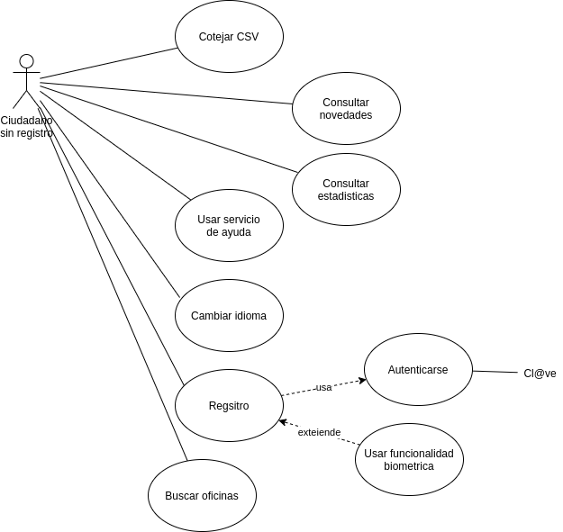
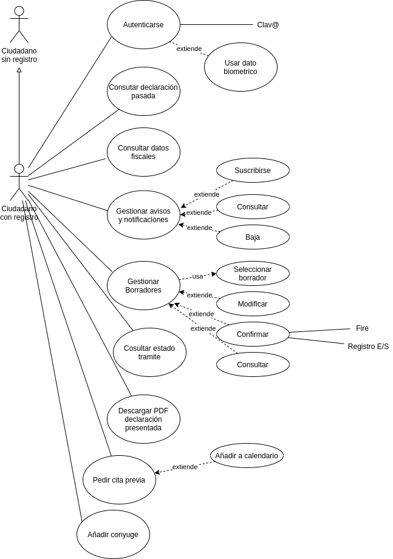
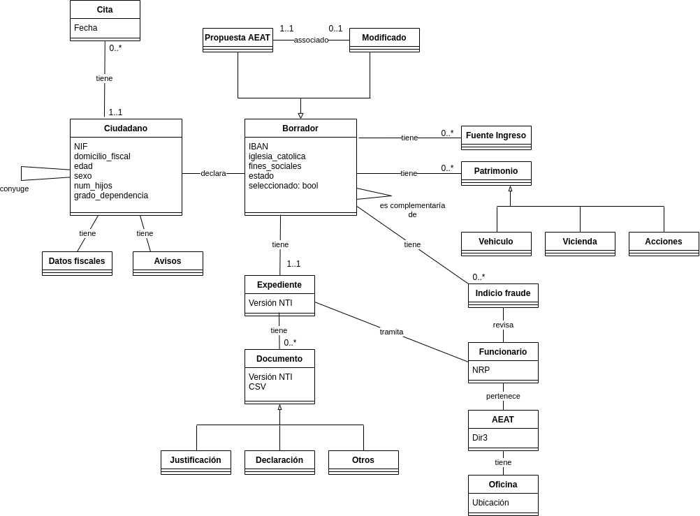

*El examen real fueron unas 8 o 9 páginas.*

**1-** A continuación se realiza un análisis interno y externo del
sistema a través de un diagrama DAFO (debilidades, amenazas, fortalezas
y oportunidades):

<table>
<tr>
<td>
I 
N 
T 
E 
R 
N 
O
</td>
<td>
<b>Debilidades</b> 
- Menor experiencia en el desarrollo de aplicaciones móviles 
- Resistencia al cambio
</td>
<td>
<b>Fortalezas</b> 
- Amplio conocimiento en el negocio de la aplicación 
- Recursos suficientes para acometer el proyecto (no se si me he referido expresamente a los económicos, humanos o ambos)
</td>
</tr>
<tr>
<td>
E 
X 
T 
E 
R 
N 
O
</td>
<td>
<b>Amenazas</b> 
- Falta de uso por parte del público objetivo de la aplicación 
- Deterioro de la reputación por malas opiniones en la app store
</td>
<td>
<b>Oportunidades</b> 
- Mejorar la lucha contra el fraude 
- Mejorar la relación con el contribuyente
</td>
</tr>
</table>

En cuanto a la normativa y recomendaciones a tener en cuenta tenemos:

- Será de aplicación la Ley 39/2015 del procedimiento administrativo
común en las administraciones públicas debido a que la aplicación
realizará trámites como la declaración de la renta. También será de
aplicación el RD 203/2021
- Al tratarse datos personales será de aplicación el RGPD y la LOPD-GDD,
debiéndose determinar si es necesario realizar una evaluación de impacto
de datos personales. Para ello se hará un análisis de riesgos.
- Se deberá cumplir con el RD 1112/2018 de accesibilidad en servicios
web y aplicaciones móviles en la administración publica, para ello se
seguirá la norma UNE-EN 301549:2022.
- Se deberá aplicar el ENS y sus guiás CCN-STIC serie 800. En especial
se categorizará el sistema (Anexo 1 y guía CCN-STIC 803) y se aplicarán
las medidas de seguridad correspondientes (Anexo 2 y guía CCN-STIC 804)
- Se deberá aplicar el ENI y sus NTI, como por ejemplo la NTI del
expediente electrónico, la NTI de documentos electrónicos y la NTI del
catalogo de estándares.
- Previo al desarrollo, se consultara el CTT y el CISE en busca de
soluciones y modelos de datos reutilizables
- Tras el desarrollo, se estudiara si es de interés publicar parte o
todo el producto en el CTT y el CISE
- En consonancia con el plan de digitalización de las AAPP se propone
mejorar el sistema de asistencia y ayuda con un chatbot. Podemos usar
para ello soluciones como Google DialogFlow, Watson Assistant de IBM, o
el framework Rasa (python con tensorflow)
- Se deberán usar los servicios comunes que puedan facilitar el
desarrollo evitando crear nuevas soluciones. En concreto podemos usar:
    - Cl@ve para identificación
    - Notifica para notificaciones y comunicaciones
    - SIM para avisos
    - PID para consulta de datos del ciudadano en manos de otras administraciones públicas
    - Fire para firmar
    - PLATA para multilinguismo

**2-** A continuación se muestran los casos de uso del ciudadano

**3-** A continuación se muestra el diagrama de clases del sistema

**4-** Las alternativas disponibles para hacer una aplicación móvil son:

1. Desarrollar una Aplicación Web Progresiva
2. Desarrollar una Aplicación Híbrida
3. Desarrollar una aplicación Nativa

Cada opción ofrece mejor rendimiento, mejor experiencia de usuario y
mayor acceso a funcionalidades nativas que la anterior, pero también
supone mayor gasto de recursos (tanto de desarrollo como de
mantenimiento).

La primera opción se descarta ya que una AWP esta pensada para ser
instalada desde el explorador web y no desde una tienda de aplicaciones.

La segunda opción nos permite tener un entregable para Android y iPhone
con un solo desarrollo usando un framework como ionic o React Native,
además de permitirnos usar funcionalidades nativas como notificaciones
push, geolocalización, etc pero la experiencia de usuario sería peor que
con una nativa y puede que no podamos usar todas las funcionalidades
deseadas.

Por lo tanto se propone optar por dos aplicación nativa, una en Java
para Android y otra en Swift para iphone que nos dará la mejor
experiencia de usuario, rendimiento y acceso a todas las funcionalidades
del dispositivo que necesitamos, esto es:

- Notificaciones push
- Ubicación
- Determinar si existe mecanismo de bloqueo
- Huela dactilar, reconocimiento facial u otro dato biometrico

Para el uso de las funcionalidades anteriores necesitaremos solicitar
permisos para su acceso. Esto es debido a los mecanismos de seguridad
que los sistemas operativos móviles tienen para restringir las
aplicaciones a los privilegios mínimos necesarios, de manera que ciertas
funcionalidades no puedan ser usadas sin consentimiento del usuario.

Nota: la funcionalidad push no requiere permisos, pero puede ser
deshabilitada a posteriori por el usuario.

**5-** Para asegurar la accesibilidad y la usabilidad de la aplicación
se plantean las siguientes fases:

* 1º fase: realización de pruebas automáticas de código (especialmente de
la interfaz) para detectar lo antes posible los problemas
* 2º fase: realización de pruebas por personal humano, entre los cuales ha
de haber personas con distintos grados de discapacidad

El objetivo será cumplir el RD 1112/2018, la norma UNE-EN 301549:2022
correspondiente al nivel doble A de las WCAG 2.1, y seguir las
recomendaciones de usabilidad y ergonómica ISO 9241 en sus tres
componentes: eficacia, eficiencia y satisfacción.

Para ello en la 1º fase eliminaremos todos los errores detectables y en
la 2º haremos encuestas de satisfacción.
