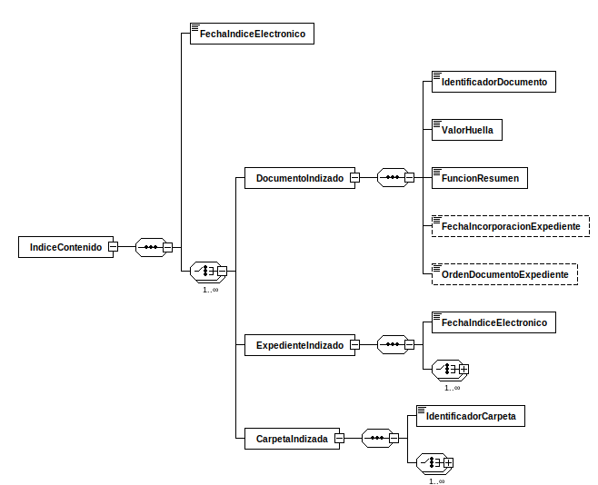

<div class="widthscroll" id="IndiceContenido">
<pre><code><a href="http://regis.cosnier.free.fr/?page=XSDDiagram">xsddiagram</a> -no-gui -y -r IndiceContenido -e 6 -o <a href="IndiceContenidoExpedienteEni/IndiceContenido.csv">IndiceContenido.csv</a> http://administracionelectronica.gob.es/ENI/XSD/v1.0/expediente-e/indice-e/contenido/IndiceContenidoExpedienteEni.xsd
<a href="http://regis.cosnier.free.fr/?page=XSDDiagram">xsddiagram</a> -no-gui -y -r IndiceContenido -e 6 -o <a href="IndiceContenidoExpedienteEni/IndiceContenido.txt">IndiceContenido.txt</a> http://administracionelectronica.gob.es/ENI/XSD/v1.0/expediente-e/indice-e/contenido/IndiceContenidoExpedienteEni.xsd
<a href="http://regis.cosnier.free.fr/?page=XSDDiagram">xsddiagram</a> -no-gui -y -r IndiceContenido -e 6 -o <a href="IndiceContenidoExpedienteEni/IndiceContenido.png">IndiceContenido.png</a> http://administracionelectronica.gob.es/ENI/XSD/v1.0/expediente-e/indice-e/contenido/IndiceContenidoExpedienteEni.xsd
<a href="http://regis.cosnier.free.fr/?page=XSDDiagram">xsddiagram</a> -no-gui -y -r IndiceContenido -e 6 -o <a href="IndiceContenidoExpedienteEni/IndiceContenido.svg">IndiceContenido.svg</a> http://administracionelectronica.gob.es/ENI/XSD/v1.0/expediente-e/indice-e/contenido/IndiceContenidoExpedienteEni.xsd
</code></pre>
</div>



| PATH | NAME | TYPE | NAMESPACE |
|:----|:----|:----|:----|
| /IndiceContenido | IndiceContenido | element | http://administracionelectronica.gob.es/ENI/XSD/v1.0/expediente-e/indice-e/contenido |
| /IndiceContenido/FechaIndiceElectronico | FechaIndiceElectronico | element | http://administracionelectronica.gob.es/ENI/XSD/v1.0/expediente-e/indice-e/contenido |
| /IndiceContenido/DocumentoIndizado | DocumentoIndizado | element | http://administracionelectronica.gob.es/ENI/XSD/v1.0/expediente-e/indice-e/contenido |
| /IndiceContenido/DocumentoIndizado/IdentificadorDocumento | IdentificadorDocumento | element | http://administracionelectronica.gob.es/ENI/XSD/v1.0/expediente-e/indice-e/contenido |
| /IndiceContenido/DocumentoIndizado/ValorHuella | ValorHuella | element | http://administracionelectronica.gob.es/ENI/XSD/v1.0/expediente-e/indice-e/contenido |
| /IndiceContenido/DocumentoIndizado/FuncionResumen | FuncionResumen | element | http://administracionelectronica.gob.es/ENI/XSD/v1.0/expediente-e/indice-e/contenido |
| /IndiceContenido/DocumentoIndizado/FechaIncorporacionExpediente | FechaIncorporacionExpediente | element | http://administracionelectronica.gob.es/ENI/XSD/v1.0/expediente-e/indice-e/contenido |
| /IndiceContenido/DocumentoIndizado/OrdenDocumentoExpediente | OrdenDocumentoExpediente | element | http://administracionelectronica.gob.es/ENI/XSD/v1.0/expediente-e/indice-e/contenido |
| /IndiceContenido/ExpedienteIndizado | ExpedienteIndizado | element | http://administracionelectronica.gob.es/ENI/XSD/v1.0/expediente-e/indice-e/contenido |
| /IndiceContenido/ExpedienteIndizado/FechaIndiceElectronico | FechaIndiceElectronico | element | http://administracionelectronica.gob.es/ENI/XSD/v1.0/expediente-e/indice-e/contenido |
| /IndiceContenido/ExpedienteIndizado/DocumentoIndizado | DocumentoIndizado | element | http://administracionelectronica.gob.es/ENI/XSD/v1.0/expediente-e/indice-e/contenido |
| /IndiceContenido/ExpedienteIndizado/DocumentoIndizado/IdentificadorDocumento | IdentificadorDocumento | element | http://administracionelectronica.gob.es/ENI/XSD/v1.0/expediente-e/indice-e/contenido |
| /IndiceContenido/ExpedienteIndizado/DocumentoIndizado/ValorHuella | ValorHuella | element | http://administracionelectronica.gob.es/ENI/XSD/v1.0/expediente-e/indice-e/contenido |
| /IndiceContenido/ExpedienteIndizado/DocumentoIndizado/FuncionResumen | FuncionResumen | element | http://administracionelectronica.gob.es/ENI/XSD/v1.0/expediente-e/indice-e/contenido |
| /IndiceContenido/ExpedienteIndizado/DocumentoIndizado/FechaIncorporacionExpediente | FechaIncorporacionExpediente | element | http://administracionelectronica.gob.es/ENI/XSD/v1.0/expediente-e/indice-e/contenido |
| /IndiceContenido/ExpedienteIndizado/DocumentoIndizado/OrdenDocumentoExpediente | OrdenDocumentoExpediente | element | http://administracionelectronica.gob.es/ENI/XSD/v1.0/expediente-e/indice-e/contenido |
| /IndiceContenido/ExpedienteIndizado/ExpedienteIndizado | ExpedienteIndizado | element | http://administracionelectronica.gob.es/ENI/XSD/v1.0/expediente-e/indice-e/contenido |
| /IndiceContenido/ExpedienteIndizado/ExpedienteIndizado/FechaIndiceElectronico | FechaIndiceElectronico | element | http://administracionelectronica.gob.es/ENI/XSD/v1.0/expediente-e/indice-e/contenido |
| /IndiceContenido/ExpedienteIndizado/ExpedienteIndizado/DocumentoIndizado | DocumentoIndizado | element | http://administracionelectronica.gob.es/ENI/XSD/v1.0/expediente-e/indice-e/contenido |
| /IndiceContenido/ExpedienteIndizado/ExpedienteIndizado/ExpedienteIndizado | ExpedienteIndizado | element | http://administracionelectronica.gob.es/ENI/XSD/v1.0/expediente-e/indice-e/contenido |
| /IndiceContenido/ExpedienteIndizado/ExpedienteIndizado/CarpetaIndizada | CarpetaIndizada | element | http://administracionelectronica.gob.es/ENI/XSD/v1.0/expediente-e/indice-e/contenido |
| /IndiceContenido/ExpedienteIndizado/CarpetaIndizada | CarpetaIndizada | element | http://administracionelectronica.gob.es/ENI/XSD/v1.0/expediente-e/indice-e/contenido |
| /IndiceContenido/ExpedienteIndizado/CarpetaIndizada/IdentificadorCarpeta | IdentificadorCarpeta | element | http://administracionelectronica.gob.es/ENI/XSD/v1.0/expediente-e/indice-e/contenido |
| /IndiceContenido/ExpedienteIndizado/CarpetaIndizada/DocumentoIndizado | DocumentoIndizado | element | http://administracionelectronica.gob.es/ENI/XSD/v1.0/expediente-e/indice-e/contenido |
| /IndiceContenido/ExpedienteIndizado/CarpetaIndizada/ExpedienteIndizado | ExpedienteIndizado | element | http://administracionelectronica.gob.es/ENI/XSD/v1.0/expediente-e/indice-e/contenido |
| /IndiceContenido/ExpedienteIndizado/CarpetaIndizada/CarpetaIndizada | CarpetaIndizada | element | http://administracionelectronica.gob.es/ENI/XSD/v1.0/expediente-e/indice-e/contenido |
| /IndiceContenido/CarpetaIndizada | CarpetaIndizada | element | http://administracionelectronica.gob.es/ENI/XSD/v1.0/expediente-e/indice-e/contenido |
| /IndiceContenido/CarpetaIndizada/IdentificadorCarpeta | IdentificadorCarpeta | element | http://administracionelectronica.gob.es/ENI/XSD/v1.0/expediente-e/indice-e/contenido |
| /IndiceContenido/CarpetaIndizada/DocumentoIndizado | DocumentoIndizado | element | http://administracionelectronica.gob.es/ENI/XSD/v1.0/expediente-e/indice-e/contenido |
| /IndiceContenido/CarpetaIndizada/DocumentoIndizado/IdentificadorDocumento | IdentificadorDocumento | element | http://administracionelectronica.gob.es/ENI/XSD/v1.0/expediente-e/indice-e/contenido |
| /IndiceContenido/CarpetaIndizada/DocumentoIndizado/ValorHuella | ValorHuella | element | http://administracionelectronica.gob.es/ENI/XSD/v1.0/expediente-e/indice-e/contenido |
| /IndiceContenido/CarpetaIndizada/DocumentoIndizado/FuncionResumen | FuncionResumen | element | http://administracionelectronica.gob.es/ENI/XSD/v1.0/expediente-e/indice-e/contenido |
| /IndiceContenido/CarpetaIndizada/DocumentoIndizado/FechaIncorporacionExpediente | FechaIncorporacionExpediente | element | http://administracionelectronica.gob.es/ENI/XSD/v1.0/expediente-e/indice-e/contenido |
| /IndiceContenido/CarpetaIndizada/DocumentoIndizado/OrdenDocumentoExpediente | OrdenDocumentoExpediente | element | http://administracionelectronica.gob.es/ENI/XSD/v1.0/expediente-e/indice-e/contenido |
| /IndiceContenido/CarpetaIndizada/ExpedienteIndizado | ExpedienteIndizado | element | http://administracionelectronica.gob.es/ENI/XSD/v1.0/expediente-e/indice-e/contenido |
| /IndiceContenido/CarpetaIndizada/ExpedienteIndizado/FechaIndiceElectronico | FechaIndiceElectronico | element | http://administracionelectronica.gob.es/ENI/XSD/v1.0/expediente-e/indice-e/contenido |
| /IndiceContenido/CarpetaIndizada/ExpedienteIndizado/DocumentoIndizado | DocumentoIndizado | element | http://administracionelectronica.gob.es/ENI/XSD/v1.0/expediente-e/indice-e/contenido |
| /IndiceContenido/CarpetaIndizada/ExpedienteIndizado/ExpedienteIndizado | ExpedienteIndizado | element | http://administracionelectronica.gob.es/ENI/XSD/v1.0/expediente-e/indice-e/contenido |
| /IndiceContenido/CarpetaIndizada/ExpedienteIndizado/CarpetaIndizada | CarpetaIndizada | element | http://administracionelectronica.gob.es/ENI/XSD/v1.0/expediente-e/indice-e/contenido |
| /IndiceContenido/CarpetaIndizada/CarpetaIndizada | CarpetaIndizada | element | http://administracionelectronica.gob.es/ENI/XSD/v1.0/expediente-e/indice-e/contenido |
| /IndiceContenido/CarpetaIndizada/CarpetaIndizada/IdentificadorCarpeta | IdentificadorCarpeta | element | http://administracionelectronica.gob.es/ENI/XSD/v1.0/expediente-e/indice-e/contenido |
| /IndiceContenido/CarpetaIndizada/CarpetaIndizada/DocumentoIndizado | DocumentoIndizado | element | http://administracionelectronica.gob.es/ENI/XSD/v1.0/expediente-e/indice-e/contenido |
| /IndiceContenido/CarpetaIndizada/CarpetaIndizada/ExpedienteIndizado | ExpedienteIndizado | element | http://administracionelectronica.gob.es/ENI/XSD/v1.0/expediente-e/indice-e/contenido |
| /IndiceContenido/CarpetaIndizada/CarpetaIndizada/CarpetaIndizada | CarpetaIndizada | element | http://administracionelectronica.gob.es/ENI/XSD/v1.0/expediente-e/indice-e/contenido |

```console
curl -L http://administracionelectronica.gob.es/ENI/XSD/v1.0/expediente-e/indice-e/contenido/IndiceContenidoExpedienteEni.xsd
```
```xml
<?xml version="1.0" encoding="UTF-8"?>
<xsd:schema 
xmlns:xsd="http://www.w3.org/2001/XMLSchema" 
xmlns:eniconexpind="http://administracionelectronica.gob.es/ENI/XSD/v1.0/expediente-e/indice-e/contenido" 
targetNamespace="http://administracionelectronica.gob.es/ENI/XSD/v1.0/expediente-e/indice-e/contenido" 
elementFormDefault="qualified" attributeFormDefault="unqualified">
	<xsd:annotation>
		<xsd:documentation xml:lang="es">XSD CONTENIDO INDICE EXPEDIENTE ELECTRONICO ENI (v1.0)</xsd:documentation>
	</xsd:annotation>
	<xsd:element name="IndiceContenido" type="eniconexpind:TipoIndiceContenido"/>
	<xsd:complexType name="TipoIndiceContenido">
		<xsd:sequence>
			<xsd:element name="FechaIndiceElectronico" type="xsd:dateTime"/>
			<xsd:choice maxOccurs="unbounded">
				<xsd:element name="DocumentoIndizado" type="eniconexpind:TipoDocumentoIndizado"/>
				<xsd:element name="ExpedienteIndizado" type="eniconexpind:TipoIndiceContenido"/>
				<xsd:element name="CarpetaIndizada" type="eniconexpind:TipoCarpetaIndizada"/>
			</xsd:choice>
		</xsd:sequence>
		<xsd:attribute name="Id" type="xsd:ID" use="optional"/>
	</xsd:complexType>
	<xsd:complexType name="TipoDocumentoIndizado">
		<xsd:sequence>
			<xsd:element name="IdentificadorDocumento" type="xsd:string"/>
			<xsd:element name="ValorHuella" type="xsd:string"/>
			<xsd:element name="FuncionResumen" type="xsd:string"/>
			<xsd:element name="FechaIncorporacionExpediente" type="xsd:dateTime" minOccurs="0"/>
			<xsd:element name="OrdenDocumentoExpediente" type="xsd:string" minOccurs="0"/>
		</xsd:sequence>
		<xsd:attribute name="Id" type="xsd:ID" use="optional"/>
	</xsd:complexType>
	<xsd:complexType name="TipoCarpetaIndizada">
		<xsd:sequence>
			<xsd:element name="IdentificadorCarpeta" type="xsd:string"/>
			<xsd:choice maxOccurs="unbounded">
				<xsd:element name="DocumentoIndizado" type="eniconexpind:TipoDocumentoIndizado"/>
				<xsd:element name="ExpedienteIndizado" type="eniconexpind:TipoIndiceContenido"/>
				<xsd:element name="CarpetaIndizada" type="eniconexpind:TipoCarpetaIndizada"/>
			</xsd:choice>
		</xsd:sequence>
		<xsd:attribute name="Id" type="xsd:ID" use="optional"/>
	</xsd:complexType>
</xsd:schema>
```