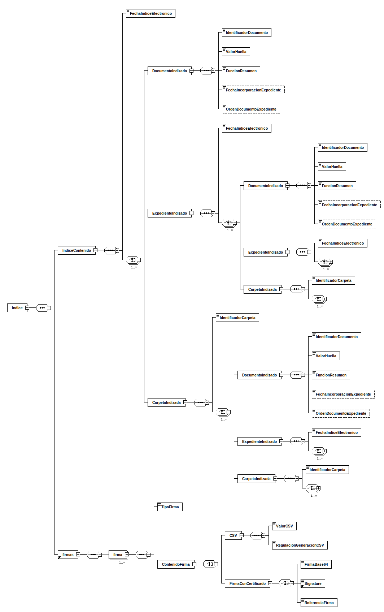

---
title: indice (IndiceExpedienteEni)
summary: "Fuente: [administracionelectronica.gob.es/ENI/XSD/v1.0/expediente-e/indice-e/IndiceExpedienteEni.xsd](http://administracionelectronica.gob.es/ENI/XSD/v1.0/expediente-e/indice-e/IndiceExpedienteEni.xsd)"
---

<div class="widthscroll" id="indice">
<pre><code><a href="http://regis.cosnier.free.fr/?page=XSDDiagram">xsddiagram</a> -no-gui -y -r indice -e 6 -o <a href="IndiceExpedienteEni/indice.csv">indice.csv</a> http://administracionelectronica.gob.es/ENI/XSD/v1.0/expediente-e/indice-e/IndiceExpedienteEni.xsd
<a href="http://regis.cosnier.free.fr/?page=XSDDiagram">xsddiagram</a> -no-gui -y -r indice -e 6 -o <a href="IndiceExpedienteEni/indice.txt">indice.txt</a> http://administracionelectronica.gob.es/ENI/XSD/v1.0/expediente-e/indice-e/IndiceExpedienteEni.xsd
<a href="http://regis.cosnier.free.fr/?page=XSDDiagram">xsddiagram</a> -no-gui -y -r indice -e 6 -o <a href="IndiceExpedienteEni/indice.png">indice.png</a> http://administracionelectronica.gob.es/ENI/XSD/v1.0/expediente-e/indice-e/IndiceExpedienteEni.xsd
<a href="http://regis.cosnier.free.fr/?page=XSDDiagram">xsddiagram</a> -no-gui -y -r indice -e 6 -o <a href="IndiceExpedienteEni/indice.svg">indice.svg</a> http://administracionelectronica.gob.es/ENI/XSD/v1.0/expediente-e/indice-e/IndiceExpedienteEni.xsd
</code></pre>
</div>



| PATH | NAME | TYPE | NAMESPACE | COMMENT |
|:----|:----|:----|:----|:----|
| /indice | indice | element | http://administracionelectronica.gob.es/ENI/XSD/v1.0/expediente-e/indice-e |  |
| /indice/IndiceContenido | IndiceContenido | element | http://administracionelectronica.gob.es/ENI/XSD/v1.0/expediente-e/indice-e |  |
| /indice/IndiceContenido/FechaIndiceElectronico | FechaIndiceElectronico | element | http://administracionelectronica.gob.es/ENI/XSD/v1.0/expediente-e/indice-e |  |
| /indice/IndiceContenido/DocumentoIndizado | DocumentoIndizado | element | http://administracionelectronica.gob.es/ENI/XSD/v1.0/expediente-e/indice-e |  |
| /indice/IndiceContenido/DocumentoIndizado/IdentificadorDocumento | IdentificadorDocumento | element | http://administracionelectronica.gob.es/ENI/XSD/v1.0/expediente-e/indice-e |  |
| /indice/IndiceContenido/DocumentoIndizado/ValorHuella | ValorHuella | element | http://administracionelectronica.gob.es/ENI/XSD/v1.0/expediente-e/indice-e |  |
| /indice/IndiceContenido/DocumentoIndizado/FuncionResumen | FuncionResumen | element | http://administracionelectronica.gob.es/ENI/XSD/v1.0/expediente-e/indice-e |  |
| /indice/IndiceContenido/DocumentoIndizado/FechaIncorporacionExpediente | FechaIncorporacionExpediente | element | http://administracionelectronica.gob.es/ENI/XSD/v1.0/expediente-e/indice-e |  |
| /indice/IndiceContenido/DocumentoIndizado/OrdenDocumentoExpediente | OrdenDocumentoExpediente | element | http://administracionelectronica.gob.es/ENI/XSD/v1.0/expediente-e/indice-e |  |
| /indice/IndiceContenido/ExpedienteIndizado | ExpedienteIndizado | element | http://administracionelectronica.gob.es/ENI/XSD/v1.0/expediente-e/indice-e |  |
| /indice/IndiceContenido/ExpedienteIndizado/FechaIndiceElectronico | FechaIndiceElectronico | element | http://administracionelectronica.gob.es/ENI/XSD/v1.0/expediente-e/indice-e |  |
| /indice/IndiceContenido/ExpedienteIndizado/DocumentoIndizado | DocumentoIndizado | element | http://administracionelectronica.gob.es/ENI/XSD/v1.0/expediente-e/indice-e |  |
| /indice/IndiceContenido/ExpedienteIndizado/DocumentoIndizado/IdentificadorDocumento | IdentificadorDocumento | element | http://administracionelectronica.gob.es/ENI/XSD/v1.0/expediente-e/indice-e |  |
| /indice/IndiceContenido/ExpedienteIndizado/DocumentoIndizado/ValorHuella | ValorHuella | element | http://administracionelectronica.gob.es/ENI/XSD/v1.0/expediente-e/indice-e |  |
| /indice/IndiceContenido/ExpedienteIndizado/DocumentoIndizado/FuncionResumen | FuncionResumen | element | http://administracionelectronica.gob.es/ENI/XSD/v1.0/expediente-e/indice-e |  |
| /indice/IndiceContenido/ExpedienteIndizado/DocumentoIndizado/FechaIncorporacionExpediente | FechaIncorporacionExpediente | element | http://administracionelectronica.gob.es/ENI/XSD/v1.0/expediente-e/indice-e |  |
| /indice/IndiceContenido/ExpedienteIndizado/DocumentoIndizado/OrdenDocumentoExpediente | OrdenDocumentoExpediente | element | http://administracionelectronica.gob.es/ENI/XSD/v1.0/expediente-e/indice-e |  |
| /indice/IndiceContenido/ExpedienteIndizado/ExpedienteIndizado | ExpedienteIndizado | element | http://administracionelectronica.gob.es/ENI/XSD/v1.0/expediente-e/indice-e |  |
| /indice/IndiceContenido/ExpedienteIndizado/ExpedienteIndizado/FechaIndiceElectronico | FechaIndiceElectronico | element | http://administracionelectronica.gob.es/ENI/XSD/v1.0/expediente-e/indice-e |  |
| /indice/IndiceContenido/ExpedienteIndizado/CarpetaIndizada | CarpetaIndizada | element | http://administracionelectronica.gob.es/ENI/XSD/v1.0/expediente-e/indice-e |  |
| /indice/IndiceContenido/ExpedienteIndizado/CarpetaIndizada/IdentificadorCarpeta | IdentificadorCarpeta | element | http://administracionelectronica.gob.es/ENI/XSD/v1.0/expediente-e/indice-e |  |
| /indice/IndiceContenido/CarpetaIndizada | CarpetaIndizada | element | http://administracionelectronica.gob.es/ENI/XSD/v1.0/expediente-e/indice-e |  |
| /indice/IndiceContenido/CarpetaIndizada/IdentificadorCarpeta | IdentificadorCarpeta | element | http://administracionelectronica.gob.es/ENI/XSD/v1.0/expediente-e/indice-e |  |
| /indice/IndiceContenido/CarpetaIndizada/DocumentoIndizado | DocumentoIndizado | element | http://administracionelectronica.gob.es/ENI/XSD/v1.0/expediente-e/indice-e |  |
| /indice/IndiceContenido/CarpetaIndizada/DocumentoIndizado/IdentificadorDocumento | IdentificadorDocumento | element | http://administracionelectronica.gob.es/ENI/XSD/v1.0/expediente-e/indice-e |  |
| /indice/IndiceContenido/CarpetaIndizada/DocumentoIndizado/ValorHuella | ValorHuella | element | http://administracionelectronica.gob.es/ENI/XSD/v1.0/expediente-e/indice-e |  |
| /indice/IndiceContenido/CarpetaIndizada/DocumentoIndizado/FuncionResumen | FuncionResumen | element | http://administracionelectronica.gob.es/ENI/XSD/v1.0/expediente-e/indice-e |  |
| /indice/IndiceContenido/CarpetaIndizada/DocumentoIndizado/FechaIncorporacionExpediente | FechaIncorporacionExpediente | element | http://administracionelectronica.gob.es/ENI/XSD/v1.0/expediente-e/indice-e |  |
| /indice/IndiceContenido/CarpetaIndizada/DocumentoIndizado/OrdenDocumentoExpediente | OrdenDocumentoExpediente | element | http://administracionelectronica.gob.es/ENI/XSD/v1.0/expediente-e/indice-e |  |
| /indice/IndiceContenido/CarpetaIndizada/ExpedienteIndizado | ExpedienteIndizado | element | http://administracionelectronica.gob.es/ENI/XSD/v1.0/expediente-e/indice-e |  |
| /indice/IndiceContenido/CarpetaIndizada/ExpedienteIndizado/FechaIndiceElectronico | FechaIndiceElectronico | element | http://administracionelectronica.gob.es/ENI/XSD/v1.0/expediente-e/indice-e |  |
| /indice/IndiceContenido/CarpetaIndizada/CarpetaIndizada | CarpetaIndizada | element | http://administracionelectronica.gob.es/ENI/XSD/v1.0/expediente-e/indice-e |  |
| /indice/IndiceContenido/CarpetaIndizada/CarpetaIndizada/IdentificadorCarpeta | IdentificadorCarpeta | element | http://administracionelectronica.gob.es/ENI/XSD/v1.0/expediente-e/indice-e |  |
| /indice/firmas | firmas | element | http://administracionelectronica.gob.es/ENI/XSD/v1.0/expediente-e/indice-e |  |
| /indice/firmas/firma | firma | element | http://administracionelectronica.gob.es/ENI/XSD/v1.0/expediente-e/indice-e |  |
| /indice/firmas/firma/TipoFirma | TipoFirma | element | http://administracionelectronica.gob.es/ENI/XSD/v1.0/expediente-e/indice-e | - TF01 - CSV. - TF02 - XAdES internally detached signature. - TF03 - XAdES enveloped signature. - TF04 - CAdES detached/explicit signature. - TF05 - CAdES attached/implicit signature. - TF06 - PAdES. |
| /indice/firmas/firma/ContenidoFirma | ContenidoFirma | element | http://administracionelectronica.gob.es/ENI/XSD/v1.0/expediente-e/indice-e |  |
| /indice/firmas/firma/ContenidoFirma/CSV | CSV | element | http://administracionelectronica.gob.es/ENI/XSD/v1.0/expediente-e/indice-e |  |
| /indice/firmas/firma/ContenidoFirma/CSV/ValorCSV | ValorCSV | element | http://administracionelectronica.gob.es/ENI/XSD/v1.0/expediente-e/indice-e |  |
| /indice/firmas/firma/ContenidoFirma/CSV/RegulacionGeneracionCSV | RegulacionGeneracionCSV | element | http://administracionelectronica.gob.es/ENI/XSD/v1.0/expediente-e/indice-e |  |
| /indice/firmas/firma/ContenidoFirma/FirmaConCertificado | FirmaConCertificado | element | http://administracionelectronica.gob.es/ENI/XSD/v1.0/expediente-e/indice-e |  |
| /indice/firmas/firma/ContenidoFirma/FirmaConCertificado/FirmaBase64 | FirmaBase64 | element | http://administracionelectronica.gob.es/ENI/XSD/v1.0/expediente-e/indice-e |  |
| /indice/firmas/firma/ContenidoFirma/FirmaConCertificado/Signature | Signature | element | http://administracionelectronica.gob.es/ENI/XSD/v1.0/expediente-e/indice-e |  |
| /indice/firmas/firma/ContenidoFirma/FirmaConCertificado/ReferenciaFirma | ReferenciaFirma | element | http://administracionelectronica.gob.es/ENI/XSD/v1.0/expediente-e/indice-e | Referencia interna al fichero que incluye la firma. |

```console
curl -L http://administracionelectronica.gob.es/ENI/XSD/v1.0/expediente-e/indice-e/IndiceExpedienteEni.xsd
```
```xml
<?xml version="1.0" encoding="UTF-8"?>
<xsd:schema 
xmlns:xsd="http://www.w3.org/2001/XMLSchema" 
xmlns:enids="http://administracionelectronica.gob.es/ENI/XSD/v1.0/firma" 
xmlns:eniexpind="http://administracionelectronica.gob.es/ENI/XSD/v1.0/expediente-e/indice-e" 
xmlns:eniconexpind="http://administracionelectronica.gob.es/ENI/XSD/v1.0/expediente-e/indice-e/contenido" 
targetNamespace="http://administracionelectronica.gob.es/ENI/XSD/v1.0/expediente-e/indice-e" 
elementFormDefault="qualified" attributeFormDefault="unqualified">
	<xsd:annotation>
		<xsd:documentation xml:lang="es">XSD INDICE EXPEDIENTE ELECTRONICO ENI (v1.0)</xsd:documentation>
	</xsd:annotation>
	<xsd:import namespace="http://administracionelectronica.gob.es/ENI/XSD/v1.0/firma" schemaLocation="http://administracionelectronica.gob.es/ENI/XSD/v1.0/firma/firmasEni.xsd"/>
	<xsd:import namespace="http://administracionelectronica.gob.es/ENI/XSD/v1.0/expediente-e/indice-e/contenido" schemaLocation="http://administracionelectronica.gob.es/ENI/XSD/v1.0/expediente-e/indice-e/contenido/IndiceContenidoExpedienteEni.xsd"/>
	<xsd:element name="indice" type="eniexpind:TipoIndice"/>
	<xsd:complexType name="TipoIndice">
		<xsd:sequence>
			<xsd:element name="IndiceContenido" type="eniconexpind:TipoIndiceContenido"/>
			<xsd:element ref="enids:firmas">
				<xsd:annotation>
					<xsd:documentation>Existirá, al menos, una firma del contenido del índice del expediente electrónico.</xsd:documentation>
				</xsd:annotation>
			</xsd:element>
		</xsd:sequence>
		<xsd:attribute name="Id" type="xsd:ID" use="optional"/>
	</xsd:complexType>
</xsd:schema>
```