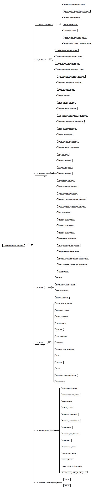

---
title: Fichero_Intercambio_SICRES_3 (SICRES3_INTERCAMBIO_APL)
summary: "Fuente: [administracionelectronica.gob.es/ENI/XSD/v1.0/documento-e/SICRES3_INTERCAMBIO_APL.xsd](http://administracionelectronica.gob.es/ENI/XSD/v1.0/documento-e/SICRES3_INTERCAMBIO_APL.xsd)"
---

<div class="widthscroll" id="Fichero_Intercambio_SICRES_3">
<pre><code><a href="http://regis.cosnier.free.fr/?page=XSDDiagram">xsddiagram</a> -no-gui -y -r Fichero_Intercambio_SICRES_3 -e 2 -o <a href="SICRES3_INTERCAMBIO_APL/Fichero_Intercambio_SICRES_3.csv">Fichero_Intercambio_SICRES_3.csv</a> http://administracionelectronica.gob.es/ENI/XSD/v1.0/documento-e/SICRES3_INTERCAMBIO_APL.xsd
<a href="http://regis.cosnier.free.fr/?page=XSDDiagram">xsddiagram</a> -no-gui -y -r Fichero_Intercambio_SICRES_3 -e 2 -o <a href="SICRES3_INTERCAMBIO_APL/Fichero_Intercambio_SICRES_3.txt">Fichero_Intercambio_SICRES_3.txt</a> http://administracionelectronica.gob.es/ENI/XSD/v1.0/documento-e/SICRES3_INTERCAMBIO_APL.xsd
<a href="http://regis.cosnier.free.fr/?page=XSDDiagram">xsddiagram</a> -no-gui -y -r Fichero_Intercambio_SICRES_3 -e 2 -o <a href="SICRES3_INTERCAMBIO_APL/Fichero_Intercambio_SICRES_3.png">Fichero_Intercambio_SICRES_3.png</a> http://administracionelectronica.gob.es/ENI/XSD/v1.0/documento-e/SICRES3_INTERCAMBIO_APL.xsd
<a href="http://regis.cosnier.free.fr/?page=XSDDiagram">xsddiagram</a> -no-gui -y -r Fichero_Intercambio_SICRES_3 -e 2 -o <a href="SICRES3_INTERCAMBIO_APL/Fichero_Intercambio_SICRES_3.svg">Fichero_Intercambio_SICRES_3.svg</a> http://administracionelectronica.gob.es/ENI/XSD/v1.0/documento-e/SICRES3_INTERCAMBIO_APL.xsd
</code></pre>
</div>



| PATH | NAME | TYPE |
|:----|:----|:----|
| /Fichero_Intercambio_SICRES_3 | Fichero_Intercambio_SICRES_3 | element |
| /Fichero_Intercambio_SICRES_3/De_Origen_o_Remitente | De_Origen_o_Remitente | element |
| /Fichero_Intercambio_SICRES_3/De_Origen_o_Remitente/Codigo_Entidad_Registral_Origen | Codigo_Entidad_Registral_Origen | element |
| /Fichero_Intercambio_SICRES_3/De_Origen_o_Remitente/Decodificacion_Entidad_Registral_Origen | Decodificacion_Entidad_Registral_Origen | element |
| /Fichero_Intercambio_SICRES_3/De_Origen_o_Remitente/Numero_Registro_Entrada | Numero_Registro_Entrada | element |
| /Fichero_Intercambio_SICRES_3/De_Origen_o_Remitente/Fecha_Hora_Entrada | Fecha_Hora_Entrada | element |
| /Fichero_Intercambio_SICRES_3/De_Origen_o_Remitente/Timestamp_Entrada | Timestamp_Entrada | element |
| /Fichero_Intercambio_SICRES_3/De_Origen_o_Remitente/Codigo_Unidad_Tramitacion_Origen | Codigo_Unidad_Tramitacion_Origen | element |
| /Fichero_Intercambio_SICRES_3/De_Origen_o_Remitente/Decodificacion_Unidad_Tramitacion_Origen | Decodificacion_Unidad_Tramitacion_Origen | element |
| /Fichero_Intercambio_SICRES_3/De_Destino | De_Destino | element |
| /Fichero_Intercambio_SICRES_3/De_Destino/Codigo_Entidad_Registral_Destino | Codigo_Entidad_Registral_Destino | element |
| /Fichero_Intercambio_SICRES_3/De_Destino/Decodificacion_Entidad_Registral_Destino | Decodificacion_Entidad_Registral_Destino | element |
| /Fichero_Intercambio_SICRES_3/De_Destino/Codigo_Unidad_Tramitacion_Destino | Codigo_Unidad_Tramitacion_Destino | element |
| /Fichero_Intercambio_SICRES_3/De_Destino/Decodificacion_Unidad_Tramitacion_Destino | Decodificacion_Unidad_Tramitacion_Destino | element |
| /Fichero_Intercambio_SICRES_3/De_Interesado | De_Interesado | element |
| /Fichero_Intercambio_SICRES_3/De_Interesado/Tipo_Documento_Identificacion_Interesado | Tipo_Documento_Identificacion_Interesado | element |
| /Fichero_Intercambio_SICRES_3/De_Interesado/Documento_Identificacion_Interesado | Documento_Identificacion_Interesado | element |
| /Fichero_Intercambio_SICRES_3/De_Interesado/Razon_Social_Interesado | Razon_Social_Interesado | element |
| /Fichero_Intercambio_SICRES_3/De_Interesado/Nombre_Interesado | Nombre_Interesado | element |
| /Fichero_Intercambio_SICRES_3/De_Interesado/Primer_Apellido_Interesado | Primer_Apellido_Interesado | element |
| /Fichero_Intercambio_SICRES_3/De_Interesado/Segundo_Apellido_Interesado | Segundo_Apellido_Interesado | element |
| /Fichero_Intercambio_SICRES_3/De_Interesado/Tipo_Documento_Identificacion_Representante | Tipo_Documento_Identificacion_Representante | element |
| /Fichero_Intercambio_SICRES_3/De_Interesado/Documento_Identificacion_Representante | Documento_Identificacion_Representante | element |
| /Fichero_Intercambio_SICRES_3/De_Interesado/Razon_Social_Representante | Razon_Social_Representante | element |
| /Fichero_Intercambio_SICRES_3/De_Interesado/Nombre_Representante | Nombre_Representante | element |
| /Fichero_Intercambio_SICRES_3/De_Interesado/Primer_Apellido_Representante | Primer_Apellido_Representante | element |
| /Fichero_Intercambio_SICRES_3/De_Interesado/Segundo_Apellido_Representante | Segundo_Apellido_Representante | element |
| /Fichero_Intercambio_SICRES_3/De_Interesado/Pais_Interesado | Pais_Interesado | element |
| /Fichero_Intercambio_SICRES_3/De_Interesado/Provincia_Interesado | Provincia_Interesado | element |
| /Fichero_Intercambio_SICRES_3/De_Interesado/Municipio_Interesado | Municipio_Interesado | element |
| /Fichero_Intercambio_SICRES_3/De_Interesado/Direccion_Interesado | Direccion_Interesado | element |
| /Fichero_Intercambio_SICRES_3/De_Interesado/Codigo_Postal_Interesado | Codigo_Postal_Interesado | element |
| /Fichero_Intercambio_SICRES_3/De_Interesado/Correo_Electronico_Interesado | Correo_Electronico_Interesado | element |
| /Fichero_Intercambio_SICRES_3/De_Interesado/Telefono_Contacto_Interesado | Telefono_Contacto_Interesado | element |
| /Fichero_Intercambio_SICRES_3/De_Interesado/Direccion_Electronica_Habilitada_Interesado | Direccion_Electronica_Habilitada_Interesado | element |
| /Fichero_Intercambio_SICRES_3/De_Interesado/Canal_Preferente_Comunicacion_Interesado | Canal_Preferente_Comunicacion_Interesado | element |
| /Fichero_Intercambio_SICRES_3/De_Interesado/Pais_Representante | Pais_Representante | element |
| /Fichero_Intercambio_SICRES_3/De_Interesado/Provincia_Representante | Provincia_Representante | element |
| /Fichero_Intercambio_SICRES_3/De_Interesado/Municipio_Representante | Municipio_Representante | element |
| /Fichero_Intercambio_SICRES_3/De_Interesado/Direccion_Representante | Direccion_Representante | element |
| /Fichero_Intercambio_SICRES_3/De_Interesado/Codigo_Postal_Representante | Codigo_Postal_Representante | element |
| /Fichero_Intercambio_SICRES_3/De_Interesado/Correo_Electronico_Representante | Correo_Electronico_Representante | element |
| /Fichero_Intercambio_SICRES_3/De_Interesado/Telefono_Contacto_Representante | Telefono_Contacto_Representante | element |
| /Fichero_Intercambio_SICRES_3/De_Interesado/Direccion_Electronica_Habilitada_Representante | Direccion_Electronica_Habilitada_Representante | element |
| /Fichero_Intercambio_SICRES_3/De_Interesado/Canal_Preferente_Comunicacion_Representante | Canal_Preferente_Comunicacion_Representante | element |
| /Fichero_Intercambio_SICRES_3/De_Interesado/Observaciones | Observaciones | element |
| /Fichero_Intercambio_SICRES_3/De_Asunto | De_Asunto | element |
| /Fichero_Intercambio_SICRES_3/De_Asunto/Resumen | Resumen | element |
| /Fichero_Intercambio_SICRES_3/De_Asunto/Codigo_Asunto_Segun_Destino | Codigo_Asunto_Segun_Destino | element |
| /Fichero_Intercambio_SICRES_3/De_Asunto/Referencia_Externa | Referencia_Externa | element |
| /Fichero_Intercambio_SICRES_3/De_Asunto/Numero_Expediente | Numero_Expediente | element |
| /Fichero_Intercambio_SICRES_3/De_Anexo | De_Anexo | element |
| /Fichero_Intercambio_SICRES_3/De_Anexo/Nombre_Fichero_Anexado | Nombre_Fichero_Anexado | element |
| /Fichero_Intercambio_SICRES_3/De_Anexo/Identificador_Fichero | Identificador_Fichero | element |
| /Fichero_Intercambio_SICRES_3/De_Anexo/Validez_Documento | Validez_Documento | element |
| /Fichero_Intercambio_SICRES_3/De_Anexo/Tipo_Documento | Tipo_Documento | element |
| /Fichero_Intercambio_SICRES_3/De_Anexo/Certificado | Certificado | element |
| /Fichero_Intercambio_SICRES_3/De_Anexo/Firma_Documento | Firma_Documento | element |
| /Fichero_Intercambio_SICRES_3/De_Anexo/TimeStamp | TimeStamp | element |
| /Fichero_Intercambio_SICRES_3/De_Anexo/Validacion_OCSP_Certificado | Validacion_OCSP_Certificado | element |
| /Fichero_Intercambio_SICRES_3/De_Anexo/Hash | Hash | element |
| /Fichero_Intercambio_SICRES_3/De_Anexo/Tipo_MIME | Tipo_MIME | element |
| /Fichero_Intercambio_SICRES_3/De_Anexo/Anexo | Anexo | element |
| /Fichero_Intercambio_SICRES_3/De_Anexo/Identificador_Documento_Firmado | Identificador_Documento_Firmado | element |
| /Fichero_Intercambio_SICRES_3/De_Anexo/Observaciones | Observaciones | element |
| /Fichero_Intercambio_SICRES_3/De_Internos_Control | De_Internos_Control | element |
| /Fichero_Intercambio_SICRES_3/De_Internos_Control/Tipo_Transporte_Entrada | Tipo_Transporte_Entrada | element |
| /Fichero_Intercambio_SICRES_3/De_Internos_Control/Numero_Transporte_Entrada | Numero_Transporte_Entrada | element |
| /Fichero_Intercambio_SICRES_3/De_Internos_Control/Nombre_Usuario | Nombre_Usuario | element |
| /Fichero_Intercambio_SICRES_3/De_Internos_Control/Contacto_Usuario | Contacto_Usuario | element |
| /Fichero_Intercambio_SICRES_3/De_Internos_Control/Identificador_Intercambio | Identificador_Intercambio | element |
| /Fichero_Intercambio_SICRES_3/De_Internos_Control/Aplicacion_Version_Emisora | Aplicacion_Version_Emisora | element |
| /Fichero_Intercambio_SICRES_3/De_Internos_Control/Tipo_Anotacion | Tipo_Anotacion | element |
| /Fichero_Intercambio_SICRES_3/De_Internos_Control/Descripcion_Tipo_Anotacion | Descripcion_Tipo_Anotacion | element |
| /Fichero_Intercambio_SICRES_3/De_Internos_Control/Tipo_Registro | Tipo_Registro | element |
| /Fichero_Intercambio_SICRES_3/De_Internos_Control/Documentacion_Fisica | Documentacion_Fisica | element |
| /Fichero_Intercambio_SICRES_3/De_Internos_Control/Observaciones_Apunte | Observaciones_Apunte | element |
| /Fichero_Intercambio_SICRES_3/De_Internos_Control/Indicador_Prueba | Indicador_Prueba | element |
| /Fichero_Intercambio_SICRES_3/De_Internos_Control/Codigo_Entidad_Registral_Inicio | Codigo_Entidad_Registral_Inicio | element |
| /Fichero_Intercambio_SICRES_3/De_Internos_Control/Decodificacion_Entidad_Registral_Inicio | Decodificacion_Entidad_Registral_Inicio | element |
| /Fichero_Intercambio_SICRES_3/De_Formulario_Generico | De_Formulario_Generico | element |
| /Fichero_Intercambio_SICRES_3/De_Formulario_Generico/Expone | Expone | element |
| /Fichero_Intercambio_SICRES_3/De_Formulario_Generico/Solicita | Solicita | element |

```console
curl -L http://administracionelectronica.gob.es/ENI/XSD/v1.0/documento-e/SICRES3_INTERCAMBIO_APL.xsd
```
```xml
<xs:schema elementFormDefault="qualified" xmlns:xs="http://www.w3.org/2001/XMLSchema">
  <xs:element name="Fichero_Intercambio_SICRES_3">
    <xs:complexType>
      <xs:sequence>
        <xs:element minOccurs="1" maxOccurs="1" name="De_Origen_o_Remitente">
          <xs:complexType>
            <xs:sequence>
              <xs:element minOccurs="1" maxOccurs="1" name="Codigo_Entidad_Registral_Origen">
                <xs:simpleType>
                  <xs:restriction base="xs:string">
                    <xs:maxLength value="21"/>
                  </xs:restriction>
                </xs:simpleType>
              </xs:element>
              <xs:element minOccurs="0" maxOccurs="1" name="Decodificacion_Entidad_Registral_Origen">
                <xs:simpleType>
                  <xs:restriction base="xs:string">
                    <xs:maxLength value="80"/>
                  </xs:restriction>
                </xs:simpleType>
              </xs:element>
              <xs:element minOccurs="1" maxOccurs="1" name="Numero_Registro_Entrada">
                <xs:simpleType>
                  <xs:restriction base="xs:string">
                    <xs:maxLength value="20"/>
                  </xs:restriction>
                </xs:simpleType>
              </xs:element>
              <xs:element minOccurs="1" maxOccurs="1" name="Fecha_Hora_Entrada">
                <xs:simpleType>
                  <xs:restriction base="xs:string">
                    <xs:maxLength value="14"/>
                  </xs:restriction>
                </xs:simpleType>
              </xs:element>
              <xs:element minOccurs="0" maxOccurs="1" name="Timestamp_Entrada" type="xs:base64Binary"/>
              <xs:element minOccurs="0" maxOccurs="1" name="Codigo_Unidad_Tramitacion_Origen">
                <xs:simpleType>
                  <xs:restriction base="xs:string">
                    <xs:maxLength value="21"/>
                  </xs:restriction>
                </xs:simpleType>
              </xs:element>
              <xs:element minOccurs="0" maxOccurs="1" name="Decodificacion_Unidad_Tramitacion_Origen">
                <xs:simpleType>
                  <xs:restriction base="xs:string">
                    <xs:maxLength value="80"/>
                  </xs:restriction>
                </xs:simpleType>
              </xs:element>
            </xs:sequence>
          </xs:complexType>
        </xs:element>
        <xs:element minOccurs="1" maxOccurs="1" name="De_Destino">
          <xs:complexType>
            <xs:sequence>
              <xs:element minOccurs="1" maxOccurs="1" name="Codigo_Entidad_Registral_Destino">
                <xs:simpleType>
                  <xs:restriction base="xs:string">
                    <xs:maxLength value="21"/>
                  </xs:restriction>
                </xs:simpleType>
              </xs:element>
              <xs:element minOccurs="0" maxOccurs="1" name="Decodificacion_Entidad_Registral_Destino">
                <xs:simpleType>
                  <xs:restriction base="xs:string">
                    <xs:maxLength value="80"/>
                  </xs:restriction>
                </xs:simpleType>
              </xs:element>
              <xs:element minOccurs="0" maxOccurs="1" name="Codigo_Unidad_Tramitacion_Destino">
                <xs:simpleType>
                  <xs:restriction base="xs:string">
                    <xs:maxLength value="21"/>
                  </xs:restriction>
                </xs:simpleType>
              </xs:element>
              <xs:element minOccurs="0" maxOccurs="1" name="Decodificacion_Unidad_Tramitacion_Destino">
                <xs:simpleType>
                  <xs:restriction base="xs:string">
                    <xs:maxLength value="80"/>
                  </xs:restriction>
                </xs:simpleType>
              </xs:element>
            </xs:sequence>
          </xs:complexType>
        </xs:element>
        <xs:element minOccurs="1" maxOccurs="unbounded" name="De_Interesado">
          <xs:complexType>
            <xs:sequence>
              <xs:element minOccurs="0" maxOccurs="1" name="Tipo_Documento_Identificacion_Interesado">
                <xs:simpleType>
                  <xs:restriction base="xs:string">
                    <xs:maxLength value="1"/>
                  </xs:restriction>
                </xs:simpleType>
              </xs:element>
              <xs:element minOccurs="0" maxOccurs="1" name="Documento_Identificacion_Interesado">
                <xs:simpleType>
                  <xs:restriction base="xs:string">
                    <xs:maxLength value="17"/>
                  </xs:restriction>
                </xs:simpleType>
              </xs:element>
              <xs:element minOccurs="0" maxOccurs="1" name="Razon_Social_Interesado">
                <xs:simpleType>
                  <xs:restriction base="xs:string">
                    <xs:maxLength value="80"/>
                  </xs:restriction>
                </xs:simpleType>
              </xs:element>
              <xs:element minOccurs="0" maxOccurs="1" name="Nombre_Interesado">
                <xs:simpleType>
                  <xs:restriction base="xs:string">
                    <xs:maxLength value="30"/>
                  </xs:restriction>
                </xs:simpleType>
              </xs:element>
              <xs:element minOccurs="0" maxOccurs="1" name="Primer_Apellido_Interesado">
                <xs:simpleType>
                  <xs:restriction base="xs:string">
                    <xs:maxLength value="30"/>
                  </xs:restriction>
                </xs:simpleType>
              </xs:element>
              <xs:element minOccurs="0" maxOccurs="1" name="Segundo_Apellido_Interesado">
                <xs:simpleType>
                  <xs:restriction base="xs:string">
                    <xs:maxLength value="30"/>
                  </xs:restriction>
                </xs:simpleType>
              </xs:element>
              <xs:element minOccurs="0" maxOccurs="1" name="Tipo_Documento_Identificacion_Representante">
                <xs:simpleType>
                  <xs:restriction base="xs:string">
                    <xs:maxLength value="1"/>
                  </xs:restriction>
                </xs:simpleType>
              </xs:element>
              <xs:element minOccurs="0" maxOccurs="1" name="Documento_Identificacion_Representante">
                <xs:simpleType>
                  <xs:restriction base="xs:string">
                    <xs:maxLength value="17"/>
                  </xs:restriction>
                </xs:simpleType>
              </xs:element>
              <xs:element minOccurs="0" maxOccurs="1" name="Razon_Social_Representante">
                <xs:simpleType>
                  <xs:restriction base="xs:string">
                    <xs:maxLength value="80"/>
                  </xs:restriction>
                </xs:simpleType>
              </xs:element>
              <xs:element minOccurs="0" maxOccurs="1" name="Nombre_Representante">
                <xs:simpleType>
                  <xs:restriction base="xs:string">
                    <xs:maxLength value="30"/>
                  </xs:restriction>
                </xs:simpleType>
              </xs:element>
              <xs:element minOccurs="0" maxOccurs="1" name="Primer_Apellido_Representante">
                <xs:simpleType>
                  <xs:restriction base="xs:string">
                    <xs:maxLength value="30"/>
                  </xs:restriction>
                </xs:simpleType>
              </xs:element>
              <xs:element minOccurs="0" maxOccurs="1" name="Segundo_Apellido_Representante">
                <xs:simpleType>
                  <xs:restriction base="xs:string">
                    <xs:maxLength value="30"/>
                  </xs:restriction>
                </xs:simpleType>
              </xs:element>
              <xs:element minOccurs="0" maxOccurs="1" name="Pais_Interesado">
                <xs:simpleType>
                  <xs:restriction base="xs:string">
                    <xs:maxLength value="4"/>
                  </xs:restriction>
                </xs:simpleType>
              </xs:element>
              <xs:element minOccurs="0" maxOccurs="1" name="Provincia_Interesado">
                <xs:simpleType>
                  <xs:restriction base="xs:string">
                    <xs:maxLength value="2"/>
                  </xs:restriction>
                </xs:simpleType>
              </xs:element>
              <xs:element minOccurs="0" maxOccurs="1" name="Municipio_Interesado">
                <xs:simpleType>
                  <xs:restriction base="xs:string">
                    <xs:maxLength value="5"/>
                  </xs:restriction>
                </xs:simpleType>
              </xs:element>
              <xs:element minOccurs="0" maxOccurs="1" name="Direccion_Interesado">
                <xs:simpleType>
                  <xs:restriction base="xs:string">
                    <xs:maxLength value="160"/>
                  </xs:restriction>
                </xs:simpleType>
              </xs:element>
              <xs:element minOccurs="0" maxOccurs="1" name="Codigo_Postal_Interesado">
                <xs:simpleType>
                  <xs:restriction base="xs:string">
                    <xs:maxLength value="5"/>
                  </xs:restriction>
                </xs:simpleType>
              </xs:element>
              <xs:element minOccurs="0" maxOccurs="1" name="Correo_Electronico_Interesado">
                <xs:simpleType>
                  <xs:restriction base="xs:string">
                    <xs:maxLength value="160"/>
                  </xs:restriction>
                </xs:simpleType>
              </xs:element>
              <xs:element minOccurs="0" maxOccurs="1" name="Telefono_Contacto_Interesado">
                <xs:simpleType>
                  <xs:restriction base="xs:string">
                    <xs:maxLength value="20"/>
                  </xs:restriction>
                </xs:simpleType>
              </xs:element>
              <xs:element minOccurs="0" maxOccurs="1" name="Direccion_Electronica_Habilitada_Interesado">
                <xs:simpleType>
                  <xs:restriction base="xs:string">
                    <xs:maxLength value="160"/>
                  </xs:restriction>
                </xs:simpleType>
              </xs:element>
              <xs:element minOccurs="0" maxOccurs="1" name="Canal_Preferente_Comunicacion_Interesado">
                <xs:simpleType>
                  <xs:restriction base="xs:string">
                    <xs:maxLength value="2"/>
                  </xs:restriction>
                </xs:simpleType>
              </xs:element>
              <xs:element minOccurs="0" maxOccurs="1" name="Pais_Representante">
                <xs:simpleType>
                  <xs:restriction base="xs:string">
                    <xs:maxLength value="4"/>
                  </xs:restriction>
                </xs:simpleType>
              </xs:element>
              <xs:element minOccurs="0" maxOccurs="1" name="Provincia_Representante">
                <xs:simpleType>
                  <xs:restriction base="xs:string">
                    <xs:maxLength value="2"/>
                  </xs:restriction>
                </xs:simpleType>
              </xs:element>
              <xs:element minOccurs="0" maxOccurs="1" name="Municipio_Representante">
                <xs:simpleType>
                  <xs:restriction base="xs:string">
                    <xs:maxLength value="5"/>
                  </xs:restriction>
                </xs:simpleType>
              </xs:element>
              <xs:element minOccurs="0" maxOccurs="1" name="Direccion_Representante">
                <xs:simpleType>
                  <xs:restriction base="xs:string">
                    <xs:maxLength value="160"/>
                  </xs:restriction>
                </xs:simpleType>
              </xs:element>
              <xs:element minOccurs="0" maxOccurs="1" name="Codigo_Postal_Representante">
                <xs:simpleType>
                  <xs:restriction base="xs:string">
                    <xs:maxLength value="5"/>
                  </xs:restriction>
                </xs:simpleType>
              </xs:element>
              <xs:element minOccurs="0" maxOccurs="1" name="Correo_Electronico_Representante">
                <xs:simpleType>
                  <xs:restriction base="xs:string">
                    <xs:maxLength value="160"/>
                  </xs:restriction>
                </xs:simpleType>
              </xs:element>
              <xs:element minOccurs="0" maxOccurs="1" name="Telefono_Contacto_Representante">
                <xs:simpleType>
                  <xs:restriction base="xs:string">
                    <xs:maxLength value="20"/>
                  </xs:restriction>
                </xs:simpleType>
              </xs:element>
              <xs:element minOccurs="0" maxOccurs="1" name="Direccion_Electronica_Habilitada_Representante">
                <xs:simpleType>
                  <xs:restriction base="xs:string">
                    <xs:maxLength value="160"/>
                  </xs:restriction>
                </xs:simpleType>
              </xs:element>
              <xs:element minOccurs="0" maxOccurs="1" name="Canal_Preferente_Comunicacion_Representante">
                <xs:simpleType>
                  <xs:restriction base="xs:string">
                    <xs:maxLength value="2"/>
                  </xs:restriction>
                </xs:simpleType>
              </xs:element>
              <xs:element minOccurs="0" maxOccurs="1" name="Observaciones">
                <xs:simpleType>
                  <xs:restriction base="xs:string">
                    <xs:maxLength value="160"/>
                  </xs:restriction>
                </xs:simpleType>
              </xs:element>
            </xs:sequence>
          </xs:complexType>
        </xs:element>
        <xs:element minOccurs="1" maxOccurs="1" name="De_Asunto">
          <xs:complexType>
            <xs:sequence>
              <xs:element minOccurs="1" maxOccurs="1" name="Resumen">
                <xs:simpleType>
                  <xs:restriction base="xs:string">
                    <xs:maxLength value="240"/>
                  </xs:restriction>
                </xs:simpleType>
              </xs:element>
              <xs:element minOccurs="0" maxOccurs="1" name="Codigo_Asunto_Segun_Destino">
                <xs:simpleType>
                  <xs:restriction base="xs:string">
                    <xs:maxLength value="16"/>
                  </xs:restriction>
                </xs:simpleType>
              </xs:element>
              <xs:element minOccurs="0" maxOccurs="1" name="Referencia_Externa">
                <xs:simpleType>
                  <xs:restriction base="xs:string">
                    <xs:maxLength value="16"/>
                  </xs:restriction>
                </xs:simpleType>
              </xs:element>
              <xs:element minOccurs="0" maxOccurs="1" name="Numero_Expediente">
                <xs:simpleType>
                  <xs:restriction base="xs:string">
                    <xs:maxLength value="80"/>
                  </xs:restriction>
                </xs:simpleType>
              </xs:element>
            </xs:sequence>
          </xs:complexType>
        </xs:element>
        <xs:element minOccurs="0" maxOccurs="unbounded" name="De_Anexo">
          <xs:complexType>
            <xs:sequence>
              <xs:element minOccurs="1" maxOccurs="1" name="Nombre_Fichero_Anexado">
                <xs:simpleType>
                  <xs:restriction base="xs:string">
                    <xs:maxLength value="80"/>
                  </xs:restriction>
                </xs:simpleType>
              </xs:element>
              <xs:element minOccurs="1" maxOccurs="1" name="Identificador_Fichero">
                <xs:simpleType>
                  <xs:restriction base="xs:string">
                    <xs:maxLength value="50"/>
                  </xs:restriction>
                </xs:simpleType>
              </xs:element>
              <xs:element minOccurs="0" maxOccurs="1" name="Validez_Documento">
                <xs:simpleType>
                  <xs:restriction base="xs:string">
                    <xs:maxLength value="2"/>
                  </xs:restriction>
                </xs:simpleType>
              </xs:element>
              <xs:element minOccurs="1" maxOccurs="1" name="Tipo_Documento">
                <xs:simpleType>
                  <xs:restriction base="xs:string">
                    <xs:maxLength value="2"/>
                  </xs:restriction>
                </xs:simpleType>
              </xs:element>
              <xs:element minOccurs="0" maxOccurs="1" name="Certificado" type="xs:base64Binary"/>
              <xs:element minOccurs="0" maxOccurs="1" name="Firma_Documento" type="xs:base64Binary"/>
              <xs:element minOccurs="0" maxOccurs="1" name="TimeStamp" type="xs:base64Binary"/>
              <xs:element minOccurs="0" maxOccurs="1" name="Validacion_OCSP_Certificado" type="xs:base64Binary"/>
              <xs:element minOccurs="1" maxOccurs="1" name="Hash" type="xs:base64Binary"/>
              <xs:element minOccurs="0" maxOccurs="1" name="Tipo_MIME">
                <xs:simpleType>
                  <xs:restriction base="xs:string">
                    <xs:maxLength value="20"/>
                  </xs:restriction>
                </xs:simpleType>
              </xs:element>
              <xs:element minOccurs="0" maxOccurs="1" name="Anexo" type="xs:base64Binary"/>
              <xs:element minOccurs="0" maxOccurs="1" name="Identificador_Documento_Firmado">
                <xs:simpleType>
                  <xs:restriction base="xs:string">
                    <xs:maxLength value="50"/>
                  </xs:restriction>
                </xs:simpleType>
              </xs:element>
              <xs:element minOccurs="0" maxOccurs="1" name="Observaciones">
                <xs:simpleType>
                  <xs:restriction base="xs:string">
                    <xs:maxLength value="50"/>
                  </xs:restriction>
                </xs:simpleType>
              </xs:element>
            </xs:sequence>
          </xs:complexType>
        </xs:element>
        <xs:element minOccurs="1" maxOccurs="1" name="De_Internos_Control">
          <xs:complexType>
            <xs:sequence>
              <xs:element minOccurs="0" maxOccurs="1" name="Tipo_Transporte_Entrada">
                <xs:simpleType>
                  <xs:restriction base="xs:string">
                    <xs:maxLength value="2"/>
                  </xs:restriction>
                </xs:simpleType>
              </xs:element>
              <xs:element minOccurs="0" maxOccurs="1" name="Numero_Transporte_Entrada">
                <xs:simpleType>
                  <xs:restriction base="xs:string">
                    <xs:maxLength value="20"/>
                  </xs:restriction>
                </xs:simpleType>
              </xs:element>
              <xs:element minOccurs="0" maxOccurs="1" name="Nombre_Usuario">
                <xs:simpleType>
                  <xs:restriction base="xs:string">
                    <xs:maxLength value="80"/>
                  </xs:restriction>
                </xs:simpleType>
              </xs:element>
              <xs:element minOccurs="0" maxOccurs="1" name="Contacto_Usuario">
                <xs:simpleType>
                  <xs:restriction base="xs:string">
                    <xs:maxLength value="160"/>
                  </xs:restriction>
                </xs:simpleType>
              </xs:element>
              <xs:element minOccurs="1" maxOccurs="1" name="Identificador_Intercambio">
                <xs:simpleType>
                  <xs:restriction base="xs:string">
                    <xs:maxLength value="33"/>
                  </xs:restriction>
                </xs:simpleType>
              </xs:element>
              <xs:element minOccurs="0" maxOccurs="1" name="Aplicacion_Version_Emisora">
                <xs:simpleType>
                  <xs:restriction base="xs:string">
                    <xs:maxLength value="4"/>
                  </xs:restriction>
                </xs:simpleType>
              </xs:element>
              <xs:element minOccurs="1" maxOccurs="1" name="Tipo_Anotacion">
                <xs:simpleType>
                  <xs:restriction base="xs:string">
                    <xs:maxLength value="2"/>
                  </xs:restriction>
                </xs:simpleType>
              </xs:element>
              <xs:element minOccurs="0" maxOccurs="1" name="Descripcion_Tipo_Anotacion">
                <xs:simpleType>
                  <xs:restriction base="xs:string">
                    <xs:maxLength value="80"/>
                  </xs:restriction>
                </xs:simpleType>
              </xs:element>
              <xs:element minOccurs="1" maxOccurs="1" name="Tipo_Registro">
                <xs:simpleType>
                  <xs:restriction base="xs:string">
                    <xs:maxLength value="1"/>
                    <xs:enumeration value="0"/>
                    <xs:enumeration value="1"/>
                  </xs:restriction>
                </xs:simpleType>
              </xs:element>
              <xs:element minOccurs="1" maxOccurs="1" name="Documentacion_Fisica">
                <xs:simpleType>
                  <xs:restriction base="xs:string">
                    <xs:maxLength value="1"/>
                    <xs:enumeration value="1"/>
                    <xs:enumeration value="2"/>
                    <xs:enumeration value="3"/>
                  </xs:restriction>
                </xs:simpleType>
              </xs:element>
              <xs:element minOccurs="0" maxOccurs="1" name="Observaciones_Apunte">
                <xs:simpleType>
                  <xs:restriction base="xs:string">
                    <xs:maxLength value="50"/>
                  </xs:restriction>
                </xs:simpleType>
              </xs:element>
              <xs:element minOccurs="1" maxOccurs="1" name="Indicador_Prueba">
                <xs:simpleType>
                  <xs:restriction base="xs:string">
                    <xs:maxLength value="1"/>
                    <xs:enumeration value="0"/>
                    <xs:enumeration value="1"/>
                  </xs:restriction>
                </xs:simpleType>
              </xs:element>
              <xs:element minOccurs="1" maxOccurs="1" name="Codigo_Entidad_Registral_Inicio">
                <xs:simpleType>
                  <xs:restriction base="xs:string">
                    <xs:maxLength value="21"/>
                  </xs:restriction>
                </xs:simpleType>
              </xs:element>
              <xs:element minOccurs="0" maxOccurs="1" name="Decodificacion_Entidad_Registral_Inicio">
                <xs:simpleType>
                  <xs:restriction base="xs:string">
                    <xs:maxLength value="80"/>
                  </xs:restriction>
                </xs:simpleType>
              </xs:element>
            </xs:sequence>
          </xs:complexType>
        </xs:element>
        <xs:element minOccurs="1" maxOccurs="1" name="De_Formulario_Generico">
          <xs:complexType>
            <xs:sequence>
              <xs:element minOccurs="1" maxOccurs="1" name="Expone">
                <xs:simpleType>
                  <xs:restriction base="xs:string">
                    <xs:maxLength value="4000"/>
                  </xs:restriction>
                </xs:simpleType>
              </xs:element>
              <xs:element minOccurs="1" maxOccurs="1" name="Solicita">
                <xs:simpleType>
                  <xs:restriction base="xs:string">
                    <xs:maxLength value="4000"/>
                  </xs:restriction>
                </xs:simpleType>
              </xs:element>
            </xs:sequence>
          </xs:complexType>
        </xs:element>
      </xs:sequence>
    </xs:complexType>
  </xs:element>
</xs:schema>
```