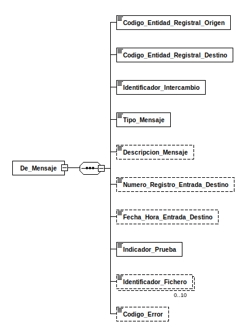

---
title: De_Mensaje (SICRES3_MENSAJE_APL)
summary: "Fuente: [administracionelectronica.gob.es/ENI/XSD/v1.0/documento-e/SICRES3_MENSAJE_APL.xsd](http://administracionelectronica.gob.es/ENI/XSD/v1.0/documento-e/SICRES3_MENSAJE_APL.xsd)"
---

<div class="widthscroll" id="De_Mensaje">
<pre><code><a href="http://regis.cosnier.free.fr/?page=XSDDiagram">xsddiagram</a> -no-gui -y -r De_Mensaje -e 1 -o <a href="SICRES3_MENSAJE_APL/De_Mensaje.csv">De_Mensaje.csv</a> http://administracionelectronica.gob.es/ENI/XSD/v1.0/documento-e/SICRES3_MENSAJE_APL.xsd
<a href="http://regis.cosnier.free.fr/?page=XSDDiagram">xsddiagram</a> -no-gui -y -r De_Mensaje -e 1 -o <a href="SICRES3_MENSAJE_APL/De_Mensaje.txt">De_Mensaje.txt</a> http://administracionelectronica.gob.es/ENI/XSD/v1.0/documento-e/SICRES3_MENSAJE_APL.xsd
<a href="http://regis.cosnier.free.fr/?page=XSDDiagram">xsddiagram</a> -no-gui -y -r De_Mensaje -e 1 -o <a href="SICRES3_MENSAJE_APL/De_Mensaje.png">De_Mensaje.png</a> http://administracionelectronica.gob.es/ENI/XSD/v1.0/documento-e/SICRES3_MENSAJE_APL.xsd
<a href="http://regis.cosnier.free.fr/?page=XSDDiagram">xsddiagram</a> -no-gui -y -r De_Mensaje -e 1 -o <a href="SICRES3_MENSAJE_APL/De_Mensaje.svg">De_Mensaje.svg</a> http://administracionelectronica.gob.es/ENI/XSD/v1.0/documento-e/SICRES3_MENSAJE_APL.xsd</code></pre>
</div>




```console
curl -L http://administracionelectronica.gob.es/ENI/XSD/v1.0/documento-e/SICRES3_MENSAJE_APL.xsd
```
```xml
<xs:schema elementFormDefault="qualified" xmlns:xs="http://www.w3.org/2001/XMLSchema">
  <xs:element name="De_Mensaje">
    <xs:complexType>
      <xs:sequence>
        <xs:element minOccurs="1" maxOccurs="1" name="Codigo_Entidad_Registral_Origen">
          <xs:simpleType>
            <xs:restriction base="xs:string">
              <xs:maxLength value="21"/>
            </xs:restriction>
          </xs:simpleType>
        </xs:element>
        <xs:element minOccurs="1" maxOccurs="1" name="Codigo_Entidad_Registral_Destino">
          <xs:simpleType>
            <xs:restriction base="xs:string">
              <xs:maxLength value="21"/>
            </xs:restriction>
          </xs:simpleType>
        </xs:element>
        <xs:element minOccurs="1" maxOccurs="1" name="Identificador_Intercambio">
          <xs:simpleType>
            <xs:restriction base="xs:string">
              <xs:maxLength value="33"/>
            </xs:restriction>
          </xs:simpleType>
        </xs:element>
        <xs:element minOccurs="1" maxOccurs="1" name="Tipo_Mensaje">
          <xs:simpleType>
            <xs:restriction base="xs:string">
              <xs:maxLength value="2"/>
            </xs:restriction>
          </xs:simpleType>
        </xs:element>
        <xs:element minOccurs="0" maxOccurs="1" name="Descripcion_Mensaje">
          <xs:simpleType>
            <xs:restriction base="xs:string">
              <xs:maxLength value="1024"/>
            </xs:restriction>
          </xs:simpleType>
        </xs:element>
        <xs:element minOccurs="0" maxOccurs="1" name="Numero_Registro_Entrada_Destino">
          <xs:simpleType>
            <xs:restriction base="xs:string">
              <xs:maxLength value="20"/>
            </xs:restriction>
          </xs:simpleType>
        </xs:element>
        <xs:element minOccurs="0" maxOccurs="1" name="Fecha_Hora_Entrada_Destino">
          <xs:simpleType>
            <xs:restriction base="xs:string">
              <xs:maxLength value="14"/>
            </xs:restriction>
          </xs:simpleType>
        </xs:element>
        <xs:element minOccurs="1" maxOccurs="1" name="Indicador_Prueba">
          <xs:simpleType>
            <xs:restriction base="xs:string">
              <xs:enumeration value="0"/>
              <xs:enumeration value="1"/>
            </xs:restriction>
          </xs:simpleType>
        </xs:element>
        <xs:element minOccurs="0" maxOccurs="10" name="Identificador_Fichero">
          <xs:simpleType>
            <xs:restriction base="xs:string">
              <xs:maxLength value="50"/>
            </xs:restriction>
          </xs:simpleType>
        </xs:element>
        <xs:element minOccurs="0" maxOccurs="1" name="Codigo_Error">
          <xs:simpleType>
            <xs:restriction base="xs:string">
              <xs:maxLength value="4"/>
            </xs:restriction>
          </xs:simpleType>
        </xs:element>
      </xs:sequence>
    </xs:complexType>
  </xs:element>
</xs:schema>
```