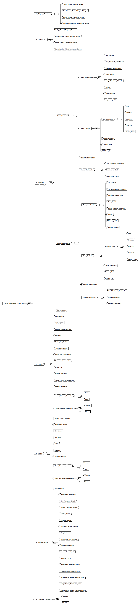

---
title: Fichero_Intercambio_SICRES_4 (SICRES4_INTERCAMBIO_APL)
summary: "Fuente: [administracionelectronica.gob.es/pae_Home/dam/jcr:13c2f191-2748-4a5e-bf05-44330b52578e/2021-SICRES4_INTERCAMBIO_APL.xsd](https://administracionelectronica.gob.es/pae_Home/dam/jcr:13c2f191-2748-4a5e-bf05-44330b52578e/2021-SICRES4_INTERCAMBIO_APL.xsd)"
---

<div class="widthscroll" id="Fichero_Intercambio_SICRES_4">
<pre><code><a href="http://regis.cosnier.free.fr/?page=XSDDiagram">xsddiagram</a> -no-gui -y -r Fichero_Intercambio_SICRES_4 -e 5 -o <a href="SICRES4_INTERCAMBIO_APL/Fichero_Intercambio_SICRES_4.csv">Fichero_Intercambio_SICRES_4.csv</a> https://administracionelectronica.gob.es/pae_Home/dam/jcr:13c2f191-2748-4a5e-bf05-44330b52578e/2021-SICRES4_INTERCAMBIO_APL.xsd
<a href="http://regis.cosnier.free.fr/?page=XSDDiagram">xsddiagram</a> -no-gui -y -r Fichero_Intercambio_SICRES_4 -e 5 -o <a href="SICRES4_INTERCAMBIO_APL/Fichero_Intercambio_SICRES_4.txt">Fichero_Intercambio_SICRES_4.txt</a> https://administracionelectronica.gob.es/pae_Home/dam/jcr:13c2f191-2748-4a5e-bf05-44330b52578e/2021-SICRES4_INTERCAMBIO_APL.xsd
<a href="http://regis.cosnier.free.fr/?page=XSDDiagram">xsddiagram</a> -no-gui -y -r Fichero_Intercambio_SICRES_4 -e 5 -o <a href="SICRES4_INTERCAMBIO_APL/Fichero_Intercambio_SICRES_4.png">Fichero_Intercambio_SICRES_4.png</a> https://administracionelectronica.gob.es/pae_Home/dam/jcr:13c2f191-2748-4a5e-bf05-44330b52578e/2021-SICRES4_INTERCAMBIO_APL.xsd
<a href="http://regis.cosnier.free.fr/?page=XSDDiagram">xsddiagram</a> -no-gui -y -r Fichero_Intercambio_SICRES_4 -e 5 -o <a href="SICRES4_INTERCAMBIO_APL/Fichero_Intercambio_SICRES_4.svg">Fichero_Intercambio_SICRES_4.svg</a> https://administracionelectronica.gob.es/pae_Home/dam/jcr:13c2f191-2748-4a5e-bf05-44330b52578e/2021-SICRES4_INTERCAMBIO_APL.xsd</code></pre>
</div>




```console
curl -L https://administracionelectronica.gob.es/pae_Home/dam/jcr:13c2f191-2748-4a5e-bf05-44330b52578e/2021-SICRES4_INTERCAMBIO_APL.xsd
```
```xml
<xs:schema xmlns:xs="http://www.w3.org/2001/XMLSchema" elementFormDefault="qualified">
<xs:complexType name="Datos_Persona">
		<xs:sequence>
			<xs:element name="Datos_Identificacion" minOccurs="1" maxOccurs="1">
				<xs:complexType>
					<xs:sequence>
						<xs:element name="Tipo_Persona" minOccurs="1" maxOccurs="1">
							<xs:simpleType>
								<xs:restriction base="xs:string">
									<xs:maxLength value="1"/>
									<xs:enumeration value="1"/>
									<xs:enumeration value="2"/>
								</xs:restriction>
							</xs:simpleType>
						</xs:element>
						<xs:element name="Tipo_Documento_Identificacion" minOccurs="1" maxOccurs="1">
							<xs:simpleType>
								<xs:restriction base="xs:string">
									<xs:maxLength value="1"/>
									<xs:enumeration value="N"/>
									<xs:enumeration value="C"/>
									<xs:enumeration value="P"/>
									<xs:enumeration value="E"/>
									<xs:enumeration value="X"/>
									<xs:enumeration value="O"/>
								</xs:restriction>
							</xs:simpleType>
						</xs:element>
						<xs:element name="Documento_Identificacion" minOccurs="1" maxOccurs="1">
							<xs:simpleType>
								<xs:restriction base="xs:string">
									<xs:maxLength value="256"/>
								</xs:restriction>
							</xs:simpleType>
						</xs:element>
						<xs:element name="Razon_Social" minOccurs="0" maxOccurs="1">
							<xs:simpleType>
								<xs:restriction base="xs:string">
									<xs:maxLength value="80"/>
								</xs:restriction>
							</xs:simpleType>
						</xs:element>
						<xs:element name="Codigo_Directorio_Unificado" minOccurs="0" maxOccurs="1">
							<xs:simpleType>
								<xs:restriction base="xs:string">
									<xs:maxLength value="21"/>
								</xs:restriction>
							</xs:simpleType>
						</xs:element>
						<xs:element name="Nombre" minOccurs="0" maxOccurs="1">
							<xs:simpleType>
								<xs:restriction base="xs:string">
									<xs:maxLength value="30"/>
								</xs:restriction>
							</xs:simpleType>
						</xs:element>
						<xs:element name="Primer_Apellido" minOccurs="0" maxOccurs="1">
							<xs:simpleType>
								<xs:restriction base="xs:string">
									<xs:maxLength value="30"/>
								</xs:restriction>
							</xs:simpleType>
						</xs:element>
						<xs:element name="Segundo_Apellido" minOccurs="0" maxOccurs="1">
							<xs:simpleType>
								<xs:restriction base="xs:string">
									<xs:maxLength value="30"/>
								</xs:restriction>
							</xs:simpleType>
						</xs:element>
					</xs:sequence>
				</xs:complexType>
			</xs:element>
			<xs:element name="Datos_Contacto" minOccurs="0" maxOccurs="1">
				<xs:complexType>
					<xs:sequence>
						<xs:element name="Direccion_Postal" minOccurs="0" maxOccurs="1">
							<xs:complexType>
								<xs:sequence>
									<xs:element name="Pais" minOccurs="0" maxOccurs="1">
										<xs:simpleType>
											<xs:restriction base="xs:string">
												<xs:maxLength value="4"/>
											</xs:restriction>
										</xs:simpleType>
									</xs:element>
									<xs:element name="Provincia" minOccurs="0" maxOccurs="1">
										<xs:simpleType>
											<xs:restriction base="xs:string">
												<xs:maxLength value="2"/>
											</xs:restriction>
										</xs:simpleType>
									</xs:element>
									<xs:element name="Municipio" minOccurs="0" maxOccurs="1">
										<xs:simpleType>
											<xs:restriction base="xs:string">
												<xs:maxLength value="5"/>
											</xs:restriction>
										</xs:simpleType>
									</xs:element>
									<xs:element name="Direccion" minOccurs="0" maxOccurs="1">
										<xs:simpleType>
											<xs:restriction base="xs:string">
												<xs:maxLength value="160"/>
											</xs:restriction>
										</xs:simpleType>
									</xs:element>
									<xs:element name="Codigo_Postal" minOccurs="0" maxOccurs="1">
										<xs:simpleType>
											<xs:restriction base="xs:string">
												<xs:maxLength value="5"/>
											</xs:restriction>
										</xs:simpleType>
									</xs:element>
								</xs:sequence>
							</xs:complexType>
						</xs:element>
						<xs:element name="Correo_Electronico" minOccurs="0" maxOccurs="1">
							<xs:simpleType>
								<xs:restriction base="xs:string">
									<xs:maxLength value="160"/>
								</xs:restriction>
							</xs:simpleType>
						</xs:element>
						<xs:element name="Telefono_Movil" minOccurs="0" maxOccurs="1">
							<xs:simpleType>
								<xs:restriction base="xs:string">
									<xs:maxLength value="20"/>
								</xs:restriction>
							</xs:simpleType>
						</xs:element>
						<xs:element name="Telefono_Fijo" minOccurs="0" maxOccurs="1">
							<xs:simpleType>
								<xs:restriction base="xs:string">
									<xs:maxLength value="20"/>
								</xs:restriction>
							</xs:simpleType>
						</xs:element>
					</xs:sequence>
				</xs:complexType>
			</xs:element>
			<xs:element name="Receptor_Notificaciones" type="xs:boolean" minOccurs="0" maxOccurs="1"/>
			<xs:element name="Canales_Notificacion" minOccurs="0" maxOccurs="1">
				<xs:complexType>
					<xs:sequence>
						<xs:element name="Canal_Preferente_Notificacion" minOccurs="0" maxOccurs="1">
							<xs:simpleType>
								<xs:restriction base="xs:string">
									<xs:maxLength value="1"/>
									<xs:enumeration value="1"/>
									<xs:enumeration value="2"/>
								</xs:restriction>
							</xs:simpleType>
						</xs:element>
						<xs:element name="Solicita_aviso_SMS" type="xs:boolean" minOccurs="0" maxOccurs="1"/>
						<xs:element name="Solicita_aviso_correo" type="xs:boolean" minOccurs="0" maxOccurs="1"/>
					</xs:sequence>
				</xs:complexType>
			</xs:element>
		</xs:sequence>
	</xs:complexType>
	<xs:complexType name="Listado_Metadatos">
		<xs:sequence minOccurs="1" maxOccurs="unbounded">
			<xs:element name="Campo" minOccurs="1" maxOccurs="1">
				<xs:simpleType>
					<xs:restriction base="xs:string">
						<xs:maxLength value="80"/>
					</xs:restriction>
				</xs:simpleType>
			</xs:element>
			<xs:element name="Valor" type="xs:string" minOccurs="1" maxOccurs="1"/>
		</xs:sequence>
	</xs:complexType>
<xs:element name="Fichero_Intercambio_SICRES_4">
		<xs:complexType>
			<xs:sequence>
				<xs:element name="De_Origen_o_Remitente" minOccurs="1" maxOccurs="1">
					<xs:complexType>
						<xs:sequence>
							<xs:element name="Codigo_Entidad_Registral_Origen" minOccurs="1" maxOccurs="1">
								<xs:simpleType>
									<xs:restriction base="xs:string">
										<xs:maxLength value="21"/>
									</xs:restriction>
								</xs:simpleType>
							</xs:element>
							<xs:element name="Decodificacion_Entidad_Registral_Origen" minOccurs="0" maxOccurs="1">
								<xs:simpleType>
									<xs:restriction base="xs:string">
										<xs:maxLength value="120"/>
									</xs:restriction>
								</xs:simpleType>
							</xs:element>
							<xs:element name="Codigo_Unidad_Tramitacion_Origen" minOccurs="0" maxOccurs="1">
								<xs:simpleType>
									<xs:restriction base="xs:string">
										<xs:maxLength value="21"/>
									</xs:restriction>
								</xs:simpleType>
							</xs:element>
							<xs:element name="Decodificacion_Unidad_Tramitacion_Origen" minOccurs="0" maxOccurs="1">
								<xs:simpleType>
									<xs:restriction base="xs:string">
										<xs:maxLength value="120"/>
									</xs:restriction>
								</xs:simpleType>
							</xs:element>
						</xs:sequence>
					</xs:complexType>
				</xs:element>
				<xs:element name="De_Destino" minOccurs="1" maxOccurs="1">
					<xs:complexType>
						<xs:sequence>
							<xs:element name="Codigo_Entidad_Registral_Destino" minOccurs="1" maxOccurs="1">
								<xs:simpleType>
									<xs:restriction base="xs:string">
										<xs:maxLength value="21"/>
									</xs:restriction>
								</xs:simpleType>
							</xs:element>
							<xs:element name="Decodificacion_Entidad_Registral_Destino" minOccurs="0" maxOccurs="1">
								<xs:simpleType>
									<xs:restriction base="xs:string">
										<xs:maxLength value="120"/>
									</xs:restriction>
								</xs:simpleType>
							</xs:element>
							<xs:element name="Codigo_Unidad_Tramitacion_Destino" minOccurs="0" maxOccurs="1">
								<xs:simpleType>
									<xs:restriction base="xs:string">
										<xs:maxLength value="21"/>
									</xs:restriction>
								</xs:simpleType>
							</xs:element>
							<xs:element name="Decodificacion_Unidad_Tramitacion_Destino" minOccurs="0" maxOccurs="1">
								<xs:simpleType>
									<xs:restriction base="xs:string">
										<xs:maxLength value="120"/>
									</xs:restriction>
								</xs:simpleType>
							</xs:element>
						</xs:sequence>
					</xs:complexType>
				</xs:element>
				<xs:element name="De_Interesado" minOccurs="0" maxOccurs="unbounded">
					<xs:complexType>
						<xs:sequence>
							<xs:element name="Datos_Interesado" type="Datos_Persona" minOccurs="0" maxOccurs="1"/>
							<xs:element name="Datos_Representante" type="Datos_Persona" minOccurs="0" maxOccurs="1"/>
							<xs:element name="Observaciones" minOccurs="0" maxOccurs="1">
								<xs:simpleType>
									<xs:restriction base="xs:string">
										<xs:maxLength value="160"/>
									</xs:restriction>
								</xs:simpleType>
							</xs:element>
						</xs:sequence>
					</xs:complexType>
				</xs:element>
				<xs:element name="De_Asiento" minOccurs="1" maxOccurs="1">
					<xs:complexType>
						<xs:sequence>
							<xs:element name="Modo_Registro" minOccurs="1" maxOccurs="1">
								<xs:simpleType>
									<xs:restriction base="xs:string">
										<xs:maxLength value="2"/>
										<xs:enumeration value="01"/>
										<xs:enumeration value="02"/>
									</xs:restriction>
								</xs:simpleType>
							</xs:element>
							<xs:element name="Tipo_Registro" minOccurs="1" maxOccurs="1">
								<xs:simpleType>
									<xs:restriction base="xs:string">
										<xs:maxLength value="1"/>
										<xs:enumeration value="0"/>
										<xs:enumeration value="1"/>
									</xs:restriction>
								</xs:simpleType>
							</xs:element>
							<xs:element name="Numero_Registro_Entrada" minOccurs="1" maxOccurs="1">
								<xs:simpleType>
									<xs:restriction base="xs:string">
										<xs:maxLength value="20"/>
									</xs:restriction>
								</xs:simpleType>
							</xs:element>
							<xs:element name="Resumen" minOccurs="1" maxOccurs="1">
								<xs:simpleType>
									<xs:restriction base="xs:string">
										<xs:maxLength value="240"/>
									</xs:restriction>
								</xs:simpleType>
							</xs:element>
							<xs:element name="Fecha_Hora_Registro" minOccurs="1" maxOccurs="1">
								<xs:simpleType>
									<xs:restriction base="xs:string">
										<xs:maxLength value="19"/>
									</xs:restriction>
								</xs:simpleType>
							</xs:element>
							<xs:element name="Timestamp_Registro" type="xs:base64Binary" minOccurs="0" maxOccurs="1"/>
							<xs:element name="Fecha_Hora_Presentacion" minOccurs="1" maxOccurs="1">
								<xs:simpleType>
									<xs:restriction base="xs:string">
										<xs:maxLength value="19"/>
									</xs:restriction>
								</xs:simpleType>
							</xs:element>
							<xs:element name="Timestamp_Presentacion" type="xs:base64Binary" minOccurs="0" maxOccurs="1"/>
							<xs:element name="Codigo_SIA" minOccurs="0" maxOccurs="1">
								<xs:simpleType>
									<xs:restriction base="xs:string">
										<xs:maxLength value="80"/>
									</xs:restriction>
								</xs:simpleType>
							</xs:element>
							<xs:element name="Numero_Expediente" minOccurs="0" maxOccurs="1">
								<xs:simpleType>
									<xs:restriction base="xs:string">
										<xs:maxLength value="80"/>
									</xs:restriction>
								</xs:simpleType>
							</xs:element>
							<xs:element name="Codigo_Asunto_Segun_Destino" minOccurs="0" maxOccurs="1">
								<xs:simpleType>
									<xs:restriction base="xs:string">
										<xs:maxLength value="16"/>
									</xs:restriction>
								</xs:simpleType>
							</xs:element>
							<xs:element name="Referencia_Externa" minOccurs="0" maxOccurs="1">
								<xs:simpleType>
									<xs:restriction base="xs:string">
										<xs:maxLength value="16"/>
									</xs:restriction>
								</xs:simpleType>
							</xs:element>
							<xs:element name="Otros_Metadatos_Generales" type="Listado_Metadatos" minOccurs="0" maxOccurs="1"/>
							<xs:element name="Otros_Metadatos_Particulares" type="Listado_Metadatos" minOccurs="0" maxOccurs="1"/>
						</xs:sequence>
					</xs:complexType>
				</xs:element>
				<xs:element name="De_Anexo" minOccurs="0" maxOccurs="unbounded">
					<xs:complexType>
						<xs:sequence>
							<xs:element name="Nombre_Fichero_Anexado" minOccurs="1" maxOccurs="1">
								<xs:simpleType>
									<xs:restriction base="xs:string">
										<xs:maxLength value="80"/>
									</xs:restriction>
								</xs:simpleType>
							</xs:element>
							<xs:element name="Identificador_Fichero" minOccurs="1" maxOccurs="1">
								<xs:simpleType>
									<xs:restriction base="xs:string">
										<xs:maxLength value="50"/>
									</xs:restriction>
								</xs:simpleType>
							</xs:element>
							<xs:element name="Tipo_Anexo" minOccurs="1" maxOccurs="1">
								<xs:simpleType>
									<xs:restriction base="xs:string">
										<xs:maxLength value="2"/>
										<xs:enumeration value="01"/>
										<xs:enumeration value="02"/>
										<xs:enumeration value="03"/>
									</xs:restriction>
								</xs:simpleType>
							</xs:element>
							<xs:element name="Tipo_MIME" minOccurs="0" maxOccurs="1">
								<xs:simpleType>
									<xs:restriction base="xs:string">
										<xs:maxLength value="80"/>
									</xs:restriction>
								</xs:simpleType>
							</xs:element>
							<xs:element name="Anexo" minOccurs="0" maxOccurs="1"/>
							<xs:element name="Resumen" minOccurs="0" maxOccurs="1">
								<xs:simpleType>
									<xs:restriction base="xs:string">
										<xs:maxLength value="160"/>
									</xs:restriction>
								</xs:simpleType>
							</xs:element>
							<xs:element name="Codigo_Formulario" minOccurs="0" maxOccurs="1">
								<xs:simpleType>
									<xs:restriction base="xs:string">
										<xs:maxLength value="80"/>
									</xs:restriction>
								</xs:simpleType>
							</xs:element>
							<xs:element name="Otros_Metadatos_Generales" type="Listado_Metadatos" minOccurs="0" maxOccurs="1"/>
							<xs:element name="Otros_Metadatos_Particulares" type="Listado_Metadatos" minOccurs="0" maxOccurs="1"/>
							<xs:element name="Observaciones" minOccurs="0" maxOccurs="1">
								<xs:simpleType>
									<xs:restriction base="xs:string">
										<xs:maxLength value="160"/>
									</xs:restriction>
								</xs:simpleType>
							</xs:element>
						</xs:sequence>
					</xs:complexType>
				</xs:element>
				<xs:element name="De_Internos_Control" minOccurs="1" maxOccurs="1">
					<xs:complexType>
						<xs:sequence>
							<xs:element name="Identificador_Intercambio" minOccurs="1" maxOccurs="1">
								<xs:simpleType>
									<xs:restriction base="xs:string">
										<xs:maxLength value="33"/>
									</xs:restriction>
								</xs:simpleType>
							</xs:element>
							<xs:element name="Tipo_Transporte_Entrada" minOccurs="0" maxOccurs="1">
								<xs:simpleType>
									<xs:restriction base="xs:string">
										<xs:maxLength value="2"/>
										<xs:enumeration value="01"/>
										<xs:enumeration value="02"/>
										<xs:enumeration value="03"/>
										<xs:enumeration value="04"/>
										<xs:enumeration value="05"/>
										<xs:enumeration value="06"/>
										<xs:enumeration value="07"/>
										<xs:enumeration value="08"/>
									</xs:restriction>
								</xs:simpleType>
							</xs:element>
							<xs:element name="Numero_Transporte_Entrada" minOccurs="0" maxOccurs="1">
								<xs:simpleType>
									<xs:restriction base="xs:string">
										<xs:maxLength value="40"/>
									</xs:restriction>
								</xs:simpleType>
							</xs:element>
							<xs:element name="Nombre_Usuario" minOccurs="0" maxOccurs="1">
								<xs:simpleType>
									<xs:restriction base="xs:string">
										<xs:maxLength value="80"/>
									</xs:restriction>
								</xs:simpleType>
							</xs:element>
							<xs:element name="Contacto_Usuario" minOccurs="0" maxOccurs="1">
								<xs:simpleType>
									<xs:restriction base="xs:string">
										<xs:maxLength value="160"/>
									</xs:restriction>
								</xs:simpleType>
							</xs:element>
							<xs:element name="Aplicacion_Version_Emisora" minOccurs="0" maxOccurs="1">
								<xs:simpleType>
									<xs:restriction base="xs:string">
										<xs:maxLength value="20"/>
									</xs:restriction>
								</xs:simpleType>
							</xs:element>
							<xs:element name="Tipo_Anotacion" minOccurs="1" maxOccurs="1">
								<xs:simpleType>
									<xs:restriction base="xs:string">
										<xs:maxLength value="2"/>
										<xs:enumeration value="01"/>
										<xs:enumeration value="02"/>
										<xs:enumeration value="03"/>
									</xs:restriction>
								</xs:simpleType>
							</xs:element>
							<xs:element name="Descripcion_Tipo_Anotacion" minOccurs="0" maxOccurs="1">
								<xs:simpleType>
									<xs:restriction base="xs:string">
										<xs:maxLength value="160"/>
									</xs:restriction>
								</xs:simpleType>
							</xs:element>
							<xs:element name="Documentacion_Fisica" minOccurs="1" maxOccurs="1">
								<xs:simpleType>
									<xs:restriction base="xs:string">
										<xs:maxLength value="1"/>
										<xs:enumeration value="1"/>
										<xs:enumeration value="2"/>
										<xs:enumeration value="3"/>
									</xs:restriction>
								</xs:simpleType>
							</xs:element>
							<xs:element name="Observaciones_Apunte" minOccurs="0" maxOccurs="1">
								<xs:simpleType>
									<xs:restriction base="xs:string">
										<xs:maxLength value="160"/>
									</xs:restriction>
								</xs:simpleType>
							</xs:element>
							<xs:element name="Indicador_Prueba" minOccurs="0" maxOccurs="1">
								<xs:simpleType>
									<xs:restriction base="xs:string">
										<xs:maxLength value="1"/>
										<xs:enumeration value="0"/>
										<xs:enumeration value="1"/>
									</xs:restriction>
								</xs:simpleType>
							</xs:element>
							<xs:element name="Identificador_Intercambio_Previo" minOccurs="0" maxOccurs="1">
								<xs:simpleType>
									<xs:restriction base="xs:string">
										<xs:maxLength value="33"/>
									</xs:restriction>
								</xs:simpleType>
							</xs:element>
							<xs:element name="Codigo_Entidad_Registral_Inicio" minOccurs="1" maxOccurs="1">
								<xs:simpleType>
									<xs:restriction base="xs:string">
										<xs:maxLength value="21"/>
									</xs:restriction>
								</xs:simpleType>
							</xs:element>
							<xs:element name="Decodificacion_Entidad_Registral_Inicio" minOccurs="0" maxOccurs="1">
								<xs:simpleType>
									<xs:restriction base="xs:string">
										<xs:maxLength value="120"/>
									</xs:restriction>
								</xs:simpleType>
							</xs:element>
							<xs:element name="Codigo_Unidad_Tramitacion_Inicio" minOccurs="0" maxOccurs="1">
								<xs:simpleType>
									<xs:restriction base="xs:string">
										<xs:maxLength value="21"/>
									</xs:restriction>
								</xs:simpleType>
							</xs:element>
							<xs:element name="Decodificacion_Unidad_Tramitacion_Inicio" minOccurs="0" maxOccurs="1">
								<xs:simpleType>
									<xs:restriction base="xs:string">
										<xs:maxLength value="120"/>
									</xs:restriction>
								</xs:simpleType>
							</xs:element>
						</xs:sequence>
					</xs:complexType>
				</xs:element>
				<xs:element name="De_Formulario_Generico" minOccurs="0" maxOccurs="1">
				  <xs:complexType>
					<xs:sequence>
					  <xs:element minOccurs="1" maxOccurs="1" name="Expone">
						<xs:simpleType>
						  <xs:restriction base="xs:string">
							<xs:maxLength value="4000"/>
						  </xs:restriction>
						</xs:simpleType>
					  </xs:element>
					  <xs:element minOccurs="1" maxOccurs="1" name="Solicita">
						<xs:simpleType>
						  <xs:restriction base="xs:string">
							<xs:maxLength value="4000"/>
						  </xs:restriction>
						</xs:simpleType>
					  </xs:element>
					</xs:sequence>
				  </xs:complexType>
				</xs:element>
			</xs:sequence>
		</xs:complexType>
	</xs:element>
</xs:schema>
```