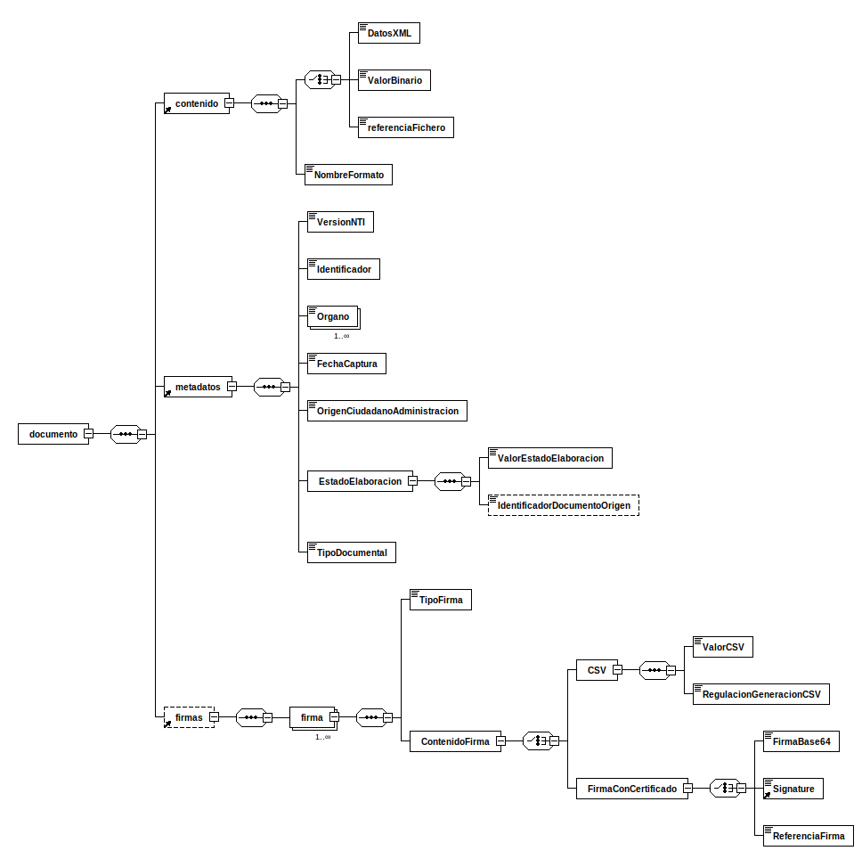

---
title: documento (documentoEni)
summary: "Fuente: [administracionelectronica.gob.es/ENI/XSD/v1.0/documento-e/documentoEni.xsd](http://administracionelectronica.gob.es/ENI/XSD/v1.0/documento-e/documentoEni.xsd)"
---

<div class="widthscroll" id="documento">
<pre><code><a href="http://regis.cosnier.free.fr/?page=XSDDiagram">xsddiagram</a> -no-gui -y -r documento -e 5 -o <a href="documentoEni/documento.csv">documento.csv</a> http://administracionelectronica.gob.es/ENI/XSD/v1.0/documento-e/documentoEni.xsd
<a href="http://regis.cosnier.free.fr/?page=XSDDiagram">xsddiagram</a> -no-gui -y -r documento -e 5 -o <a href="documentoEni/documento.txt">documento.txt</a> http://administracionelectronica.gob.es/ENI/XSD/v1.0/documento-e/documentoEni.xsd
<a href="http://regis.cosnier.free.fr/?page=XSDDiagram">xsddiagram</a> -no-gui -y -r documento -e 5 -o <a href="documentoEni/documento.png">documento.png</a> http://administracionelectronica.gob.es/ENI/XSD/v1.0/documento-e/documentoEni.xsd
<a href="http://regis.cosnier.free.fr/?page=XSDDiagram">xsddiagram</a> -no-gui -y -r documento -e 5 -o <a href="documentoEni/documento.svg">documento.svg</a> http://administracionelectronica.gob.es/ENI/XSD/v1.0/documento-e/documentoEni.xsd</code></pre>
</div>




```console
curl -L http://administracionelectronica.gob.es/ENI/XSD/v1.0/documento-e/documentoEni.xsd
```
```xml
<?xml version="1.0" encoding="UTF-8"?>
<xsd:schema 
xmlns:xsd="http://www.w3.org/2001/XMLSchema" 
xmlns:enids="http://administracionelectronica.gob.es/ENI/XSD/v1.0/firma" 
xmlns:enidocmeta="http://administracionelectronica.gob.es/ENI/XSD/v1.0/documento-e/metadatos" 
xmlns:enifile="http://administracionelectronica.gob.es/ENI/XSD/v1.0/documento-e/contenido" 
xmlns:enidoc="http://administracionelectronica.gob.es/ENI/XSD/v1.0/documento-e" 
targetNamespace="http://administracionelectronica.gob.es/ENI/XSD/v1.0/documento-e" 
elementFormDefault="qualified" attributeFormDefault="unqualified">
	<xsd:annotation>
		<xsd:documentation xml:lang="es">XSD DOCUMENTO ENI (v1.0)</xsd:documentation>
	</xsd:annotation>
	<xsd:import namespace="http://administracionelectronica.gob.es/ENI/XSD/v1.0/documento-e/metadatos" schemaLocation="http://administracionelectronica.gob.es/ENI/XSD/v1.0/documento-e/metadatos/metadatosDocumentoEni.xsd"/>
	<xsd:import namespace="http://administracionelectronica.gob.es/ENI/XSD/v1.0/firma" schemaLocation="http://administracionelectronica.gob.es/ENI/XSD/v1.0/firma/firmasEni.xsd"/>
	<xsd:import namespace="http://administracionelectronica.gob.es/ENI/XSD/v1.0/documento-e/contenido" schemaLocation="http://administracionelectronica.gob.es/ENI/XSD/v1.0/documento-e/contenido/contenidoDocumentoEni.xsd"/>
	<xsd:element name="documento" type="enidoc:TipoDocumento">
		<xsd:annotation>
			<xsd:documentation xml:lang="es">El elemento "documento" podrá aparecer como elemento raíz de un documento XML objeto de intercambio o como elemento no raíz (elemento hijo).</xsd:documentation>
		</xsd:annotation>
	</xsd:element>
	<xsd:complexType name="TipoDocumento">
		<xsd:sequence>
			<xsd:element ref="enifile:contenido"/>
			<xsd:element ref="enidocmeta:metadatos"/>
			<xsd:element ref="enids:firmas" minOccurs="0" maxOccurs="1">
				<xsd:annotation>
					<xsd:documentation xml:lang="es">La firma es obligatoria para el documento administrativo electrónico y para todo aquel documento electrónico susceptible de ser incorporado en un expediente electrónico.</xsd:documentation>
				</xsd:annotation>
			</xsd:element>
		</xsd:sequence>
		<xsd:attribute name="Id" type="xsd:ID" use="optional"/>
	</xsd:complexType>
</xsd:schema>
```