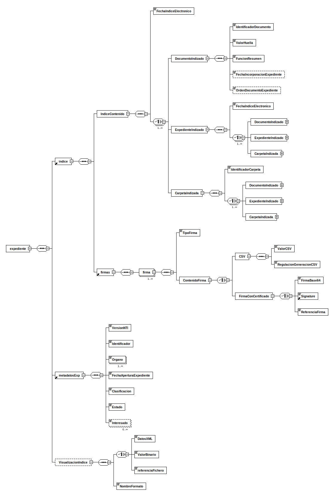

---
title: expediente (expedienteEni)
summary: "Fuente: [administracionelectronica.gob.es/ENI/XSD/v1.0/expediente-e/expedienteEni.xsd](http://administracionelectronica.gob.es/ENI/XSD/v1.0/expediente-e/expedienteEni.xsd)"
---

<div class="widthscroll" id="expediente">
<pre><code><a href="http://regis.cosnier.free.fr/?page=XSDDiagram">xsddiagram</a> -no-gui -y -r expediente -e 6 -o <a href="expedienteEni/expediente.csv">expediente.csv</a> http://administracionelectronica.gob.es/ENI/XSD/v1.0/expediente-e/expedienteEni.xsd
<a href="http://regis.cosnier.free.fr/?page=XSDDiagram">xsddiagram</a> -no-gui -y -r expediente -e 6 -o <a href="expedienteEni/expediente.txt">expediente.txt</a> http://administracionelectronica.gob.es/ENI/XSD/v1.0/expediente-e/expedienteEni.xsd
<a href="http://regis.cosnier.free.fr/?page=XSDDiagram">xsddiagram</a> -no-gui -y -r expediente -e 6 -o <a href="expedienteEni/expediente.png">expediente.png</a> http://administracionelectronica.gob.es/ENI/XSD/v1.0/expediente-e/expedienteEni.xsd
<a href="http://regis.cosnier.free.fr/?page=XSDDiagram">xsddiagram</a> -no-gui -y -r expediente -e 6 -o <a href="expedienteEni/expediente.svg">expediente.svg</a> http://administracionelectronica.gob.es/ENI/XSD/v1.0/expediente-e/expedienteEni.xsd</code></pre>
</div>




```console
curl -L http://administracionelectronica.gob.es/ENI/XSD/v1.0/expediente-e/expedienteEni.xsd
```
```xml
<?xml version="1.0" encoding="utf-8"?>
<xsd:schema 
xmlns:xsd="http://www.w3.org/2001/XMLSchema" 
xmlns:eniexpind="http://administracionelectronica.gob.es/ENI/XSD/v1.0/expediente-e/indice-e" 
xmlns:eniexpmeta="http://administracionelectronica.gob.es/ENI/XSD/v1.0/expediente-e/metadatos" 
xmlns:eniexp="http://administracionelectronica.gob.es/ENI/XSD/v1.0/expediente-e" 
xmlns:enifile="http://administracionelectronica.gob.es/ENI/XSD/v1.0/documento-e/contenido" 
targetNamespace="http://administracionelectronica.gob.es/ENI/XSD/v1.0/expediente-e" elementFormDefault="qualified" attributeFormDefault="unqualified">
	<xsd:annotation>
		<xsd:documentation xml:lang="es">XSD EXPEDIENTE ELECTRONICO ENI (v1.0)</xsd:documentation>
	</xsd:annotation>
	<xsd:import namespace="http://administracionelectronica.gob.es/ENI/XSD/v1.0/expediente-e/indice-e" schemaLocation="http://administracionelectronica.gob.es/ENI/XSD/v1.0/expediente-e/indice-e/IndiceExpedienteEni.xsd"/>
	<xsd:import namespace="http://administracionelectronica.gob.es/ENI/XSD/v1.0/expediente-e/metadatos" schemaLocation="http://administracionelectronica.gob.es/ENI/XSD/v1.0/expediente-e/metadatos/MetadatosExpedienteEni.xsd"/>
	<xsd:import namespace="http://administracionelectronica.gob.es/ENI/XSD/v1.0/documento-e/contenido" schemaLocation="http://administracionelectronica.gob.es/ENI/XSD/v1.0/documento-e/contenido/contenidoDocumentoEni.xsd"/>
	<xsd:element name="expediente" type="eniexp:TipoExpediente"/>
	<xsd:complexType name="TipoExpediente">
		<xsd:annotation>
			<xsd:documentation>Para el intercambio de un expediente electrónico, se envía en primer lugar, el índice del expediente. Posteriormente, se enviarán los documentos que lo componen , uno a uno,  y siguiendo la distribución reflejada en el contenido del Índice.</xsd:documentation>
		</xsd:annotation>
		<xsd:sequence>
			<xsd:element ref="eniexpind:indice"/>
			<xsd:element ref="eniexpmeta:metadatosExp"/>
			<xsd:element name="VisualizacionIndice" type="enifile:TipoContenido" minOccurs="0" maxOccurs="1">
				<xsd:annotation>
					<xsd:documentation>Elemento opcional que permite visualizar el contenido completo del expediente (contenido del índice).</xsd:documentation>
				</xsd:annotation>
			</xsd:element>
		</xsd:sequence>
		<xsd:attribute name="Id" type="xsd:ID" use="optional"/>
	</xsd:complexType>
</xsd:schema>
```