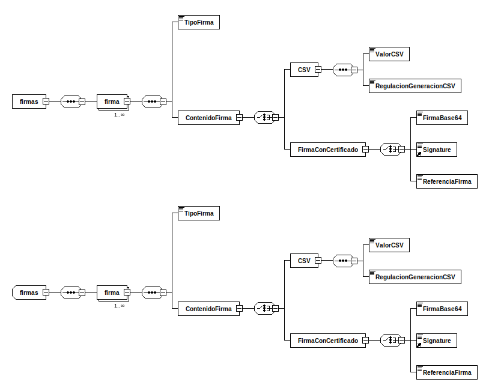

---
title: firmas (firmasEni)
summary: "Fuente: [administracionelectronica.gob.es/ENI/XSD/v1.0/firma/firmasEni.xsd](http://administracionelectronica.gob.es/ENI/XSD/v1.0/firma/firmasEni.xsd)"
---

<div class="widthscroll" id="firmas">
<pre><code><a href="http://regis.cosnier.free.fr/?page=XSDDiagram">xsddiagram</a> -no-gui -y -r firmas -e 4 -o <a href="firmasEni/firmas.csv">firmas.csv</a> http://administracionelectronica.gob.es/ENI/XSD/v1.0/firma/firmasEni.xsd
<a href="http://regis.cosnier.free.fr/?page=XSDDiagram">xsddiagram</a> -no-gui -y -r firmas -e 4 -o <a href="firmasEni/firmas.txt">firmas.txt</a> http://administracionelectronica.gob.es/ENI/XSD/v1.0/firma/firmasEni.xsd
<a href="http://regis.cosnier.free.fr/?page=XSDDiagram">xsddiagram</a> -no-gui -y -r firmas -e 4 -o <a href="firmasEni/firmas.png">firmas.png</a> http://administracionelectronica.gob.es/ENI/XSD/v1.0/firma/firmasEni.xsd
<a href="http://regis.cosnier.free.fr/?page=XSDDiagram">xsddiagram</a> -no-gui -y -r firmas -e 4 -o <a href="firmasEni/firmas.svg">firmas.svg</a> http://administracionelectronica.gob.es/ENI/XSD/v1.0/firma/firmasEni.xsd
</code></pre>
</div>



| PATH | NAME | TYPE | NAMESPACE | COMMENT |
|:----|:----|:----|:----|:----|
| /firmas | firmas | element | http://administracionelectronica.gob.es/ENI/XSD/v1.0/firma |  |
| /firmas/firma | firma | element | http://administracionelectronica.gob.es/ENI/XSD/v1.0/firma |  |
| /firmas/firma/TipoFirma | TipoFirma | element | http://administracionelectronica.gob.es/ENI/XSD/v1.0/firma | - TF01 - CSV. - TF02 - XAdES internally detached signature. - TF03 - XAdES enveloped signature. - TF04 - CAdES detached/explicit signature. - TF05 - CAdES attached/implicit signature. - TF06 - PAdES. |
| /firmas/firma/ContenidoFirma | ContenidoFirma | element | http://administracionelectronica.gob.es/ENI/XSD/v1.0/firma |  |
| /firmas/firma/ContenidoFirma/CSV | CSV | element | http://administracionelectronica.gob.es/ENI/XSD/v1.0/firma |  |
| /firmas/firma/ContenidoFirma/CSV/ValorCSV | ValorCSV | element | http://administracionelectronica.gob.es/ENI/XSD/v1.0/firma |  |
| /firmas/firma/ContenidoFirma/CSV/RegulacionGeneracionCSV | RegulacionGeneracionCSV | element | http://administracionelectronica.gob.es/ENI/XSD/v1.0/firma |  |
| /firmas/firma/ContenidoFirma/FirmaConCertificado | FirmaConCertificado | element | http://administracionelectronica.gob.es/ENI/XSD/v1.0/firma |  |
| /firmas/firma/ContenidoFirma/FirmaConCertificado/FirmaBase64 | FirmaBase64 | element | http://administracionelectronica.gob.es/ENI/XSD/v1.0/firma |  |
| /firmas/firma/ContenidoFirma/FirmaConCertificado/Signature | Signature | element | http://administracionelectronica.gob.es/ENI/XSD/v1.0/firma |  |
| /firmas/firma/ContenidoFirma/FirmaConCertificado/ReferenciaFirma | ReferenciaFirma | element | http://administracionelectronica.gob.es/ENI/XSD/v1.0/firma | Referencia interna al fichero que incluye la firma. |
| /firmas | firmas | complexType | http://administracionelectronica.gob.es/ENI/XSD/v1.0/firma |  |
| /firmas/firma | firma | element | http://administracionelectronica.gob.es/ENI/XSD/v1.0/firma |  |
| /firmas/firma/TipoFirma | TipoFirma | element | http://administracionelectronica.gob.es/ENI/XSD/v1.0/firma | - TF01 - CSV. - TF02 - XAdES internally detached signature. - TF03 - XAdES enveloped signature. - TF04 - CAdES detached/explicit signature. - TF05 - CAdES attached/implicit signature. - TF06 - PAdES. |
| /firmas/firma/ContenidoFirma | ContenidoFirma | element | http://administracionelectronica.gob.es/ENI/XSD/v1.0/firma |  |
| /firmas/firma/ContenidoFirma/CSV | CSV | element | http://administracionelectronica.gob.es/ENI/XSD/v1.0/firma |  |
| /firmas/firma/ContenidoFirma/CSV/ValorCSV | ValorCSV | element | http://administracionelectronica.gob.es/ENI/XSD/v1.0/firma |  |
| /firmas/firma/ContenidoFirma/CSV/RegulacionGeneracionCSV | RegulacionGeneracionCSV | element | http://administracionelectronica.gob.es/ENI/XSD/v1.0/firma |  |
| /firmas/firma/ContenidoFirma/FirmaConCertificado | FirmaConCertificado | element | http://administracionelectronica.gob.es/ENI/XSD/v1.0/firma |  |
| /firmas/firma/ContenidoFirma/FirmaConCertificado/FirmaBase64 | FirmaBase64 | element | http://administracionelectronica.gob.es/ENI/XSD/v1.0/firma |  |
| /firmas/firma/ContenidoFirma/FirmaConCertificado/Signature | Signature | element | http://administracionelectronica.gob.es/ENI/XSD/v1.0/firma |  |
| /firmas/firma/ContenidoFirma/FirmaConCertificado/ReferenciaFirma | ReferenciaFirma | element | http://administracionelectronica.gob.es/ENI/XSD/v1.0/firma | Referencia interna al fichero que incluye la firma. |

```console
curl -L http://administracionelectronica.gob.es/ENI/XSD/v1.0/firma/firmasEni.xsd
```
```xml
<?xml version="1.0" encoding="UTF-8"?>
<xsd:schema 
xmlns:xsd="http://www.w3.org/2001/XMLSchema" 
xmlns:enids="http://administracionelectronica.gob.es/ENI/XSD/v1.0/firma" 
xmlns:ds="http://www.w3.org/2000/09/xmldsig#" 
targetNamespace="http://administracionelectronica.gob.es/ENI/XSD/v1.0/firma" 
elementFormDefault="qualified" attributeFormDefault="unqualified">
	<xsd:annotation>
		<xsd:documentation xml:lang="es">XSD FIRMAS ELECTRONICAS ENI (v1.0)</xsd:documentation>
	</xsd:annotation>
	<xsd:import namespace="http://www.w3.org/2000/09/xmldsig#" schemaLocation="http://www.w3.org/TR/xmldsig-core/xmldsig-core-schema.xsd"/>
	<xsd:element name="firmas" type="enids:firmas"/>
	<xsd:complexType name="firmas">
		<xsd:sequence>
			<xsd:element name="firma" type="enids:TipoFirmasElectronicas" minOccurs="1" maxOccurs="unbounded"/>
		</xsd:sequence>
	</xsd:complexType>
	<xsd:complexType name="TipoFirmasElectronicas">
		<xsd:sequence>
			<xsd:element name="TipoFirma">
				<xsd:annotation>
					<xsd:documentation xml:lang="es">- TF01 - CSV. 	
- TF02 - XAdES internally detached signature.	
- TF03 - XAdES enveloped signature. 	
- TF04 - CAdES detached/explicit signature.	
- TF05 - CAdES attached/implicit signature.	
- TF06 - PAdES.</xsd:documentation>
				</xsd:annotation>
				<xsd:simpleType>
					<xsd:restriction base="xsd:string">
						<xsd:enumeration value="TF01"/>
						<xsd:enumeration value="TF02"/>
						<xsd:enumeration value="TF03"/>
						<xsd:enumeration value="TF04"/>
						<xsd:enumeration value="TF05"/>
						<xsd:enumeration value="TF06"/>
					</xsd:restriction>
				</xsd:simpleType>
			</xsd:element>
			<xsd:element name="ContenidoFirma">
				<xsd:complexType>
					<xsd:choice>
						<xsd:element name="CSV">
							<xsd:complexType>
								<xsd:sequence>
									<xsd:element name="ValorCSV" type="xsd:string"/>
									<xsd:element name="RegulacionGeneracionCSV" type="xsd:string"/>
								</xsd:sequence>
							</xsd:complexType>
						</xsd:element>
						<xsd:element name="FirmaConCertificado">
							<xsd:complexType>
								<xsd:choice>
									<xsd:element name="FirmaBase64" type="xsd:base64Binary"/>
									<xsd:element ref="ds:Signature"/>
									<xsd:element name="ReferenciaFirma">
										<xsd:annotation>
											<xsd:documentation xml:lang="es">Referencia interna al fichero que incluye la firma.</xsd:documentation>
										</xsd:annotation>
									</xsd:element>
								</xsd:choice>
							</xsd:complexType>
						</xsd:element>
					</xsd:choice>
				</xsd:complexType>
			</xsd:element>
		</xsd:sequence>
		<xsd:attribute name="Id" type="xsd:ID" use="optional"/>
		<xsd:attribute name="ref" type="xsd:string" use="optional">
			<xsd:annotation>
				<xsd:documentation xml:lang="es">Almacena el identificador del nodo que se está firmando. En caso de firmas multinodo, se incluirá una lista separada por comas de los identificadores de los nodos firmados.</xsd:documentation>
			</xsd:annotation>
		</xsd:attribute>
	</xsd:complexType>
</xsd:schema>
```